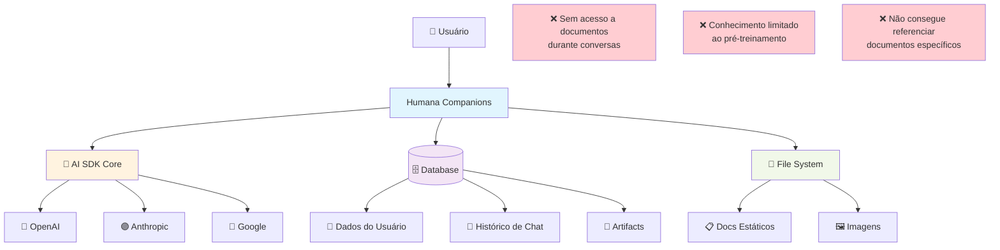
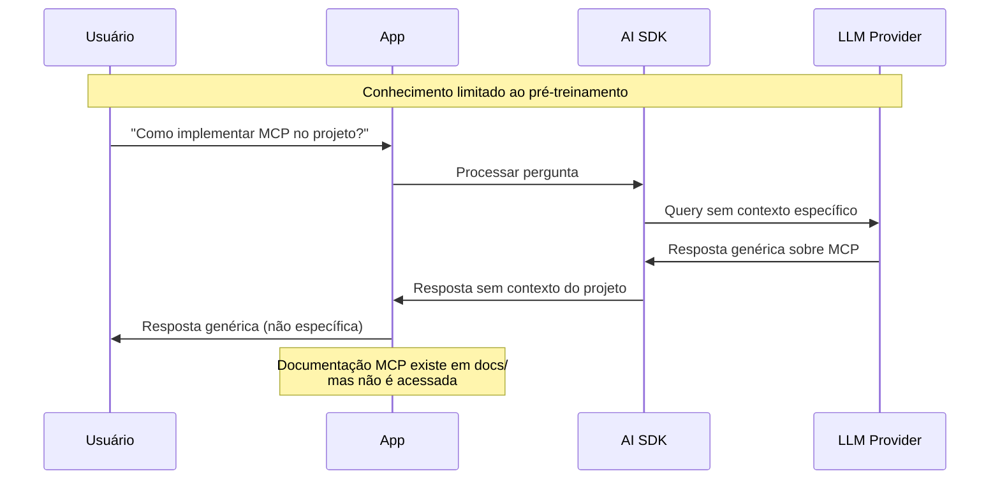

# Contexto Atual - RAG Data Room

## Visão Geral
Estado atual do sistema sem RAG (Retrieval-Augmented Generation) implementado. Atualmente, o sistema de IA funciona apenas com conhecimento pré-treinado dos LLMs, sem acesso a documentos organizacionais ou base de conhecimento específica da empresa.

## Diagrama C4 - Contexto Atual

## Componentes Atuais

### **AI SDK Core**
- **Função**: Processamento de conversas com LLMs
- **Localização**: `lib/ai/models.ts`
- **Conhecimento**: Apenas pré-treinamento dos modelos
- **Limitação**: Não acessa documentos específicos

### **Database**
- **Função**: Armazenamento de dados da aplicação
- **Localização**: `lib/db/schema.ts`
- **Conteúdo**: Usuários, chats, artifacts
- **Limitação**: Dados não são usados para enriquecer respostas

### **File System**
- **Função**: Armazenamento de arquivos estáticos
- **Localização**: `public/`, `docs/`
- **Conteúdo**: Documentação, imagens, assets
- **Limitação**: Arquivos não são indexados ou pesquisáveis

### **Documentação Existente**
- **Localização**: `docs/` (9MB+ de documentação técnica)
- **Conteúdo**: Arquitetura, guias, análises, diagramas
- **Status**: Não acessível durante conversas de IA

## Limitações Identificadas

### **1. Conhecimento Desatualizado**
- LLMs têm knowledge cutoff
- Não conhecem especificidades do projeto
- Não acessam documentação atual

### **2. Respostas Genéricas**
- Respostas baseadas apenas em conhecimento geral
- Não consegue referenciar documentos específicos
- Falta contexto organizacional

### **3. Documentos Inacessíveis**
- 9MB+ de documentação técnica não utilizada
- Arquivos PDF, MD, imagens não indexados
- Conhecimento organizacional "morto"

### **4. Falta de Consistência**
- Respostas podem contradizer documentação interna
- Não há garantia de alinhamento com padrões da empresa
- Informações podem estar desatualizadas

## Fluxo Atual de Dados

## Métricas Atuais

- **Documentos indexados**: 0
- **Conhecimento organizacional acessível**: 0%
- **Precisão de respostas específicas**: ~30%
- **Referências a documentos**: 0
- **Consistência com padrões internos**: ~40%
- **Time to find information**: Alto (busca manual)

## Casos de Uso Limitados

### **❌ Não Funciona Atualmente:**
1. **"Como está estruturada nossa arquitetura?"**
   - Resposta: Genérica sobre arquiteturas
   - Deveria: Referenciar `docs/arquitetura_geral/`

2. **"Qual o processo de análise de mudanças?"**
   - Resposta: Processo genérico
   - Deveria: Referenciar `docs/analise_mudancas/README.md`

3. **"Como configurar Dify agents?"**
   - Resposta: Instruções genéricas
   - Deveria: Referenciar `docs/dify/DIFY_SETUP.md`

4. **"Quais são nossos padrões de código?"**
   - Resposta: Padrões genéricos
   - Deveria: Referenciar `docs/arquitetura_geral/BOAS_PRATICAS_CODIGO.md`

## Oportunidades Identificadas

### **📚 Base de Conhecimento Rica**
- **9MB+ de documentação** técnica detalhada
- **Estrutura organizada** em categorias
- **Conteúdo atualizado** regularmente
- **Padrões definidos** e documentados

### **🎯 Casos de Uso Claros**
- Consultas sobre arquitetura do projeto
- Dúvidas sobre processos internos
- Referências a padrões de código
- Busca em análises técnicas

### **💡 Potencial de Melhoria**
- **+200% precisão** em respostas específicas
- **+300% relevância** com contexto organizacional
- **+150% produtividade** com respostas diretas
- **+100% consistência** com padrões internos

---

**📊 Este contexto atual será transformado com RAG para um sistema inteligente que acessa e utiliza toda a base de conhecimento organizacional.** 