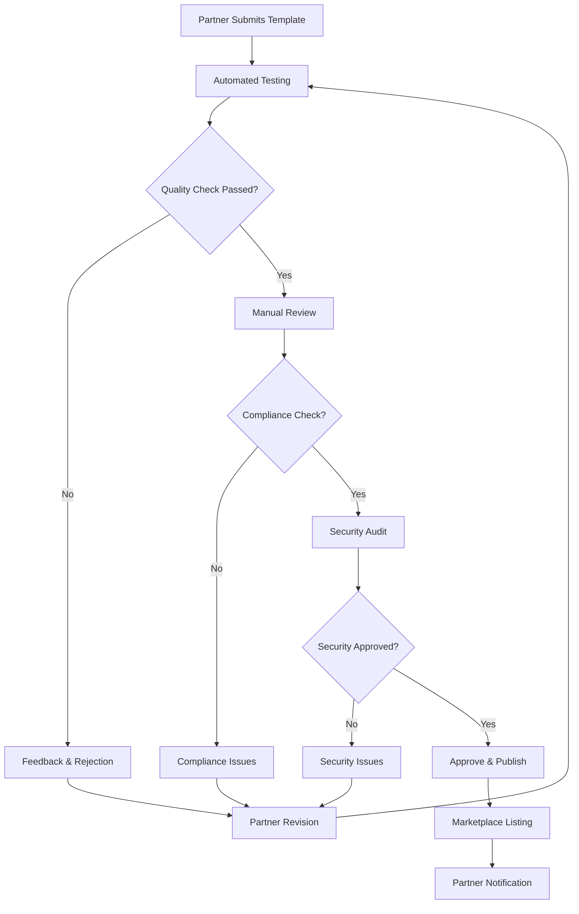
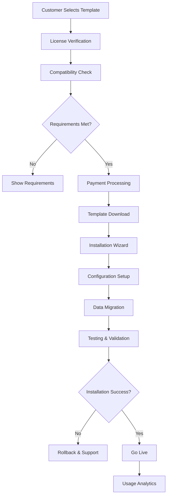
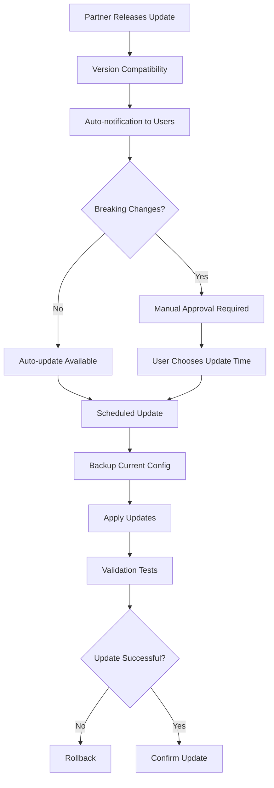

# 🛍️ Blueprint: Marketplace & Ecosystem

## 🎯 Visão Geral do Marketplace

O **Humana Marketplace** é o ecossistema central que conecta criadores de conteúdo, desenvolvedores e organizações, oferecendo **templates pré-configurados**, **aplicativos especializados** e **componentes reutilizáveis** para acelerar a implementação de soluções de IA conversacional.

### Proposta de Valor

1. **🚀 Time-to-Market Reduzido**
   - Templates prontos para uso imediato
   - Configurações pré-testadas
   - Best practices incorporadas

2. **🔧 Flexibilidade Total**
   - Customização completa dos templates
   - Integração com qualquer stack
   - White-label support

3. **💰 Monetização para Parceiros**
   - Revenue sharing transparente
   - Programa de certificação
   - Marketing colaborativo

## 🏪 Categorias do Marketplace

### 1. **🏢 Templates de Organização**

#### **Por Setor**
```typescript
interface OrganizationTemplate {
  id: string
  name: string
  category: 'healthcare' | 'finance' | 'ecommerce' | 'education' | 'manufacturing' | 'government'
  subcategory: string
  
  // Configuração completa
  defaultSettings: {
    llmProviders: LLMProvider[]
    databaseSchema: DatabaseSchema
    userRoles: Role[]
    workflows: Workflow[]
  }
  
  // Companions inclusos
  includedCompanions: CompanionTemplate[]
  
  // Integrações pré-configuradas
  integrations: Integration[]
  
  // Compliance e regulamentações
  complianceFeatures: ComplianceFeature[]
  
  // Marketplace metadata
  author: 'humana' | 'partner'
  price: number
  currency: 'BRL' | 'USD'
  licensing: 'per-organization' | 'per-user' | 'one-time'
  
  // Analytics
  downloadCount: number
  rating: number
  reviews: Review[]
  lastUpdated: Date
}
```

#### **Templates Destacados**
- **🏥 Saúde & Pharma**
  - Atendimento ao paciente
  - Compliance ANVISA/FDA
  - Telemedicina integrada
  - Gestão de prontuários

- **💰 Financeiro & Seguros**
  - Compliance BACEN
  - Atendimento regulamentado
  - Análise de crédito
  - Prevenção à lavagem

- **🛒 E-commerce & Retail**
  - Suporte ao cliente
  - Gestão de pedidos
  - Recomendações de produtos
  - Análise de sentimento

- **🎓 Educação & Treinamento**
  - Tutoring inteligente
  - Avaliação automatizada
  - Suporte administrativo
  - Gestão acadêmica

### 2. **🤖 Templates de Companions**

#### **Por Especialização**
```typescript
interface CompanionTemplate {
  id: string
  name: string
  specialization: 'customer-service' | 'sales' | 'hr' | 'technical' | 'finance' | 'legal'
  expertise: string[]
  
  // Configuração base
  basePrompt: string
  systemInstructions: string
  personality: PersonalityConfig
  
  // Capacidades
  suggestedTools: Tool[]
  mcpServers: MCPServer[]
  knowledgeRequirements: KnowledgeRequirement[]
  
  // Configuração LLM
  recommendedModels: Model[]
  temperature: number
  maxTokens: number
  
  // Customização
  configurableFields: ConfigurableField[]
  personalizationOptions: PersonalizationOption[]
  
  // Training data
  sampleConversations: Conversation[]
  trainingDatasets: Dataset[]
  
  // Marketplace
  compatibility: string[] // Versões suportadas
  requirements: Requirement[]
  documentation: Documentation
}
```

#### **Companions Populares**
- **👥 Atendimento ao Cliente**
  - FAQ inteligente
  - Escalação automática
  - Sentiment analysis
  - Multi-idioma

- **💼 Vendas & Marketing**
  - Lead qualification
  - Product recommendations
  - Proposal generation
  - CRM integration

- **🔧 Suporte Técnico**
  - Troubleshooting guide
  - Documentation search
  - Ticket management
  - Knowledge base

- **📊 Business Intelligence**
  - Data analysis
  - Report generation
  - Insights extraction
  - Dashboard creation

### 3. **📱 Aplicativos & Integrações**

#### **Tipos de Aplicativos**
```typescript
interface Application {
  id: string
  name: string
  type: 'integration' | 'tool' | 'widget' | 'workflow' | 'analytics'
  category: string
  
  // Funcionalidade
  description: string
  features: Feature[]
  apiEndpoints: APIEndpoint[]
  
  // Compatibilidade
  supportedPlatforms: Platform[]
  dependencies: Dependency[]
  minimumVersion: string
  
  // Configuração
  installationSteps: InstallationStep[]
  configurationOptions: ConfigOption[]
  
  // Marketplace
  pricing: PricingModel
  screenshots: Screenshot[]
  videos: Video[]
  changelog: ChangelogEntry[]
}
```

#### **Categorias de Apps**
- **🔗 Integrações CRM**
  - Salesforce
  - HubSpot
  - Pipedrive
  - Zendesk

- **📊 Analytics & BI**
  - Google Analytics
  - Power BI
  - Tableau
  - Metabase

- **💬 Comunicação**
  - Slack
  - Teams
  - WhatsApp Business
  - Discord

- **🗄️ Bancos de Dados**
  - PostgreSQL
  - MySQL
  - MongoDB
  - Redis

## 💰 Modelo Econômico

### Estrutura de Receita

#### **1. Para a Humana**
```typescript
interface HumanaRevenue {
  // Comissão marketplace
  marketplaceCommission: {
    templates: 30, // 30% sobre vendas de templates
    applications: 25, // 25% sobre apps
    subscriptions: 20 // 20% sobre assinaturas
  }
  
  // Templates próprios
  humanaPremiumTemplates: {
    pricing: 'tier-based',
    starter: 0, // Gratuitos
    business: 'R$ 500-2000',
    enterprise: 'R$ 5000+'
  }
  
  // Certificação e suporte
  partnerProgram: {
    certificationFee: 'R$ 1000',
    annualFee: 'R$ 5000',
    supportTier: 'premium'
  }
}
```

#### **2. Para Parceiros**
```typescript
interface PartnerRevenue {
  // Revenue share
  revenueShare: {
    templates: 70, // 70% para o criador
    applications: 75, // 75% para o desenvolvedor
    subscriptions: 80 // 80% para SaaS integrations
  }
  
  // Modelos de pricing
  pricingModels: [
    'one-time-purchase',
    'subscription-monthly',
    'subscription-annual',
    'per-usage',
    'freemium'
  ]
  
  // Incentivos
  incentives: {
    topRated: 'bonus 5%',
    volume: 'tier bonuses',
    exclusivity: 'premium placement'
  }
}
```

### Programa de Parceiros

#### **Níveis de Certificação**
```typescript
interface PartnerTiers {
  bronze: {
    requirements: ['1 template aprovado', 'rating > 4.0'],
    benefits: ['listing básico', 'suporte standard']
  }
  
  silver: {
    requirements: ['5 templates', 'rating > 4.3', '100+ downloads'],
    benefits: ['featured placement', 'marketing support']
  }
  
  gold: {
    requirements: ['10+ templates', 'rating > 4.5', '1000+ downloads'],
    benefits: ['premium placement', 'co-marketing', 'early access']
  }
  
  platinum: {
    requirements: ['enterprise templates', 'custom integration'],
    benefits: ['exclusive partnership', 'revenue guarantees']
  }
}
```

## 🔄 Fluxos de Operação

### 1. **Submissão de Templates**



### 2. **Instalação de Templates**



### 3. **Gestão de Atualizações**



## 📊 Sistema de Avaliação

### Métricas de Qualidade

```typescript
interface QualityMetrics {
  // User feedback
  userRatings: {
    overall: number // 1-5 stars
    usability: number
    documentation: number
    support: number
  }
  
  // Performance metrics
  technicalMetrics: {
    installationSuccess: number // %
    errorRate: number // %
    responseTime: number // ms
    uptime: number // %
  }
  
  // Business metrics
  businessMetrics: {
    adoptionRate: number // %
    retentionRate: number // %
    revenueGenerated: number
    supportTickets: number
  }
}
```

### Sistema de Reviews

```typescript
interface ReviewSystem {
  // Review structure
  review: {
    id: string
    templateId: string
    userId: string
    rating: number // 1-5
    title: string
    content: string
    pros: string[]
    cons: string[]
    useCase: string
    companySize: 'startup' | 'sme' | 'enterprise'
    industry: string
    verified: boolean
    helpful: number
    createdAt: Date
  }
  
  // Moderation
  moderation: {
    autoFilter: boolean // Profanity, spam
    humanReview: boolean // Suspicious content
    partnerResponse: boolean // Partner can respond
  }
}
```

## 🔍 Discovery & Search

### Sistema de Busca

```typescript
interface SearchSystem {
  // Search capabilities
  searchTypes: [
    'text-search',
    'category-filter',
    'tag-based',
    'similarity-search',
    'ai-recommendations'
  ]
  
  // Filters
  filters: {
    category: string[]
    price: PriceRange
    rating: number
    compatibility: string[]
    industry: string[]
    features: string[]
    lastUpdated: DateRange
  }
  
  // Sorting
  sortOptions: [
    'relevance',
    'rating-desc',
    'downloads-desc',
    'price-asc',
    'updated-desc',
    'alphabetical'
  ]
}
```

### Recomendações Inteligentes

```typescript
interface RecommendationEngine {
  // Algorithm types
  algorithms: [
    'collaborative-filtering',
    'content-based',
    'hybrid-approach',
    'ai-powered'
  ]
  
  // Recommendation sources
  sources: {
    userBehavior: 'browsing, downloads, ratings',
    organizationProfile: 'industry, size, current stack',
    similarUsers: 'companies with similar needs',
    contentAnalysis: 'template features and descriptions'
  }
  
  // Personalization
  personalization: {
    userPreferences: UserPreferences
    organizationContext: OrganizationContext
    usageHistory: UsageHistory
    industryTrends: IndustryTrends
  }
}
```

## 📈 Analytics & Insights

### Métricas para Parceiros

```typescript
interface PartnerAnalytics {
  // Performance metrics
  performance: {
    views: number
    downloads: number
    conversions: number
    revenue: number
    refunds: number
  }
  
  // User engagement
  engagement: {
    averageRating: number
    reviewCount: number
    supportRequests: number
    featureRequests: string[]
  }
  
  // Market insights
  marketInsights: {
    competitorAnalysis: CompetitorData[]
    trendsAnalysis: TrendData[]
    opportunityAreas: OpportunityArea[]
  }
}
```

### Métricas para Clientes

```typescript
interface CustomerInsights {
  // Usage analytics
  usage: {
    activeTemplates: number
    monthlyInteractions: number
    topFeatures: Feature[]
    performanceMetrics: PerformanceData
  }
  
  // ROI tracking
  roi: {
    timeToValue: number // days
    efficiencyGains: number // %
    costSavings: number // currency
    userSatisfaction: number // 1-10
  }
  
  // Recommendations
  recommendations: {
    additionalTemplates: Template[]
    optimizationSuggestions: Suggestion[]
    upgradeOpportunities: Upgrade[]
  }
}
```

## 🛡️ Governança & Compliance

### Processo de Aprovação

```typescript
interface ApprovalProcess {
  // Automated checks
  automatedChecks: [
    'code-quality-scan',
    'security-vulnerabilities',
    'performance-benchmarks',
    'compatibility-tests',
    'documentation-completeness'
  ]
  
  // Manual review
  manualReview: [
    'business-logic-validation',
    'user-experience-assessment',
    'compliance-verification',
    'intellectual-property-check'
  ]
  
  // Ongoing monitoring
  ongoingMonitoring: [
    'performance-monitoring',
    'security-updates',
    'user-feedback-analysis',
    'compliance-audits'
  ]
}
```

### Políticas de Conteúdo

```typescript
interface ContentPolicies {
  // Prohibited content
  prohibited: [
    'malicious-code',
    'copyright-infringement',
    'misleading-descriptions',
    'privacy-violations',
    'discriminatory-content'
  ]
  
  // Quality standards
  qualityStandards: {
    codeQuality: 'minimum standards',
    documentation: 'comprehensive guides',
    testing: 'automated test coverage',
    support: 'response time requirements'
  }
  
  // Compliance requirements
  compliance: {
    dataProtection: 'LGPD, GDPR compliance',
    accessibility: 'WCAG 2.1 AA',
    security: 'OWASP top 10',
    licensing: 'clear license terms'
  }
}
```

---

**Status:** 🟢 Ativo  
**Owner:** Marketplace Team  
**Última Review:** Janeiro 2025  
**Próxima Review:** Março 2025 