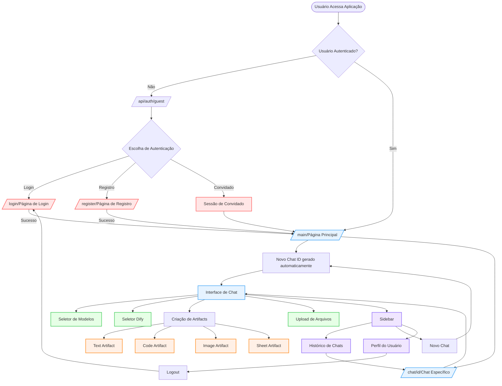
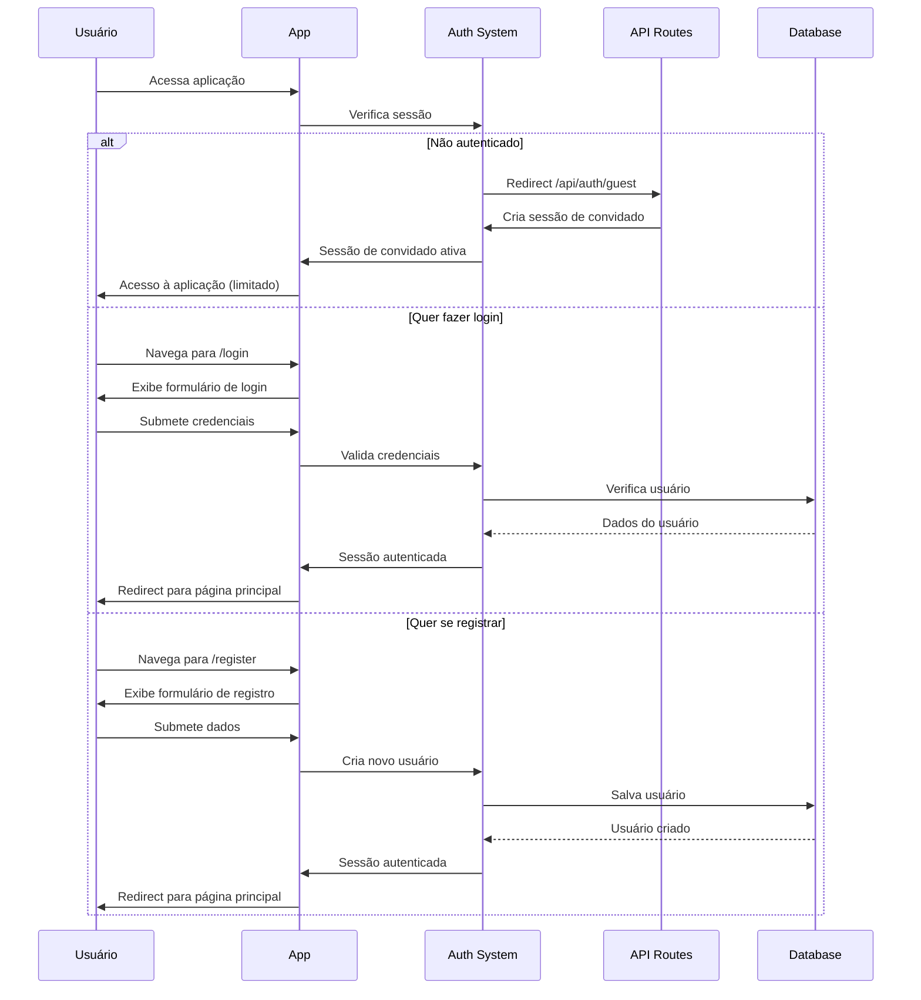
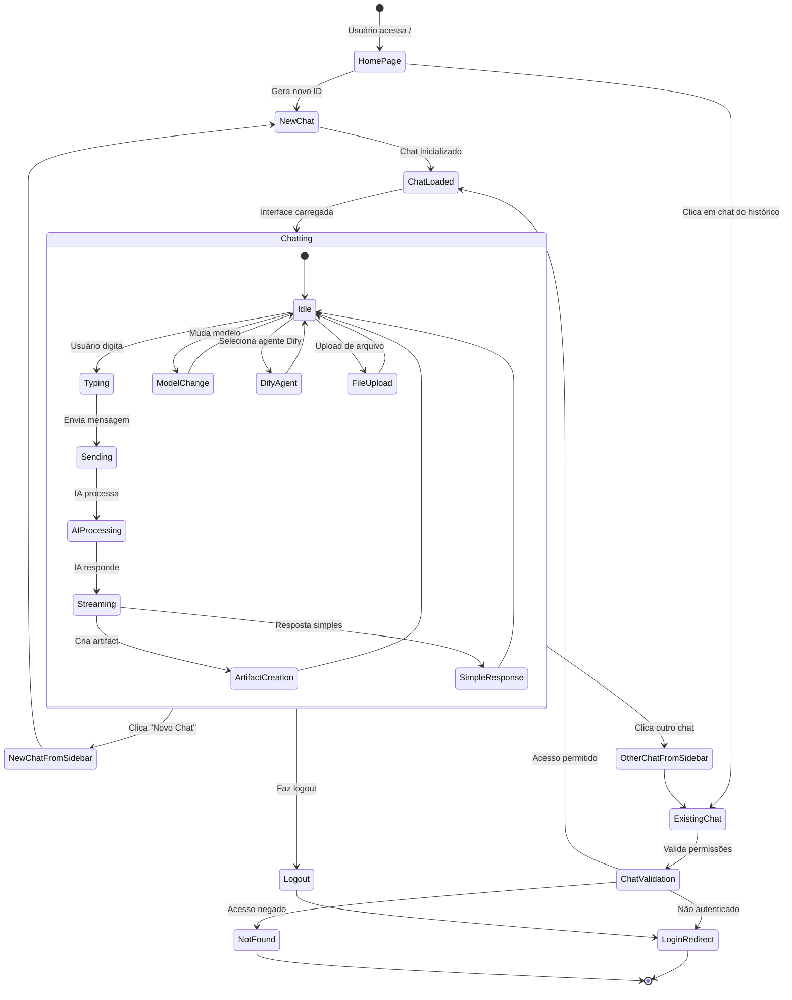
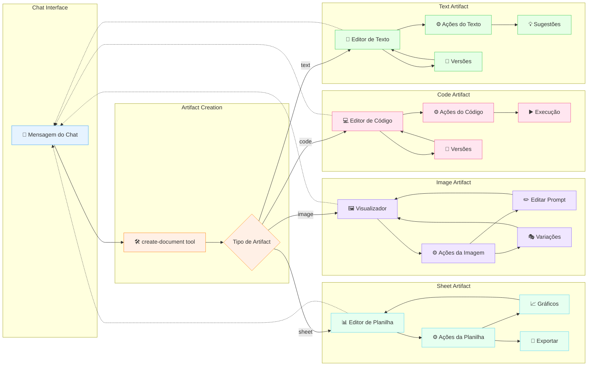
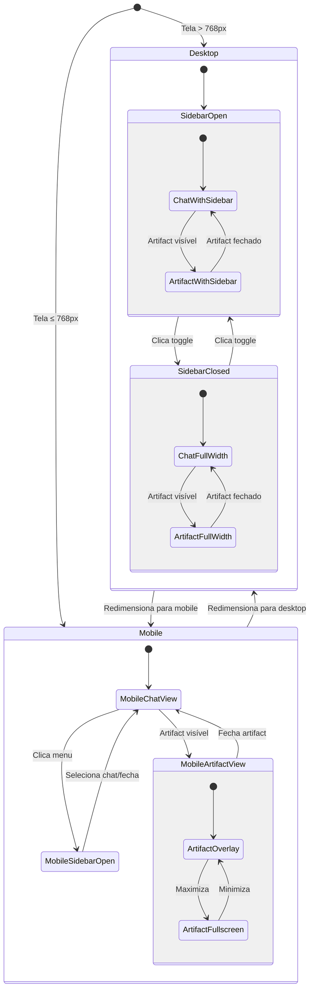
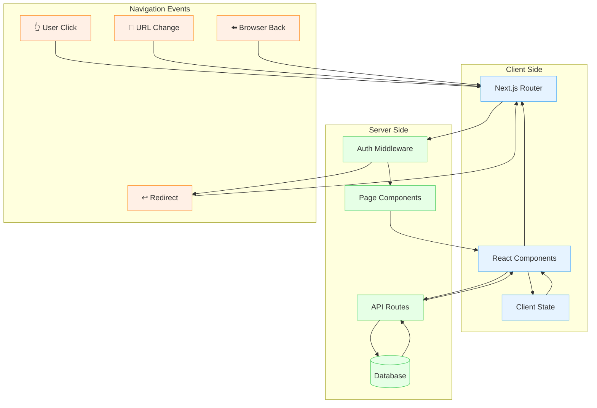
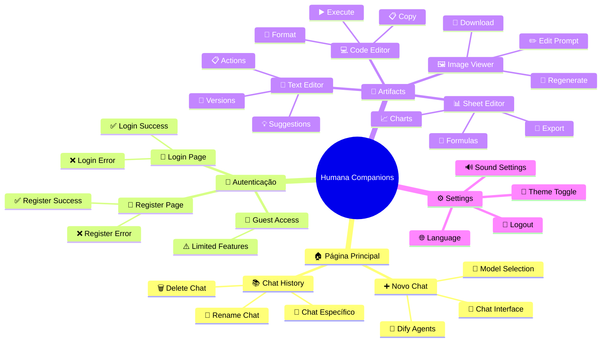
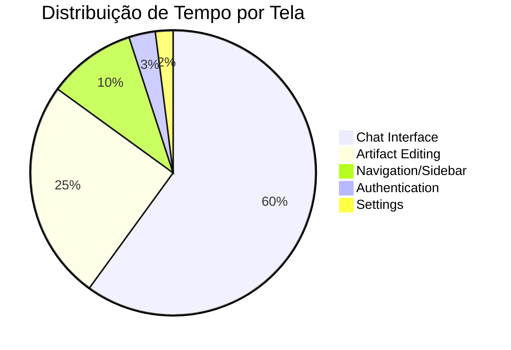
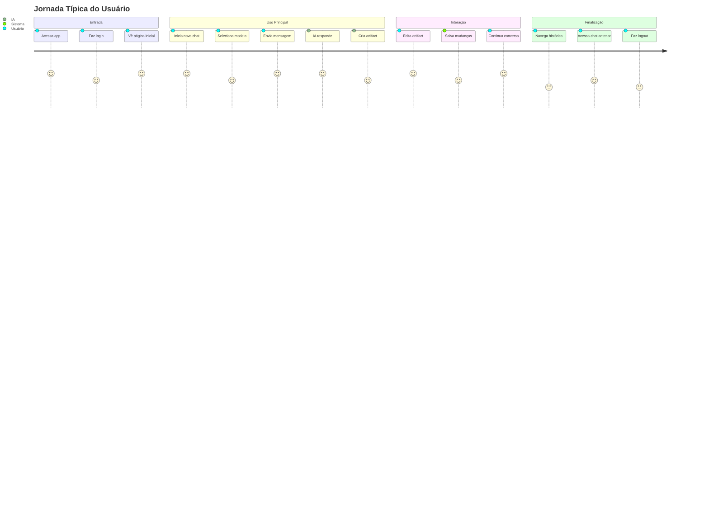

# 🧭 Navegação de Telas - Humana Companions

## 📋 Visão Geral

Este documento apresenta os diagramas de navegação de telas da aplicação Humana Companions, mostrando os fluxos de usuário, estados de autenticação e transições entre páginas.

## 🗺️ Mapa Geral de Navegação

## 🔐 Fluxo de Autenticação Detalhado

## 💬 Fluxo de Navegação do Chat

## 🎨 Navegação dos Artifacts

## 📱 Estados Responsivos da Interface

## 🔄 Fluxo de Dados e Navegação

## 🎯 Pontos de Entrada da Aplicação

## 📊 Métricas de Navegação

---

**🎯 Este mapa de navegação mostra como os usuários fluem através da aplicação, desde a autenticação até a criação colaborativa de artifacts!** 🧭✨ 