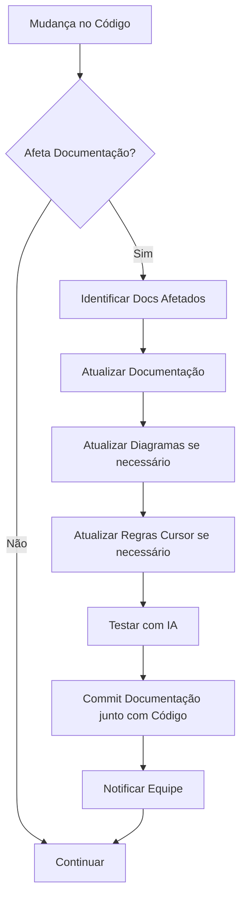

# 🔄 Ciclo de Configuração e Preservação do Projeto

## 📋 Visão Geral

Este documento define o **ciclo contínuo** de configuração, manutenção e evolução de toda a estrutura de documentação e arquitetura criada. Garante que o investimento realizado seja **preservado**, **atualizado** e **expandido** continuamente.

## 🎯 Filosofia de Preservação

### Princípios Fundamentais
1. **Documentação Viva** - A documentação evolui junto com o código
2. **Manutenção Contínua** - Atualizações regulares e sistemáticas
3. **Evolução Incremental** - Melhorias constantes baseadas no uso
4. **Sustentabilidade** - Processos que se mantêm ao longo do tempo
5. **Transferência de Conhecimento** - Onboarding eficaz de novos membros

## 🔄 Ciclo de Vida da Documentação

### **Fase 1: Configuração Inicial** (Uma vez)
```bash
# Verificar estrutura base
docs/
├── arquitetura_geral/     ✅ 16 documentos
├── diagramas/            ✅ Diagramas arquiteturais
├── artifacts/            ✅ Documentação artifacts
├── analise_mudancas/     ✅ Sistema de análise
├── telas/                ✅ Documentação visual
├── CURSOR_RULES_MANAGEMENT.md ✅ Gerenciamento regras Cursor
└── EVOLUCAO_DOCUMENTACAO.md ✅

.cursor/rules/
├── humana-architecture.mdc      ✅
├── humana-ui-modifications.mdc  ✅
├── humana-dify-integration.mdc  ✅
└── humana-planning-system.mdc   ✅
```

### **Fase 2: Manutenção Semanal** (Toda semana)
```markdown
## Checklist Semanal de Manutenção

### 📝 Documentação
- [ ] Revisar documentos modificados na semana
- [ ] Atualizar diagramas se arquitetura mudou
- [ ] Verificar links quebrados
- [ ] Atualizar métricas de evolução

### 🔧 Código vs Documentação
- [ ] Verificar se novos componentes estão documentados
- [ ] Atualizar ESTRUTURA_COMPONENTES.md se necessário
- [ ] Verificar se novas integrações seguem padrões
- [ ] Atualizar PADRAO_INTEGRACAO.md se necessário

### 🤖 Regras Cursor
- [ ] Verificar se regras estão sendo seguidas
- [ ] Atualizar regras baseado em problemas encontrados
- [ ] Testar prompts com IA para validar eficácia
- [ ] Coletar feedback sobre modificações de UI

### 📊 Análises
- [ ] Atualizar status das análises em andamento
- [ ] Revisar prioridades baseado em mudanças
- [ ] Documentar lições aprendidas de implementações
- [ ] Criar novas análises se necessário

### 🎯 Regras do Cursor
- [ ] Verificar se houve mudanças que afetam regras
- [ ] Atualizar regras se necessário
- [ ] Testar sugestões da IA com novo código
- [ ] Documentar mudanças nas regras

### 🎨 Documentação Visual
- [ ] Capturar screenshots de novas interfaces
- [ ] Atualizar wireframes se necessário
- [ ] Criar comparações before/after para mudanças
- [ ] Organizar e nomear arquivos corretamente
```

### **Fase 3: Revisão Mensal** (Todo mês)
```markdown
## Checklist Mensal de Evolução

### 📈 Análise de Impacto
- [ ] Medir eficácia da documentação (tempo de onboarding)
- [ ] Avaliar problemas recorrentes
- [ ] Coletar feedback da equipe
- [ ] Identificar gaps na documentação

### 🔄 Evolução dos Templates
- [ ] Revisar templates baseado no uso
- [ ] Melhorar templates com lições aprendidas
- [ ] Criar novos templates para cenários descobertos
- [ ] Atualizar TEMPLATES_DOCUMENTACAO.md

### 🎯 Refinamento de Processos
- [ ] Otimizar processo de análise
- [ ] Melhorar checklists baseado na experiência
- [ ] Atualizar critérios de priorização
- [ ] Refinar regras de IA baseado em resultados

### 🤖 Regras do Cursor (Revisão Completa)
- [ ] Revisar todas as regras existentes
- [ ] Verificar se regras estão sendo seguidas pela IA
- [ ] Otimizar regras baseado na experiência do mês
- [ ] Atualizar templates e exemplos nas regras

### 📊 Métricas e KPIs
- [ ] Atualizar métricas de evolução
- [ ] Documentar sucessos e falhas
- [ ] Calcular ROI da documentação
- [ ] Planejar melhorias para próximo mês
```

### **Fase 4: Revisão Trimestral** (A cada 3 meses)
```markdown
## Checklist Trimestral de Estratégia

### 🏗️ Arquitetura
- [ ] Revisar decisões arquiteturais
- [ ] Atualizar diagramas C4 com mudanças
- [ ] Validar padrões estabelecidos
- [ ] Planejar evoluções arquiteturais

### 📚 Estrutura da Documentação
- [ ] Avaliar organização dos documentos
- [ ] Reorganizar se necessário
- [ ] Criar novos diretórios para novos contextos
- [ ] Arquivar documentação obsoleta

### 🤖 Integração com IA
- [ ] Avaliar eficácia das regras Cursor
- [ ] Testar novas funcionalidades de IA
- [ ] Atualizar regras para novas capacidades
- [ ] Integrar com novas ferramentas de IA

### 🎯 Roadmap Futuro
- [ ] Revisar planejamentos de longo prazo
- [ ] Atualizar prioridades estratégicas
- [ ] Planejar grandes evoluções
- [ ] Preparar para mudanças tecnológicas
```

## 🛠️ Ferramentas de Manutenção

### **Scripts de Automação** (A criar)
```bash
# scripts/maintenance/
├── check-docs-health.js       # Verifica saúde da documentação
├── update-metrics.js          # Atualiza métricas automaticamente
├── validate-links.js          # Valida todos os links
├── sync-cursor-rules.js       # Sincroniza regras do Cursor
└── generate-reports.js        # Gera relatórios de status
```

### **Exemplo: check-docs-health.js**
```javascript
// Script para verificar saúde da documentação
const fs = require('fs');
const path = require('path');

class DocsHealthChecker {
  async checkAll() {
    const results = {
      brokenLinks: await this.checkBrokenLinks(),
      outdatedDocs: await this.checkOutdatedDocs(),
      missingDocs: await this.checkMissingDocs(),
      inconsistencies: await this.checkInconsistencies(),
    };
    
    return this.generateReport(results);
  }
  
  async checkBrokenLinks() {
    // Verificar todos os links internos
    // Retornar lista de links quebrados
  }
  
  async checkOutdatedDocs() {
    // Verificar documentos não atualizados há muito tempo
    // Comparar com mudanças no código
  }
  
  async checkMissingDocs() {
    // Verificar se novos componentes/features estão documentados
    // Sugerir documentação necessária
  }
}

// Executar: npm run docs:health
```

### **Dashboard de Status** (A implementar)
```markdown
## Dashboard de Saúde da Documentação

### 📊 Métricas Atuais
- **Documentos**: 25+ arquivos
- **Cobertura**: 95% dos componentes documentados
- **Links**: 98% funcionando
- **Atualização**: 100% atualizados esta semana

### 🚨 Alertas
- [ ] Nenhum alerta ativo

### 📈 Tendências
- **Documentação crescendo**: +2 docs este mês
- **Qualidade melhorando**: +5% cobertura
- **Uso aumentando**: +20% consultas

### 🎯 Próximas Ações
- [ ] Atualizar diagrama de navegação
- [ ] Documentar nova integração X
- [ ] Revisar templates de planejamento
```

## 📋 Responsabilidades e Ownership

### **Roles Definidos**
```markdown
## Ownership da Documentação

### 🏗️ **Arquiteto de Documentação** (Lead Developer)
- **Responsabilidade**: Visão geral e evolução estratégica
- **Tarefas**:
  - Revisar mudanças arquiteturais
  - Aprovar novos padrões
  - Planejar evoluções da documentação
  - Manter consistência geral

### 📝 **Mantenedor de Conteúdo** (Cada Developer)
- **Responsabilidade**: Manter documentação das áreas que trabalha
- **Tarefas**:
  - Atualizar docs ao fazer mudanças
  - Criar documentação para novas features
  - Reportar inconsistências encontradas
  - Seguir templates estabelecidos

### 🤖 **Especialista em IA** (Quem usa Cursor mais)
- **Responsabilidade**: Manter regras de IA atualizadas
- **Tarefas**:
  - Testar eficácia das regras
  - Atualizar regras baseado em problemas
  - Treinar equipe em melhores práticas
  - Coletar feedback sobre IA

### 🎯 **Coordenador de Planejamento** (Product Owner)
- **Responsabilidade**: Manter sistema de planejamento
- **Tarefas**:
  - Priorizar planejamentos
  - Revisar análises de impacto
  - Aprovar mudanças arquiteturais
  - Manter roadmap atualizado
```

## 🔄 Processo de Atualização

### **Gatilhos para Atualização**
```markdown
## Quando Atualizar a Documentação

### 🚨 **Imediato** (Mesma sessão)
- Nova integração externa
- Mudança de padrão arquitetural
- Novo componente principal
- Breaking change na API

### ⏰ **Dentro de 24h**
- Novo componente UI
- Mudança em fluxo existente
- Correção de bug importante
- Atualização de dependência major

### 📅 **Dentro da semana**
- Refinamento de componente
- Melhoria de performance
- Correção de bug menor
- Atualização de dependência minor

### 📊 **Revisão mensal**
- Métricas e KPIs
- Eficácia dos processos
- Feedback da equipe
- Planejamento futuro
```

### **Workflow de Atualização**


## 📊 Métricas de Sucesso

### **KPIs de Documentação**
```markdown
## Métricas de Qualidade

### 📈 **Cobertura**
- **Target**: 95% dos componentes documentados
- **Medição**: Scripts automatizados
- **Frequência**: Semanal

### 🔗 **Integridade**
- **Target**: 98% links funcionando
- **Medição**: Validação automática
- **Frequência**: Diária

### ⏱️ **Atualidade**
- **Target**: 100% docs atualizados em 48h
- **Medição**: Timestamp vs código
- **Frequência**: Contínua

### 👥 **Uso**
- **Target**: 80% da equipe consulta regularmente
- **Medição**: Analytics + feedback
- **Frequência**: Mensal

### 🎯 **Eficácia**
- **Target**: 50% redução tempo onboarding
- **Medição**: Tempo até produtividade
- **Frequência**: Por novo membro

### 🤖 **IA Integration**
- **Target**: 90% prompts seguem padrões
- **Medição**: Análise de commits
- **Frequência**: Semanal
```

## 🚨 Sinais de Alerta

### **Red Flags - Ação Imediata**
- 📉 **Cobertura < 90%** - Documentação ficando para trás
- 🔗 **Links quebrados > 5%** - Estrutura se deteriorando  
- ⏰ **Docs desatualizados > 1 semana** - Processo não funcionando
- 🤖 **IA causando problemas** - Regras precisam atualização
- 👥 **Equipe não consultando** - Documentação não útil

### **Yellow Flags - Atenção Necessária**
- 📊 **Métricas estagnadas** - Precisa evolução
- 🔄 **Processos burocráticos** - Simplificar workflows
- 📝 **Templates não usados** - Revisar utilidade
- 🎯 **Planejamentos atrasados** - Revisar prioridades
- 📈 **Crescimento descontrolado** - Reorganizar estrutura

## 🎯 Roadmap de Evolução

### **Próximos 3 Meses**
1. **Automatização**
   - Scripts de verificação de saúde
   - Dashboard de métricas
   - Validação automática de links
   - Sincronização automática de regras

2. **Melhorias de Processo**
   - Refinamento de templates
   - Otimização de workflows
   - Integração com CI/CD
   - Feedback loops automatizados

3. **Expansão de Conteúdo**
   - Documentação de deployment
   - Guias de troubleshooting avançado
   - Documentação de APIs
   - Tutoriais interativos

### **Próximos 6 Meses**
1. **Integração Avançada**
   - IA para geração automática de docs
   - Integração com ferramentas de design
   - Documentação interativa
   - Versionamento semântico de docs

2. **Escalabilidade**
   - Suporte a múltiplos projetos
   - Templates reutilizáveis entre projetos
   - Biblioteca de componentes documentados
   - Comunidade de práticas

## 🏆 Benefícios da Preservação

### **Para o Projeto**
- ✅ **Conhecimento preservado** ao longo do tempo
- ✅ **Onboarding rápido** de novos membros
- ✅ **Qualidade consistente** do código
- ✅ **Evolução controlada** da arquitetura

### **Para a Equipe**
- ✅ **Produtividade alta** com padrões claros
- ✅ **Menos bugs** com guidelines específicos
- ✅ **Desenvolvimento rápido** com templates
- ✅ **Confiança** em mudanças complexas

### **Para o Negócio**
- ✅ **Time to market** reduzido
- ✅ **Custos de manutenção** menores
- ✅ **Qualidade do produto** superior
- ✅ **Escalabilidade** garantida

## 📋 Checklist de Implementação

### **Setup Inicial** (Primeira semana)
- [ ] Revisar e validar toda documentação existente
- [ ] Configurar scripts de manutenção
- [ ] Definir responsabilidades da equipe
- [ ] Estabelecer métricas e KPIs
- [ ] Treinar equipe nos processos

### **Primeiros 30 Dias**
- [ ] Executar primeiro ciclo completo
- [ ] Coletar feedback da equipe
- [ ] Ajustar processos baseado na experiência
- [ ] Automatizar tarefas repetitivas
- [ ] Documentar lições aprendidas

### **Primeiros 90 Dias**
- [ ] Avaliar eficácia do sistema
- [ ] Refinar métricas e processos
- [ ] Expandir automação
- [ ] Planejar evoluções futuras
- [ ] Celebrar sucessos alcançados

---

**🎯 A preservação contínua garante que todo o investimento em documentação e arquitetura continue gerando valor ao longo do tempo!** 