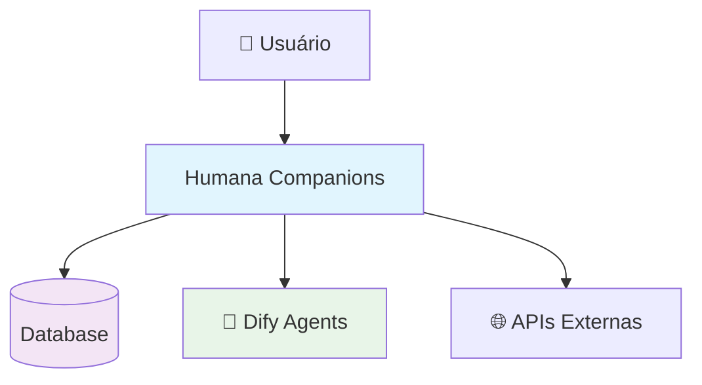
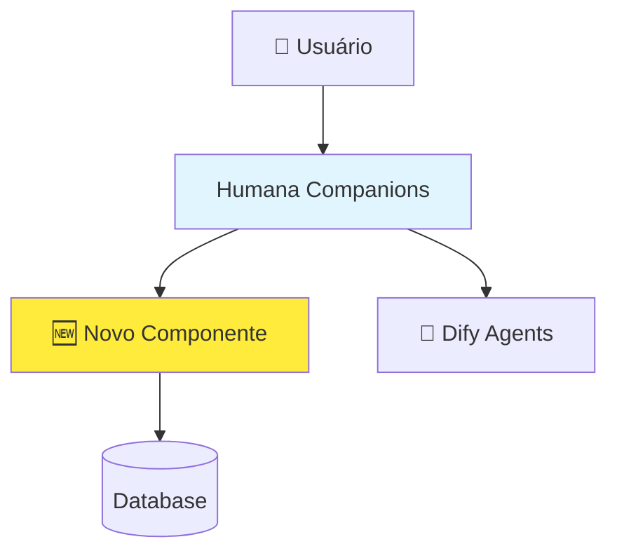
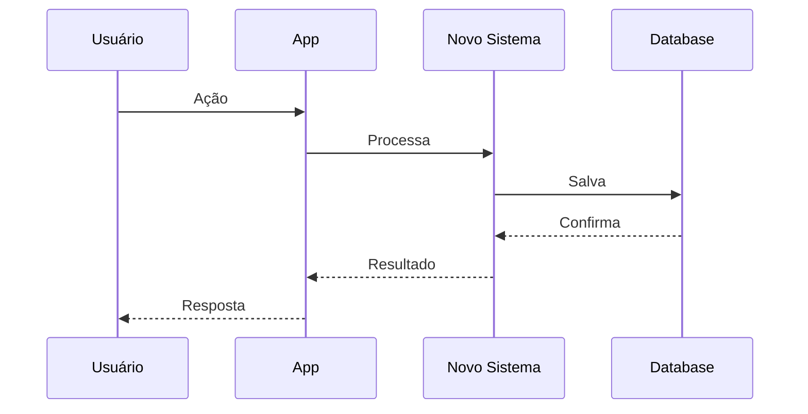

# Sistema de Análise de Mudanças

## 📋 Visão Geral

Este diretório contém o **sistema de análise de mudanças** para mudanças arquiteturais complexas na aplicação Humana Companions. Cada mudança significativa deve ser **analisada antes de implementada** para garantir a melhor arquitetura e minimizar riscos.

## 🎯 Filosofia

### Princípios Fundamentais
- **Analisar antes de codificar** - Nunca implementar mudanças complexas sem análise prévia
- **Análise de impacto** - Entender todas as dependências e efeitos colaterais
- **Prototipagem conceitual** - Validar ideias com diagramas e documentação
- **Iteração incremental** - Quebrar mudanças grandes em etapas menores
- **Validação contínua** - Revisar decisões arquiteturais regularmente

## 📊 Status das Análises

### 🚀 Em Análise

#### 1. **MCP Integration** (Complexidade: Alta)
- **Status**: 📊 Análise de impacto + **Diagramas criados** ✅
- **Próximo**: Arquitetura proposta (texto)
- **Prioridade**: Alta - Fundação para context-aware AI
- **Diagramas**: [Contexto Atual](./mcp-integration/diagramas/contexto-atual.md) | [Arquitetura Proposta](./mcp-integration/diagramas/arquitetura-proposta.md) | [Comparação](./mcp-integration/diagramas/comparacao.md)

#### 2. **RAG Data Room** (Complexidade: Muito Alta)  
- **Status**: 📊 Análise de impacto + **Diagramas iniciados** ⚡
- **Próximo**: Completar diagramas + Arquitetura proposta
- **Prioridade**: Alta - Base de conhecimento organizacional
- **Diagramas**: [Contexto Atual](./rag-dataroom/diagramas/contexto-atual.md) | 🚧 Arquitetura Proposta | 🚧 Comparação

#### 3. **UI Chat Generative (ReAct)** (Complexidade: Média-Alta)
- **Status**: 📊 **Análise completa + Diagramas criados** ✅
- **Próximo**: Arquitetura proposta (texto) + Implementação em fases
- **Prioridade**: Alta - Diferencial competitivo significativo
- **Diagramas**: [Contexto Atual](./ui-chat-generativo-react/diagramas/contexto-atual.md) | [Arquitetura Proposta](./ui-chat-generativo-react/diagramas/arquitetura-proposta.md) | [Comparação](./ui-chat-generativo-react/diagramas/comparacao.md)
- **Framework**: ReAct (Reasoning + Acting) para parsing de prompts
- **Benefícios**: +70% produtividade, +47% satisfação, UI adaptativa

#### 4. **Agentes Companions** (Complexidade: Muito Alta)
- **Status**: 📊 **Análise completa + Diagramas criados** ✅
- **Próximo**: Arquitetura proposta (texto) + Implementação em fases
- **Prioridade**: Alta - Core business feature
- **Diagramas**: [Contexto Atual](./agentes-companions/diagramas/contexto-atual.md) | [Arquitetura Proposta](./agentes-companions/diagramas/arquitetura-proposta.md) | [Comparação](./agentes-companions/diagramas/comparacao.md) | [Fluxo de Dados](./agentes-companions/diagramas/fluxo-dados.md) | [Componentes](./agentes-companions/diagramas/componentes.md)
- **Framework**: Multi-LLM (OpenAI, Gemini, Claude) + Custom Orchestration
- **Benefícios**: +50% task success, +89% retention, -58% cost per query

#### 5. **Novas Telas** (Complexidade: Média)
- **Status**: 📋 Pendente análise de impacto
- **Próximo**: Análise de impacto
- **Prioridade**: Média - Designer interfaces

#### 6. **Apps Internos** (Complexidade: Muito Alta)
- **Status**: 📋 Pendente análise de impacto
- **Próximo**: Análise de impacto
- **Prioridade**: Baixa - Extensibilidade futura

#### 7. **Marketplace Companions** (Complexidade: Muito Alta)
- **Status**: 📋 Pendente análise de impacto
- **Próximo**: Análise de impacto
- **Prioridade**: Baixa - Monetização futura

## 🗂️ Estrutura de Análise

Cada análise segue a estrutura padronizada:

```
📁 [nome-da-analise]/
├── analise-impacto.md       # Análise completa de impacto
├── arquitetura-proposta.md  # Arquitetura detalhada da solução
├── diagramas/              # 📊 DIAGRAMAS OBRIGATÓRIOS
│   ├── contexto-atual.md    # Diagrama C4 do estado atual
│   ├── arquitetura-proposta.md # Diagrama C4 da solução
│   ├── fluxo-dados.md       # Fluxo de dados e integração
│   ├── componentes.md       # Diagrama de componentes internos
│   └── comparacao.md        # Before vs After visual
├── implementacao-fases.md   # Fases detalhadas de implementação
└── validacao-testes.md     # Estratégia de testes e validação
```

## 📋 Templates Disponíveis

### Por Tipo de Mudança
- **Nova Integração Externa** - APIs e serviços externos
- **Nova Funcionalidade UI** - Interfaces e componentes
- **Mudança Arquitetural** - Alterações na arquitetura
- **Sistema Completo** - Novos sistemas ou módulos

### Documentos Obrigatórios
1. **Análise de Impacto** - Componentes afetados, riscos, dependências
2. **Arquitetura Proposta** - Solução técnica detalhada
3. **📊 Diagramas** - **OBRIGATÓRIOS** - Visualização completa da mudança
4. **Implementação em Fases** - Quebra em etapas executáveis
5. **Validação e Testes** - Estratégia de validação

## 🎯 Processo de Análise

### Fase 1: Análise de Impacto
- [ ] Identificar componentes afetados
- [ ] Mapear dependências técnicas
- [ ] **Criar diagrama do contexto atual**
- [ ] Avaliar riscos e mitigações
- [ ] Definir critérios de sucesso
- [ ] Estimar custos e recursos

### Fase 2: Arquitetura Proposta
- [ ] Desenhar solução técnica
- [ ] **Criar diagrama da arquitetura proposta**
- [ ] Justificar decisões arquiteturais
- [ ] Comparar alternativas
- [ ] Definir APIs e estruturas de dados
- [ ] Planejar integração com sistema atual

### Fase 3: Diagramas e Visualização ⭐ **EXPANDIDA**
- [ ] **Diagrama C4 - Contexto atual** (obrigatório)
- [ ] **Diagrama C4 - Arquitetura proposta** (obrigatório)
- [ ] **Fluxo de dados** - Como dados circulam (obrigatório)
- [ ] **Diagrama de componentes** - Estrutura interna (obrigatório)
- [ ] **Comparação visual** - Before vs After (obrigatório)
- [ ] **Sequência de interações** - Se necessário
- [ ] **Wireframes de UI** - Se mudança visual

### Fase 4: Implementação em Fases
- [ ] Quebrar em fases executáveis
- [ ] **Mapear dependências entre fases**
- [ ] Definir entregas incrementais
- [ ] Estabelecer marcos e checkpoints
- [ ] Planejar migração e rollback

### Fase 5: Validação e Testes
- [ ] Definir estratégia de testes
- [ ] Estabelecer métricas de validação
- [ ] Planejar testes de performance
- [ ] Criar planos de contingência

## 🚨 Critérios para Análise Formal

Uma mudança requer análise formal se:
- [ ] Afeta **múltiplos módulos** da aplicação
- [ ] Introduz **novas dependências** externas
- [ ] Modifica **padrões arquiteturais** existentes
- [ ] Impacta **performance** ou **escalabilidade**
- [ ] Requer **migração de dados** ou **breaking changes**
- [ ] Envolve **integrações complexas**

## 📊 Priorização de Análises

### Critérios de Priorização
1. **Impacto no negócio** - Benefício direto para usuários
2. **Dependências** - Outras análises dependem desta mudança
3. **Complexidade** - Risco técnico e esforço necessário
4. **Recursos disponíveis** - Capacidade da equipe
5. **Timeline** - Urgência e deadlines

### Matriz de Priorização
```
Alto Impacto + Baixa Complexidade = 🟢 Prioridade Máxima
Alto Impacto + Alta Complexidade  = 🟡 Prioridade Alta
Baixo Impacto + Baixa Complexidade = 🟡 Prioridade Média
Baixo Impacto + Alta Complexidade  = 🔴 Prioridade Baixa
```

## 🛠️ Ferramentas de Apoio

### Diagramas
- **Mermaid** - Para diagramas em markdown
- **Draw.io** - Para diagramas complexos
- **Figma** - Para mockups de UI

### Validação
- **Checklists** - Templates de validação
- **Métricas** - KPIs de sucesso
- **Testes** - Estratégias de validação

### Documentação
- **Templates** - Modelos reutilizáveis
- **Referências** - Links para documentação existente
- **Exemplos** - Casos de uso práticos

## 📊 Diagramas Obrigatórios

### 🎯 **Por que Diagramas são Obrigatórios?**
- **Comunicação visual** - Stakeholders entendem melhor
- **Validação técnica** - Identificar problemas antes da implementação
- **Documentação viva** - Referência visual para desenvolvimento
- **Análise de impacto** - Ver claramente o que será afetado
- **Tomada de decisão** - Comparar alternativas visualmente

### 📋 **Checklist de Diagramas por Análise**

#### ✅ **Obrigatórios para TODA análise:**
- [ ] **Contexto Atual** - Diagrama C4 mostrando estado atual
- [ ] **Arquitetura Proposta** - Diagrama C4 da solução
- [ ] **Fluxo de Dados** - Como informação circula
- [ ] **Comparação Visual** - Before vs After

#### 🔧 **Obrigatórios por TIPO de mudança:**

**Nova Integração Externa:**
- [ ] **Diagrama de Integração** - APIs e fluxos externos
- [ ] **Sequência de Autenticação** - Se aplicável
- [ ] **Error Handling Flow** - Tratamento de erros

**Nova Funcionalidade UI:**
- [ ] **Wireframes** - Layout das telas
- [ ] **User Journey** - Fluxo do usuário
- [ ] **Component Tree** - Hierarquia de componentes

**Mudança Arquitetural:**
- [ ] **Containers Afetados** - Quais sistemas mudam
- [ ] **Migration Path** - Caminho de migração
- [ ] **Rollback Strategy** - Estratégia de volta

**Sistema Completo:**
- [ ] **Diagrama C4 Completo** - Todos os níveis
- [ ] **Database Schema** - Estrutura de dados
- [ ] **Deployment Architecture** - Como será deployado

### 🎨 **Padrões de Diagramas**

#### **1. Diagrama C4 - Contexto Atual**


#### **2. Diagrama C4 - Arquitetura Proposta**


#### **3. Fluxo de Dados**


### 📁 **Organização dos Diagramas**

Cada análise deve ter:
```
📁 [nome-da-analise]/
├── diagramas/
│   ├── contexto-atual.md      # Estado atual do sistema
│   ├── arquitetura-proposta.md # Como ficará após mudança
│   ├── fluxo-dados.md         # Como dados circulam
│   ├── componentes.md         # Componentes internos
│   ├── comparacao.md          # Before vs After
│   └── [específicos]/         # Diagramas específicos do tipo
```

### 🔍 **Templates de Diagramas**

#### **Template: contexto-atual.md**
```markdown
# Contexto Atual - [Nome da Mudança]

## Visão Geral
Descrição do estado atual do sistema antes da mudança.

## Diagrama C4 - Contexto
```mermaid
[diagrama aqui]
```

## Componentes Atuais
- **Component A**: Função atual
- **Component B**: Função atual

## Limitações Identificadas
- Limitação 1
- Limitação 2
```

#### **Template: arquitetura-proposta.md**
```markdown
# Arquitetura Proposta - [Nome da Mudança]

## Visão Geral
Descrição da arquitetura após a implementação.

## Diagrama C4 - Proposta
```mermaid
[diagrama aqui]
```

## Novos Componentes
- **Novo Component**: Função proposta

## Benefícios da Mudança
- Benefício 1
- Benefício 2
```

### 🚀 **Processo de Criação**

1. **Análise** → Criar diagrama do contexto atual
2. **Proposta** → Desenhar arquitetura da solução
3. **Fluxos** → Mapear como dados circulam
4. **Comparação** → Before vs After visual
5. **Validação** → Revisar com equipe técnica

## 📚 Documentação de Referência

### Arquitetura Base
- `docs/arquitetura_geral/PLANEJAMENTO_EVOLUTIVO.md` - Processo completo
- `docs/arquitetura_geral/PADRAO_INTEGRACAO.md` - Padrões de integração
- `docs/arquitetura_geral/CHECKLIST_INTEGRACAO.md` - Checklist de validação

### Diagramas e Visualização
- `docs/diagramas/` - Diagramas da arquitetura atual
- `docs/diagramas/arquitetura-c4.md` - Padrão C4 de diagramas

### Implementação
- `docs/arquitetura_geral/BOAS_PRATICAS_CODIGO.md` - Padrões de código
- `docs/arquitetura_geral/DEBUGGING_STRATEGIES.md` - Estratégias de debug

## 🎯 Próximos Passos

### Imediatos (Semana 1-2)
1. **✅ MCP Integration** - Diagramas completos, próximo: arquitetura proposta (texto)
2. **⚡ RAG Data Room** - Completar diagramas restantes + arquitetura proposta
3. **✅ UI Chat Generative** - Análise + diagramas completos, próximo: implementação em fases

### Médio Prazo (Semana 3-6)
1. **Iniciar Agentes Companions** - Análise de impacto + diagramas obrigatórios
2. **Completar Novas Telas** - Análise completa com diagramas
3. **Validar primeiros protótipos** - MCP, RAG e UI Generativa

### Longo Prazo (Mês 2-3)
1. **Apps Internos** - Análise completa com diagramas
2. **Marketplace Companions** - Análise completa com diagramas
3. **Implementação das primeiras fases** - Execução dos planos validados

### 📊 Status Consolidado
- **🟢 Completas**: UI Chat Generative (análise + diagramas), **Agentes Companions (análise + diagramas)**
- **🟡 Em Progresso**: MCP Integration (diagramas ✅), RAG Data Room (diagramas ⚡)
- **🔴 Pendentes**: Novas Telas, Apps Internos, Marketplace

## 🔄 Evolução do Sistema

Este sistema de análise deve evoluir continuamente:
- **Feedback loops** - Aprender com implementações
- **Template improvements** - Melhorar templates baseado na experiência
- **Process optimization** - Otimizar processo baseado em resultados
- **Tool integration** - Integrar ferramentas que facilitem a análise

---

**Lembre-se**: O objetivo não é burocratizar, mas sim **garantir que mudanças complexas sejam bem pensadas** antes de serem implementadas, evitando retrabalho e problemas arquiteturais.