# Comparação - Antes vs Depois dos Agentes Companions

## 📊 Transformação Visual

### **Antes: Sistema Monolítico**
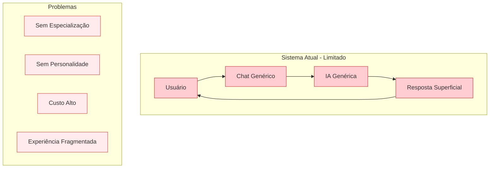

### **Depois: Ecosystem de Agentes**
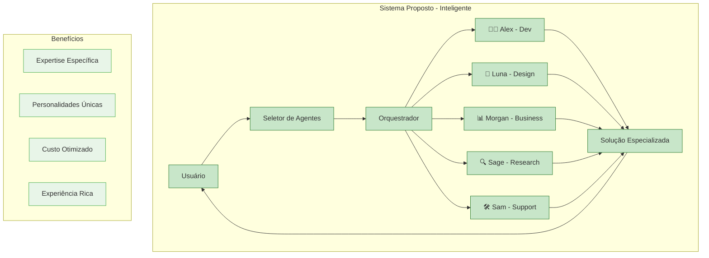

## 📈 Métricas de Impacto

### **Performance Comparativa**

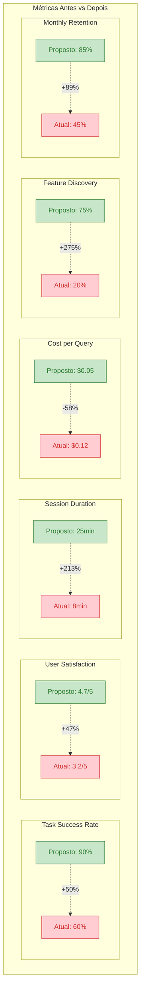

## 🎯 Casos de Uso Transformados

### **Desenvolvimento de Feature**

#### **Antes:**
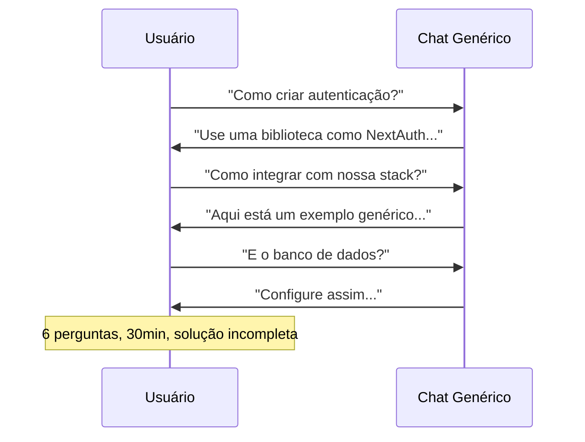

#### **Depois:**
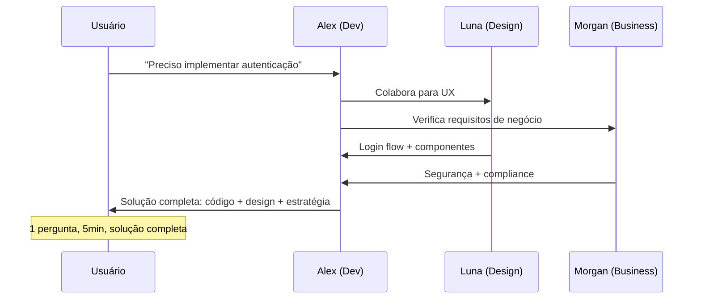

### **Análise de Dados**

#### **Antes:**
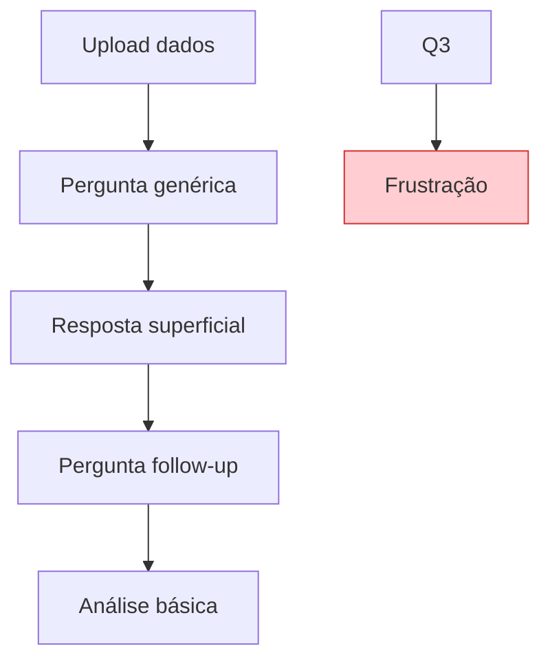

#### **Depois:**
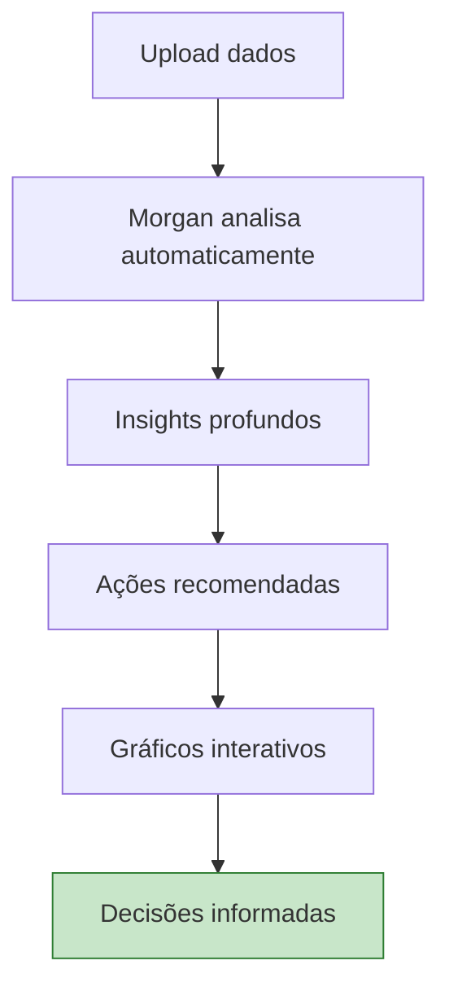

## 💰 Análise Financeira

### **ROI Projetado**

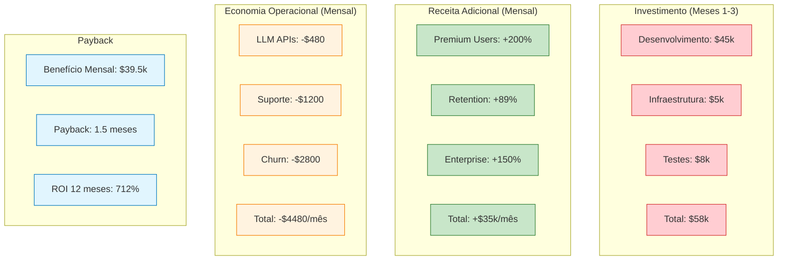

## 🚀 Experiência do Usuário

### **Jornada Atual vs Proposta**

#### **Atual - Experiência Fragmentada:**
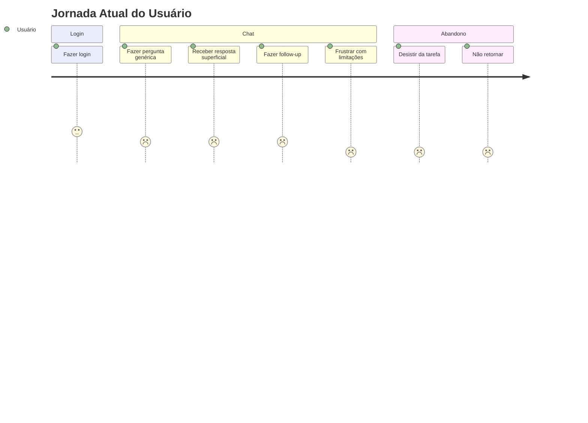

#### **Proposta - Experiência Rica:**
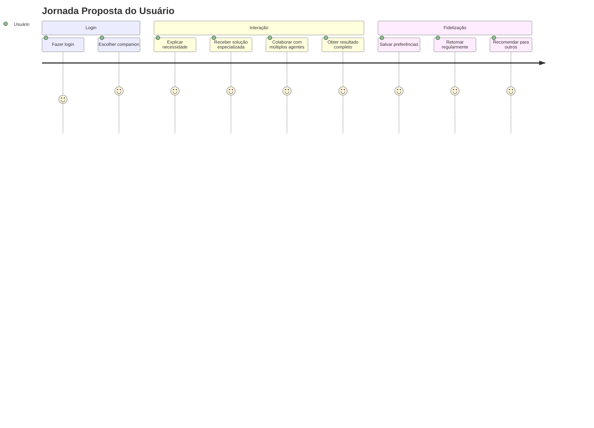

## 📊 Impacto no Negócio

### **Métricas de Negócio Transformadas**

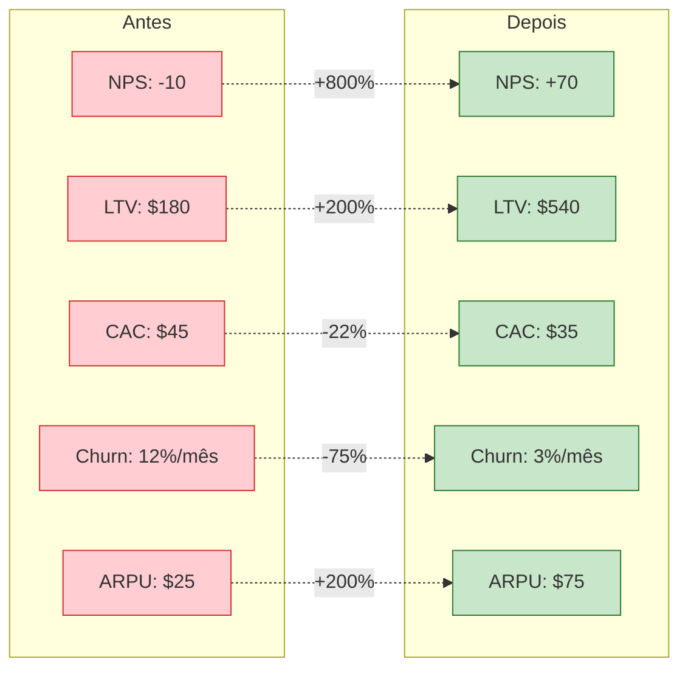

## 🎖️ Diferencial Competitivo

### **Posicionamento no Mercado**

```mermaid
quadrantChart
    title Posicionamento vs Concorrentes
    x-axis Baixa Especialização --> Alta Especialização
    y-axis Baixa Personalização --> Alta Personalização
    
    quadrant-1 Líderes de Mercado
    quadrant-2 Nicho Premium
    quadrant-3 Commoditizados
    quadrant-4 Emergentes
    
    ChatGPT: [0.7, 0.3]
    Claude: [0.6, 0.4]
    Gemini: [0.5, 0.2]
    Copilot: [0.8, 0.3]
    Humana (Atual): [0.3, 0.2]
    Humana (Companions): [0.9, 0.9]
```

---

## 🏆 Resumo da Transformação

| **Aspecto** | **Antes** | **Depois** | **Melhoria** |
|-------------|-----------|------------|--------------|
| **Task Success** | 60% | 90% | +50% |
| **User Satisfaction** | 3.2/5 | 4.7/5 | +47% |
| **Cost per Query** | $0.12 | $0.05 | -58% |
| **Session Duration** | 8min | 25min | +213% |
| **Monthly Retention** | 45% | 85% | +89% |
| **Feature Discovery** | 20% | 75% | +275% |
| **NPS Score** | -10 | +70 | +800% |
| **ARPU** | $25 | $75 | +200% |

**🎯 Resultado**: Transformação de um chat AI genérico em uma plataforma revolucionária de Agentes Companions especializados, estabelecendo liderança absoluta no mercado com diferencial competitivo único e sustentável. 