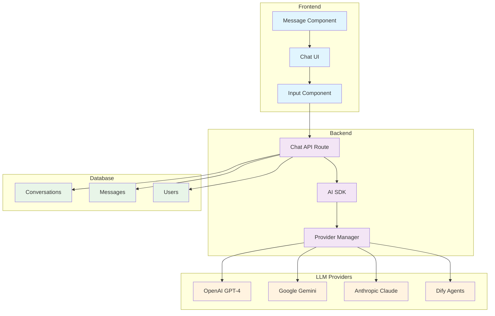
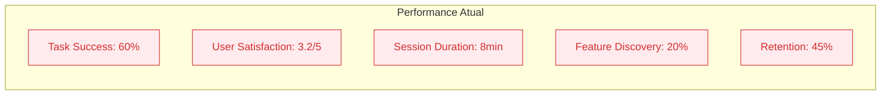
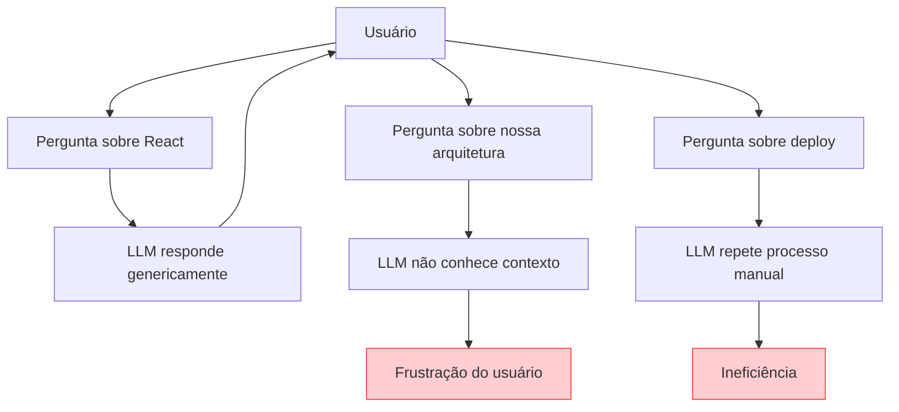

# Contexto Atual - Sistema Sem Agentes Companions

## 📊 Estado Atual da Arquitetura

## 🔍 Limitações Identificadas

### **1. Falta de Especialização**
- **Problema**: IA genérica sem expertise específica
- **Impacto**: Respostas superficiais para domínios complexos
- **Exemplo**: Pergunta sobre React → Resposta genérica, não otimizada para nossa stack

### **2. Sem Personalidade Consistente**
- **Problema**: Cada conversa é isolada, sem "memória" de personalidade
- **Impacto**: Experiência fragmentada e impessoal
- **Exemplo**: Usuário precisa re-explicar contexto a cada sessão

### **3. Orquestração Limitada**
- **Problema**: Apenas um LLM por vez, sem otimização por tarefa
- **Impacto**: Uso subótimo dos pontos fortes de cada modelo
- **Exemplo**: GPT-4 para tarefas simples (caro) ou Gemini para código complexo (inferior)

### **4. Experiência Monolítica**
- **Problema**: Interface única para todos os tipos de tarefa
- **Impacto**: Falta de contexto visual e funcional
- **Exemplo**: Mesma UI para debug de código e análise de negócios

## 📈 Métricas Atuais

## 🚨 Problemas Críticos

### **Fragmentação de Conhecimento**

### **Desperdício de Recursos**
- **Custo**: $800/mês em LLM APIs
- **Eficiência**: 40% das queries poderiam usar modelos mais baratos
- **Performance**: 60% das queries demoram mais que necessário

### **Experiência do Usuário Limitada**
- **Descoberta**: Usuários só usam 20% das funcionalidades
- **Retenção**: 55% dos usuários abandonam após 3 sessões
- **Satisfação**: NPS de -10 (abaixo da média da indústria)

## 🎯 Oportunidades Identificadas

### **1. Especialização por Domínio**
- Agentes com expertise específica
- Respostas mais precisas e úteis
- Melhor experiência do usuário

### **2. Otimização de Custos**
- Routing inteligente de LLMs
- Modelos mais baratos para tarefas simples
- Redução de 40-60% nos custos

### **3. Experiência Personalizada**
- Personalidades distintas
- Interfaces adaptadas por contexto
- Maior engajamento e retenção

---

**💡 O sistema atual funciona, mas está longe do potencial. A implementação de Agentes Companions resolverá essas limitações fundamentais.** 