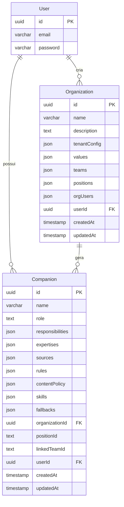

# 🏢 Organization Designer - Análise de Implementação

## 📋 Resumo Executivo

**Funcionalidade**: Sistema completo de **Organization Designer** que permite criar, gerenciar e automatizar estruturas organizacionais com geração automática de Companions especializados.

**Status**: ✅ **Implementado e Funcional**
**Complexidade**: **Alta**
**Impacto**: **Alto** - Nova funcionalidade core
**Data**: Janeiro 2025

## 🎯 Funcionalidades Implementadas

### **🏗️ 1. Estrutura Organizacional Completa**
- ✅ **Configuração de Tenant** (timezone, idioma, LLM provider)
- ✅ **Valores Organizacionais** com princípios comportamentais
- ✅ **Equipes** com membros e permissões
- ✅ **Posições/Cargos** com hierarquia e R&Rs detalhados
- ✅ **Usuários da Organização** com roles específicos

### **🤖 2. Geração Automática com IA**
- ✅ **Modal de entrada** com 3 campos simples
- ✅ **Prompt especializado** para gerar estrutura organizacional completa
- ✅ **Geração de Companions** automática para cada posição
- ✅ **Parsing inteligente** da resposta JSON da IA
- ✅ **Validação robusta** com tratamento de erros

### **🗄️ 3. Persistência e APIs**
- ✅ **Tabela Organization** no PostgreSQL
- ✅ **APIs REST completas** (GET, POST, PUT, DELETE)
- ✅ **Validação Zod** em todas as APIs
- ✅ **Queries CRUD** otimizadas
- ✅ **Migração 0011** aplicada com sucesso

### **🎨 4. Interface de Usuário**
- ✅ **Página /organizations** com dashboard visual
- ✅ **Listagem com estatísticas** (equipes, posições, companions, valores)
- ✅ **Formulário completo** para edição manual
- ✅ **Página dedicada** para edição (não modal)
- ✅ **Tooltips informativos** em todos os campos

### **🔗 5. Vinculação com Companions**
- ✅ **Campos organizacionais** adicionados ao schema Companion
- ✅ **Geração automática** de Companions por posição
- ✅ **Vinculação ao usuário** administrador da organização
- ✅ **API específica** para listar Companions por organização
- ✅ **Migração 0012** para vinculação organizacional

## 🏗️ Arquitetura Implementada

### **📊 Modelo de Dados**



### **🗂️ Estrutura JSON da Organization**

```typescript
interface OrganizationStructure {
  id?: string;
  name: string;
  description: string;
  tenantConfig: {
    timezone: string;           // Ex: "America/Sao_Paulo"
    language: string;           // Ex: "pt-BR"
    llm_provider: string;       // Ex: "azure-openai"
    default_model: string;      // Ex: "gpt-4o"
  };
  values: Array<{
    name: string;               // Ex: "Inovação"
    description: string;        // Ex: "Buscamos sempre..."
    expected_behaviors: string[]; // Lista de comportamentos
  }>;
  teams: Array<{
    id: string;                 // Ex: "team_product"
    name: string;               // Ex: "Produto"
    description: string;        // Ex: "Equipe responsável..."
    members: string[];          // Lista de IDs de usuários
  }>;
  positions: Array<{
    id: string;                 // Ex: "pos_ceo"
    title: string;              // Ex: "Chief Executive Officer"
    description: string;        // Ex: "Responsável pela..."
    reports_to: string | null;  // ID da posição superior
    r_and_r: string[];          // Responsabilidades
    companions: Array<{
      companion_id: string;     // Ex: "comp_ceo_ai"
      name: string;             // Ex: "CEO.ai"
      status: string;           // Ex: "active"
      linked_team_id: string;   // ID da equipe vinculada
    }>;
  }>;
  orgUsers: Array<{
    user_id: string;
    position_id: string;
    role: string;               // Ex: "admin", "member"
    permissions: string[];
  }>;
  userId?: string;
  createdAt?: string;
  updatedAt?: string;
}
```

## 🚀 APIs Implementadas

### **📡 Endpoints REST**

```typescript
// Listar organizações do usuário
GET /api/organizations
Response: Organization[]

// Criar nova organização
POST /api/organizations
Body: OrganizationCreateInput
Response: Organization

// Buscar organização específica
GET /api/organizations/[id]
Response: Organization

// Atualizar organização
PUT /api/organizations/[id]
Body: OrganizationUpdateInput
Response: Organization

// Deletar organização
DELETE /api/organizations/[id]
Response: { success: boolean }

// Gerar organização com IA
POST /api/organizations/generate
Body: { name, description, orgChart }
Response: { 
  organization: Organization,
  companions: Companion[],
  companionsCreated: number
}

// Listar Companions da organização
GET /api/organizations/[id]/companions
Response: Companion[]
```

### **🔍 Schemas de Validação**

```typescript
// Entrada para geração com IA
const generateOrganizationInputSchema = z.object({
  name: z.string().min(1, "Nome é obrigatório"),
  description: z.string().min(1, "Descrição é obrigatória"),
  orgChart: z.string().min(1, "Estrutura organizacional é obrigatória"),
});

// Criação manual de organização
const createOrganizationSchema = z.object({
  name: z.string().min(1).max(100),
  description: z.string().min(1),
  tenantConfig: z.object({
    timezone: z.string(),
    language: z.string(),
    llm_provider: z.string(),
    default_model: z.string(),
  }),
  values: z.array(z.object({
    name: z.string(),
    description: z.string(),
    expected_behaviors: z.array(z.string()),
  })),
  teams: z.array(z.object({
    id: z.string(),
    name: z.string(),
    description: z.string(),
    members: z.array(z.string()),
  })),
  positions: z.array(z.object({
    id: z.string(),
    title: z.string(),
    description: z.string(),
    reports_to: z.string().nullable(),
    r_and_r: z.array(z.string()),
    companions: z.array(z.object({
      companion_id: z.string(),
      name: z.string(),
      status: z.string(),
      linked_team_id: z.string(),
    })),
  })),
  orgUsers: z.array(z.object({
    user_id: z.string(),
    position_id: z.string(),
    role: z.string(),
    permissions: z.array(z.string()),
  })),
});
```

## 🤖 Geração Automática de Companions

### **🧠 Processo de IA**

1. **Input do Usuário**: Nome, descrição e org chart
2. **Prompt Especializado**: Gera estrutura organizacional completa
3. **Geração de Companions**: Para cada posição criada
4. **Vinculação Automática**: À organização e usuário administrador

## 🎨 Interface de Usuário

### **📱 Componentes Principais**

- `OrganizationsPageClient` - Página principal
- `AIOrganizationGenerator` - Modal de geração com IA
- `OrganizationsList` - Lista com cards visuais
- `OrganizationEditClient` - Página de edição
- `OrganizationFormFields` - Campos reutilizáveis com tooltips

### **📊 Estatísticas Visuais**

Cada card mostra: equipes, posições, companions e valores

## 🔄 Fluxo de Uso

1. Usuário acessa `/organizations`
2. Clica "Gerar com IA"
3. Preenche 3 campos básicos
4. IA gera estrutura + Companions automaticamente
5. Pode editar na página dedicada

## 🎉 Conclusão

Sistema completo implementado com sucesso, combinando facilidade de uso com potência da IA para criar estruturas organizacionais profissionais em minutos. 