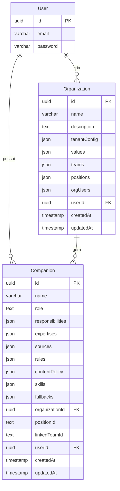

# 🏗️ Arquitetura do Sistema - Organization Designer

## 📊 Diagrama de Arquitetura Geral

```mermaid
graph TB
    subgraph "Frontend - Next.js"
        UI[Organizations Page]
        Modal[AI Generator Modal]
        Form[Organization Form]
        List[Organizations List]
    end
    
    subgraph "APIs - Next.js Routes"
        API1[/api/organizations]
        API2[/api/organizations/generate]
        API3[/api/organizations/[id]]
        API4[/api/organizations/[id]/companions]
    end
    
    subgraph "Business Logic"
        Queries[Database Queries]
        Validation[Zod Validation]
        AILogic[AI Generation Logic]
    end
    
    subgraph "External Services"
        LLM[Azure OpenAI]
        DB[(PostgreSQL)]
    end
    
    UI --> Modal
    UI --> Form
    UI --> List
    
    Modal --> API2
    Form --> API1
    Form --> API3
    List --> API1
    List --> API4
    
    API1 --> Queries
    API2 --> AILogic
    API3 --> Queries
    API4 --> Queries
    
    Queries --> Validation
    AILogic --> LLM
    AILogic --> Queries
    
    Queries --> DB
    
    style UI fill:#e1f5fe
    style LLM fill:#fff3e0
    style DB fill:#f3e5f5
```

## 🔄 Fluxo de Geração com IA

```mermaid
sequenceDiagram
    participant U as User
    participant UI as Frontend
    participant API as Generate API
    participant AI as OpenAI
    participant DB as Database
    
    U->>UI: Preenche formulário (nome, descrição, orgChart)
    UI->>API: POST /api/organizations/generate
    
    API->>AI: Prompt para gerar organização
    AI-->>API: JSON com estrutura organizacional
    
    API->>DB: Cria organização
    DB-->>API: Organization criada
    
    loop Para cada posição
        API->>AI: Prompt para gerar Companion
        AI-->>API: JSON com estrutura do Companion
        API->>DB: Cria Companion vinculado
    end
    
    API-->>UI: Response com org + companions
    UI-->>U: Toast de sucesso + redirecionamento
```



## 🗄️ Arquitetura de Dados



## 📱 Arquitetura de Componentes

```mermaid
graph TD
    subgraph "Pages"
        OrgPage[/organizations]
        EditPage[/organizations/[id]]
    end
    
    subgraph "Client Components"
        PageClient[OrganizationsPageClient]
        EditClient[OrganizationEditClient]
        Generator[AIOrganizationGenerator]
        List[OrganizationsList]
        Form[OrganizationForm]
        Fields[OrganizationFormFields]
    end
    
    subgraph "UI Components"
        Button[Button]
        Input[Input]
        Textarea[Textarea]
        Select[Select]
        Tooltip[Tooltip]
        Toast[Toast]
    end
    
    OrgPage --> PageClient
    EditPage --> EditClient
    
    PageClient --> Generator
    PageClient --> List
    PageClient --> Form
    
    EditClient --> Fields
    Form --> Fields
    
    Fields --> Input
    Fields --> Textarea
    Fields --> Select
    Fields --> Tooltip
    
    Generator --> Button
    Generator --> Toast
    
    style OrgPage fill:#e8f5e8
    style EditPage fill:#e8f5e8
    style PageClient fill:#fff3e0
    style EditClient fill:#fff3e0
```

## 🔧 Arquitetura de APIs

```mermaid
graph LR
    subgraph "Route Handlers"
        GET[GET /organizations]
        POST[POST /organizations]
        PUT[PUT /organizations/[id]]
        DELETE[DELETE /organizations/[id]]
        GENERATE[POST /organizations/generate]
        COMPANIONS[GET /organizations/[id]/companions]
    end
    
    subgraph "Middleware"
        Auth[Authentication]
        Validation[Zod Validation]
        ErrorHandling[Error Handling]
    end
    
    subgraph "Database Layer"
        Queries[queries.ts]
        Schema[schema.ts]
        Migrations[migrations/]
    end
    
    GET --> Auth
    POST --> Auth
    PUT --> Auth
    DELETE --> Auth
    GENERATE --> Auth
    COMPANIONS --> Auth
    
    Auth --> Validation
    Validation --> ErrorHandling
    
    ErrorHandling --> Queries
    Queries --> Schema
    Schema --> Migrations
    
    style GET fill:#e3f2fd
    style POST fill:#e8f5e8
    style PUT fill:#fff3e0
    style DELETE fill:#ffebee
    style GENERATE fill:#f3e5f5
    style COMPANIONS fill:#e0f2f1
``` 