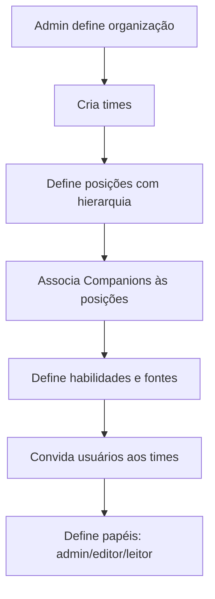
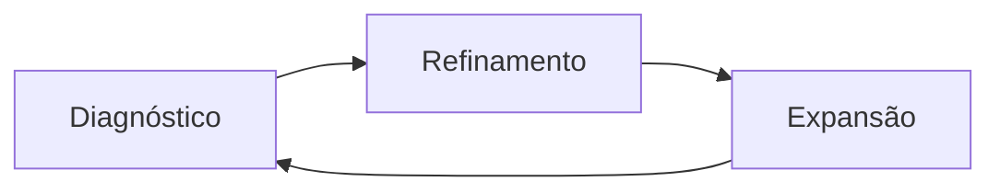
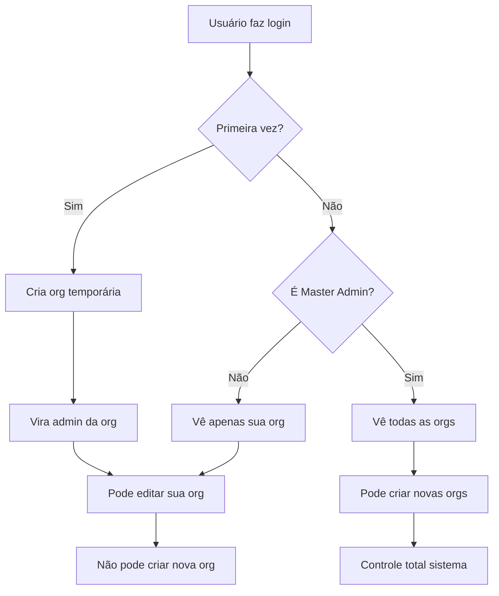

# 🧠 Especificações de Negócio - Plataforma Humana AI

## 🎯 Visão Geral da Plataforma

### **🏛️ A Humana AI como Arquitetura Cognitiva Organizacional**

A Humana AI é uma plataforma projetada para **mapear, expandir e preservar a inteligência organizacional**. Ela transforma cargos e papéis humanos em entidades cognitivas chamadas **Companions** — agentes que pensam, aprendem e atuam com seus usuários.

**Premissa Central**: Toda organização possui um **capital cognitivo interno** distribuído entre pessoas, processos, decisões, experiências e dados. A Humana materializa esse capital em forma **operacional, treinável e transferível**.

### **🎭 Filosofia: Amplificação vs Substituição**

- **❌ NÃO substitui** pessoas
- **✅ AMPLIFICA** cognitivamente os humanos
- **🚀 PROMOVE** aprendizado ativo
- **👥 FACILITA** execução supervisionada
- **🧠 PRESERVA** conhecimento crítico organizacional

---

## 🏗️ Arquitetura Multi-Tenant

### **🏢 Isolamento Organizacional**

Cada organização cadastrada opera em **ambiente isolado** com:

- **🔒 Segurança** e controle dos dados organizacionais
- **🎛️ Flexibilidade** na modelagem da estrutura funcional
- **🌍 Adaptação** aos contextos culturais, operacionais e estratégicos

### **👑 Usuário Fundador (Admin)**

Cada organização é iniciada por um **usuário fundador** que:
- Define nome e descrição da organização
- Modela a estrutura inicial
- Cria cargos e posições
- Convida colaboradores
- Associa Companions aos papéis definidos

---

## 💼 Estrutura Organizacional

### **🎯 Posições como Unidade Funcional**

As **posições** são a base estrutural de cada organização:

```yaml
Características:
  - Representa uma função cognitiva organizacional
  - Pode estar subordinada a outra (hierarquia)
  - Sempre associada a um time/área
  - Tem escopo de atuação definido
  - Serve como ancoragem para Companions
```

**Exemplos de Posições:**
- CEO (função estratégica)
- Coordenador de Operações (função operacional)
- Analista de Dados (função técnica)

### **👥 Times como Agrupadores Cognitivos**

Os **times** organizam as posições horizontalmente:

```yaml
Finalidades:
  - Organizar posições por finalidade organizacional
  - Controlar permissões de acesso
  - Estimular colaboração entre Companions correlatos
  - Permitir visões matriciais e funcionais
```

**Exemplos de Times:**
- Marketing (Social Media, Coordenador de Conteúdo, Analista de Performance)
- Produto (Product Manager, Designer, Analista de Dados)
- Engenharia (Tech Lead, Desenvolvedor Senior, DevOps)

---

## 🤖 Companions: Representação Cognitiva das Funções

### **🧠 Conceito Central**

O **Companion** é uma espécie de **gêmeo cognitivo de uma função** — mas não da pessoa que a ocupa. Representa o **como pensar, decidir, agir e melhorar** dentro de uma função específica.

### **📋 Características Principais**

#### **🔢 Múltiplos Companions por Cargo**
- Um cargo pode ter **mais de um Companion** associado
- Divisão deve ser por **escopos de atuação organizacional distintos**
- **❌ NÃO** dividir por tarefas específicas
- **✅ SIM** dividir por responsabilidades funcionais diferentes

**Exemplo - CEO:**
```yaml
CEO_Estratégico:
  escopo: "Visão estratégica e planejamento de longo prazo"
  habilidades: ["Análise de mercado", "Planejamento estratégico"]

CEO_Cultural:
  escopo: "Cultura organizacional e liderança"
  habilidades: ["Gestão de pessoas", "Comunicação interna"]
```

#### **🎯 Uma Função Cognitiva-Mãe**
- Cada Companion tem **múltiplas habilidades**
- Mas **apenas uma função cognitiva principal**
- Ligada à sua **posição de origem**

### **⚖️ Responsabilidade vs Habilidade**

#### **🎯 Responsabilidade (O PORQUÊ)**
- Compromissos organizacionais
- Garantir execução da estratégia
- Preservar a cultura
- Otimizar processos
- Supervisionar decisões

#### **🛠️ Habilidade (O COMO)**
- Capacidades cognitivas e operacionais
- Planejar estratégias
- Automatizar análises
- Redigir relatórios
- Mapear riscos
- Recomendar decisões
- Atuar com ferramentas

---

## 🔐 Governança e Permissões

### **👥 Níveis de Acesso**

```yaml
Usuário_Normal:
  - Acesso a múltiplos times da organização
  - Pode interagir com Companions dos times que pertence
  - Não pode criar/deletar Companions
  - Não pode alterar estrutura organizacional

Administrador_Organização:
  - Todos os privilégios do usuário normal
  - Criar/deletar Companions
  - Alterar estrutura de times e cargos
  - Gerenciar permissões de acesso
  - Editar organização com IA
  - NÃO pode criar nova organização

Administrador_Master:
  - Flag especial no banco de dados
  - Vê lista de TODAS as organizações do sistema
  - Pode criar novas organizações
  - Acesso total ao sistema
```

### **🎭 Papéis por Usuário**

- **Admin**: Controle total da organização
- **Editor**: Pode modificar conteúdo e interagir
- **Leitor**: Apenas visualização e interação com Companions

### **🔒 Regras de Segurança**

- **Escopo limitado** por time
- **Rastreabilidade** de todas as ações
- **Segurança cognitiva** nas interações
- **Isolamento** entre organizações

---

## 🏆 Companions como Ativos Organizacionais

### **💎 Valor Estratégico**

Os Companions **não são passageiros**:

```yaml
Características:
  - Acumulam histórico e aprendizados
  - Preservam referências organizacionais
  - Persistem mesmo com mudanças de pessoal
  - Treinam novos ocupantes da posição
```

### **🔄 Continuidade Organizacional**

Mesmo que uma pessoa saia da organização, o Companion:
- **Preserva** a inteligência da função
- **Acelera** onboarding de novos colaboradores
- **Catalisa** melhoria contínua
- **Mantém** consistência em decisões
- **Preserva** conhecimento tácito

### **📈 Evolução como Ativo**

Com o tempo, os Companions se tornam:
- **Repositório vivo** da prática da função
- **Maior ativo imaterial** da empresa
- **Inteligência organizacional operacionalizável**

---

## 🚀 Fluxo de Criação Organizacional

### **📋 Processo Incremental**



### **🎯 Curva de Maturidade**

A progressão respeita a **curva de maturidade da empresa com IA**:
- **Início**: Um Companion apenas
- **Crescimento**: Companions para posições críticas
- **Maturidade**: Mapeamento completo da inteligência organizacional

---

## 🔧 Companions como Sistemas Cognitivos Modulares

### **🧩 Blocos de Construção**

Cada Companion é estruturado com:

```yaml
Conhecimento:
  - O que ele sabe (fontes, dados, experiências)

Ações:
  - O que ele faz (automações, processos, entregas)

Comportamento:
  - Como ele age (estilo, regras, limites)

Relacionamentos:
  - Com quem ele conversa (usuários, permissões)

Aprendizado:
  - Como ele melhora (ciclo MCP)
```

### **🎯 Personalização Modular**

- **Personalizável** para contextos específicos
- **Treinável** com dados organizacionais
- **Iterativo** com melhoria contínua
- **Escalável** de simples a multifuncional

---

## ⚡ Habilidades como Núcleo de Atuação

### **🧠 Tipos de Habilidades**

```yaml
Raciocínio_Estratégico:
  exemplo: "Analisar riscos da expansão internacional"

Geração_de_Conteúdo:
  exemplo: "Redigir carta de recomendação executiva"

Processamento_de_Dados:
  exemplo: "Interpretar KPIs de vendas e sugerir ações"

Simulação:
  exemplo: "Criar roleplay com cliente B2B difícil"

Acesso_a_Ferramentas:
  exemplo: "Rodar modelo de precificação com planilhas"
```

### **📋 Estrutura de Habilidade**

```typescript
interface Habilidade {
  nome: string;
  descrição: string;
  ferramentas: string[];        // Calculadoras, BDs, APIs
  modelos_llm: string[];        // Comportamentos específicos
  templates: string[];          // Prompts pré-estruturados
  exemplo_uso: string;          // Para treinamento
}
```

---

## 📚 Fontes de Informação

### **🗂️ Categorias de Fontes**

```yaml
Internas_Formais:
  - Documentos da empresa
  - Playbooks e políticas
  - Apresentações e relatórios

Internas_Informais:
  - Histórico de conversas
  - Decisões passadas
  - Anotações de reuniões

Externas_Validadas:
  - Artigos e benchmarks
  - Frameworks reconhecidos

Especialistas_Humanos:
  - Tutores de referência
  - Avatares de especialistas
```

### **🔗 Integração de Dados**

```yaml
Arquivos_Carregados:
  tipos: [PDF, Excel, CSV, PowerPoint]

Fontes_RAG:
  - Bases vetorizadas internas

Integrações_Externas:
  ERP: [Odoo, SAP]
  CRM: [HubSpot, Salesforce]
  Data_Warehouses: [BigQuery, Snowflake]
  APIs: [Dados de mercado, indicadores públicos]
```

---

## 📝 Templates e Prompts Reutilizáveis

### **🎨 Biblioteca Cognitiva**

Cada Companion pode ter templates estruturados:

```yaml
Templates_Análise:
  - Template de análise SWOT
  - Modelo de apresentação de produto
  - Guia de negociação com cliente

Templates_Processos:
  - Script de entrevista comportamental
  - Checklist de onboarding
  - Roteiro de reunião estratégica
```

### **🔄 Reutilização**

Templates funcionam como **códigos fonte cognitivos**:
- **Reaproveitados** entre Companions
- **Adaptados** para contextos específicos
- **Refinados** pelos usuários ou IA

---

## 🎭 Regras, Tom e Limites

### **⚙️ Configurações Comportamentais**

```yaml
Tom_de_Voz:
  opções: [neutro, inspirador, assertivo, técnico]

Restrições_de_Escopo:
  exemplo: "Não pode fazer recomendações jurídicas"

Prompt_de_Esclarecimento:
  comportamento: "Como reage quando pergunta não é clara"

Instruções_de_Fallback:
  mensagem: "Resposta padrão quando não sabe/não deve responder"
```

### **🛡️ Compliance Organizacional**

- **Comportamento ético** definido
- **Comunicação** alinhada à cultura
- **Funcionalidade** respeitando compliance
- **Limites claros** de atuação

---

## 🔄 Ciclo MCP: Melhoria Contínua da Performance Cognitiva

### **📊 Três Fases do Ciclo**



### **🔍 1. Diagnóstico**

```yaml
Avaliação:
  - Gaps entre escopo da função e habilidades
  - Erros recorrentes identificados
  - Respostas evasivas mapeadas
  - Baixa utilidade percebida pelos usuários
```

### **⚙️ 2. Refinamento**

```yaml
Ajustes:
  - Fontes de informação
  - Templates e instruções
  - Ferramentas disponíveis
  - Incorporação de feedback real
```

### **🚀 3. Expansão**

```yaml
Crescimento:
  - Novas habilidades adicionadas
  - Ampliação de escopo para novos contextos
  - Geração de clones para outras posições
  - Criação de variantes especializadas
```

### **🤖 Automação com Supervisão**

- **Parcialmente automatizado** pela plataforma
- **Sempre com supervisão humana**
- **Lógica de versionamento** implementada
- **Aprendizado contínuo** supervisionado

---

## 🎯 Inteligência Combinada como Objetivo Final

### **🧠 Conceito Central**

**Inteligência Combinada** = Fusão entre cognição humana + cognição artificial

### **🤝 Papel dos Companions**

Os Companions são **catalisadores** dessa fusão:
- **❌ NÃO** pensam sozinhos
- **✅ SIM** pensam **COM** os humanos
- **📚 APRENDEM** com o ambiente
- **🎯 ATUAM** para o coletivo organizacional

### **🏗️ Resultado Final**

A plataforma cria:
- **Infraestrutura cognitiva viva**
- **Sistema de documentação prática e aplicável**
- **Forma de continuar aprendendo enquanto se trabalha**
- **Nova organização do conhecimento e trabalho**

---

## 🔐 Regras de Acesso e Criação Organizacional

### **🆕 Primeiro Login (Usuário Novo)**

```yaml
Processo_Automático:
  1. Sistema cria organização temporária
  2. Nome: "org_" + email_usuario
  3. Usuário torna-se administrador da organização
  4. Pode editar nome da organização
  5. Pode convidar outros usuários
  6. Pode editar org com IA e criar times
  7. NÃO pode criar nova organização
```

### **👑 Administrador Normal vs Master**

```yaml
Administrador_Normal:
  - Vê apenas SUA organização
  - Não pode criar nova organização
  - Controle total da sua organização
  - Pode convidar e gerenciar usuários

Administrador_Master:
  - Flag especial no banco: isMasterAdmin = true
  - Vê lista de TODAS as organizações
  - Pode criar novas organizações
  - Acesso total ao sistema
  - Supervisão global da plataforma
```

### **🎯 Fluxo de Permissões**



---

## 🎭 Supervisão, Feedback e Aprendizado

### **👥 Supervisão Humana**

Todos os Companions são **supervisionáveis**:

```yaml
Avaliação_Contínua:
  - Cada interação pode ser avaliada
  - Feedback qualitativo: útil, superficial, confuso
  - Companions aprendem com histórico
  - Curadoria humana obrigatória
```

### **🔄 Aprendizado Iterativo**

```yaml
Processo:
  - Administradores revisam respostas
  - Especialistas ajustam comportamento
  - Companions evoluem com organização
  - Evita obsolescência dos agentes
```

### **📈 Garantia de Evolução**

- **Aprendizado contínuo** supervisionado
- **Evolução** junto com a organização
- **Prevenção** de obsolescência
- **Melhoria** baseada em uso real

---

## 🎯 Resumo das Especificações

### **✅ Implementado**
- ✅ Estrutura organizacional multi-tenant
- ✅ Posições como unidade funcional
- ✅ Times como agrupadores
- ✅ Companions vinculados a posições
- ✅ Geração automática com IA
- ✅ APIs REST completas
- ✅ Interface de usuário moderna

### **🔄 Precisa Implementar**
- 🔄 Campo `isMasterAdmin` no schema User
- 🔄 Lógica de criação automática de organização no primeiro login
- 🔄 Restrições de criação de organização por tipo de admin
- 🔄 Estrutura completa de habilidades nos Companions
- 🔄 Sistema de templates reutilizáveis
- 🔄 Ciclo MCP de melhoria contínua
- 🔄 Sistema de supervisão e feedback
- 🔄 Integração com fontes de dados externas

### **📋 Próximos Passos**
1. **Migração 0013**: Adicionar campo `isMasterAdmin` ao User
2. **Middleware**: Implementar lógica de criação automática de org
3. **APIs**: Restringir criação de org por tipo de admin
4. **Companions**: Expandir estrutura de habilidades
5. **Templates**: Sistema de prompts reutilizáveis
6. **MCP**: Implementar ciclo de melhoria contínua

---

*Este documento serve como especificação central para todas as implementações da plataforma Humana AI.* 