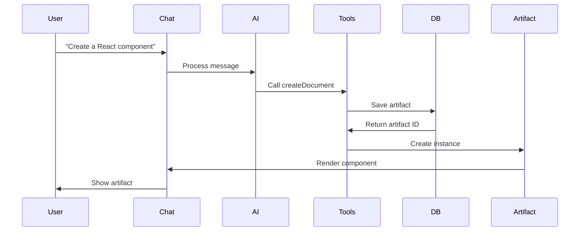

# 🎨 Chat Template & Artifacts - Guia de Implementação

## 📋 Visão Geral

Este documento extrai os conceitos fundamentais do Chat Template da Vercel e sistema de Artifacts, baseado na documentação oficial em `.cursor/chat-template-vercel`, focando na implementação prática dentro da nossa aplicação.

> **📍 Fonte:** Baseado em `.cursor/chat-template-vercel/docs/customization/` e implementação real da aplicação

## 🎯 Conceitos Fundamentais

### **📄 1. Artifacts**

**Artifacts** são documentos interativos gerados pela IA que podem ser:
- **Editados** em tempo real
- **Versionados** automaticamente  
- **Persistidos** no banco de dados
- **Compartilhados** entre usuários
- **Renderizados** de forma específica por tipo

#### **🔧 Tipos de Artifacts:**
```typescript
export type ArtifactType = 'text' | 'code' | 'image' | 'sheet';

// Cada tipo tem renderização específica
const artifactRenderers = {
  text: TextEditor,      // Editor de texto rico
  code: CodeEditor,      // Editor de código com syntax highlighting
  image: ImageEditor,    // Editor/visualizador de imagens
  sheet: SheetEditor,    // Editor de planilhas/tabelas
};
```

### **🔄 2. Streaming de Artifacts**

Artifacts são criados em **tempo real** durante a conversa:
```typescript
// Fluxo de criação de artifact
User: "Crie um componente React"
  ↓
AI: Analisa requisição
  ↓  
AI: Chama tool createDocument
  ↓
Sistema: Cria artifact no banco
  ↓
UI: Renderiza artifact em tempo real
  ↓
User: Vê resultado imediatamente
```

## 🏗️ Implementação na Nossa Aplicação

### **📁 Estrutura de Artifacts:**

```
📁 artifacts/
├── actions.ts             # Server actions para artifacts
├── text/
│   ├── client.tsx         # Componente cliente para texto
│   └── server.ts          # Lógica servidor para texto
├── code/
│   ├── client.tsx         # Editor de código
│   └── server.ts          # Processamento de código
├── image/
│   ├── client.tsx         # Editor de imagem
│   └── server.ts          # Processamento de imagem
└── sheet/
    ├── client.tsx         # Editor de planilha
    └── server.ts          # Processamento de planilha
```

### **🔧 1. Classe Base Artifact**

```typescript
// artifacts/base-artifact.ts
export abstract class BaseArtifact {
  constructor(
    public id: string,
    public type: ArtifactType,
    public title: string,
    public content: string
  ) {}

  abstract render(): React.ReactNode;
  abstract validate(): boolean;
  abstract export(): string;
  
  // Métodos comuns
  async save(): Promise<void> {
    await updateDocument(this.id, this.content);
  }

  async createVersion(reason: string): Promise<void> {
    await createArtifactVersion({
      artifactId: this.id,
      content: this.content,
      changeReason: reason,
    });
  }
}
```

### **🔧 2. Text Artifact**

```typescript
// artifacts/text/client.tsx
import { BaseArtifact } from '../base-artifact';
import { TextEditor } from '@/components/text-editor';

export class TextArtifact extends BaseArtifact {
  render(): React.ReactNode {
    return (
      <TextEditor
        content={this.content}
        onChange={(newContent) => {
          this.content = newContent;
          this.save();
        }}
        onVersionCreate={(reason) => {
          this.createVersion(reason);
        }}
      />
    );
  }

  validate(): boolean {
    return this.content.length > 0;
  }

  export(): string {
    return this.content; // Markdown format
  }
}
```

### **🔧 3. Code Artifact**

```typescript
// artifacts/code/client.tsx
import { BaseArtifact } from '../base-artifact';
import { CodeEditor } from '@/components/code-editor';

export class CodeArtifact extends BaseArtifact {
  constructor(
    id: string,
    title: string,
    content: string,
    public language: string,
    public dependencies: string[] = []
  ) {
    super(id, 'code', title, content);
  }

  render(): React.ReactNode {
    return (
      <CodeEditor
        language={this.language}
        content={this.content}
        dependencies={this.dependencies}
        onChange={(newContent) => {
          this.content = newContent;
          this.save();
        }}
        onRun={() => this.execute()}
      />
    );
  }

  async execute(): Promise<string> {
    // Executa código em sandbox
    const result = await fetch('/api/code/execute', {
      method: 'POST',
      body: JSON.stringify({
        code: this.content,
        language: this.language,
      }),
    });
    
    return result.text();
  }

  validate(): boolean {
    // Validação básica de sintaxe
    try {
      if (this.language === 'javascript') {
        new Function(this.content);
      }
      return true;
    } catch {
      return false;
    }
  }
}
```

### **🔧 4. Image Artifact**

```typescript
// artifacts/image/client.tsx
import { BaseArtifact } from '../base-artifact';
import { ImageEditor } from '@/components/image-editor';

export class ImageArtifact extends BaseArtifact {
  constructor(
    id: string,
    title: string,
    content: string, // URL ou base64
    public metadata: {
      width: number;
      height: number;
      format: string;
      aiGenerated: boolean;
    }
  ) {
    super(id, 'image', title, content);
  }

  render(): React.ReactNode {
    return (
      <ImageEditor
        src={this.content}
        metadata={this.metadata}
        onEdit={(editedImage) => {
          this.content = editedImage;
          this.save();
        }}
        onRegenerate={() => this.regenerate()}
      />
    );
  }

  async regenerate(): Promise<void> {
    // Regenera imagem usando IA
    const newImage = await fetch('/api/image/generate', {
      method: 'POST',
      body: JSON.stringify({
        prompt: this.title,
        baseImage: this.content,
      }),
    });
    
    this.content = await newImage.text();
    this.createVersion('AI regeneration');
  }
}
```

### **🔧 5. Sheet Artifact**

```typescript
// artifacts/sheet/client.tsx
import { BaseArtifact } from '../base-artifact';
import { SheetEditor } from '@/components/sheet-editor';

export class SheetArtifact extends BaseArtifact {
  constructor(
    id: string,
    title: string,
    content: string, // CSV ou JSON
    public schema: {
      columns: Array<{
        name: string;
        type: 'string' | 'number' | 'date' | 'boolean';
        required: boolean;
      }>;
    }
  ) {
    super(id, 'sheet', title, content);
  }

  render(): React.ReactNode {
    return (
      <SheetEditor
        data={this.parseData()}
        schema={this.schema}
        onChange={(newData) => {
          this.content = this.serializeData(newData);
          this.save();
        }}
        onAnalyze={() => this.analyzeData()}
      />
    );
  }

  parseData(): any[][] {
    return JSON.parse(this.content);
  }

  serializeData(data: any[][]): string {
    return JSON.stringify(data);
  }

  async analyzeData(): Promise<string> {
    // Análise dos dados usando IA
    const analysis = await fetch('/api/sheet/analyze', {
      method: 'POST',
      body: JSON.stringify({
        data: this.content,
        schema: this.schema,
      }),
    });
    
    return analysis.text();
  }
}
```

## 🎯 Sistema de Tools para Artifacts

### **🛠️ 1. Create Document Tool**

```typescript
// lib/ai/tools/create-document.ts
export const createDocument = tool({
  description: 'Cria um novo artifact/documento',
  parameters: z.object({
    title: z.string().describe('Título do documento'),
    content: z.string().describe('Conteúdo inicial'),
    type: z.enum(['text', 'code', 'image', 'sheet']),
    metadata: z.object({
      language: z.string().optional(),
      dependencies: z.array(z.string()).optional(),
      format: z.string().optional(),
    }).optional(),
  }),
  execute: async ({ title, content, type, metadata }) => {
    // Cria no banco de dados
    const document = await db.insert(documents).values({
      title,
      content,
      kind: type,
      userId: getCurrentUserId(),
    }).returning();

    // Cria artifact específico
    const artifact = createArtifactInstance(
      document[0].id,
      type,
      title,
      content,
      metadata
    );

    return {
      success: true,
      artifactId: document[0].id,
      artifact: artifact.render(),
    };
  },
});
```

### **🛠️ 2. Update Document Tool**

```typescript
// lib/ai/tools/update-document.ts
export const updateDocument = tool({
  description: 'Atualiza artifact existente',
  parameters: z.object({
    id: z.string().describe('ID do artifact'),
    content: z.string().describe('Novo conteúdo'),
    changeReason: z.string().describe('Motivo da mudança'),
  }),
  execute: async ({ id, content, changeReason }) => {
    // Atualiza no banco
    await db.update(documents)
      .set({ content, updatedAt: new Date() })
      .where(eq(documents.id, id));

    // Cria versão
    await createArtifactVersion({
      artifactId: id,
      content,
      changeReason,
      author: 'ai',
    });

    return {
      success: true,
      message: `Artifact atualizado: ${changeReason}`,
    };
  },
});
```

## 🎨 Customização e Theming

### **🎨 1. Tema Personalizado**

```typescript
// lib/themes/artifact-theme.ts
export const artifactTheme = {
  colors: {
    background: 'hsl(var(--background))',
    foreground: 'hsl(var(--foreground))',
    border: 'hsl(var(--border))',
    accent: 'hsl(var(--accent))',
  },
  typography: {
    fontFamily: 'var(--font-geist-sans)',
    fontSize: {
      sm: '0.875rem',
      base: '1rem',
      lg: '1.125rem',
    },
  },
  components: {
    artifact: {
      borderRadius: '0.5rem',
      padding: '1rem',
      shadow: '0 1px 3px rgba(0, 0, 0, 0.1)',
    },
  },
};
```

### **🎨 2. Layout Responsivo**

```typescript
// components/artifact-container.tsx
export function ArtifactContainer({ artifact }: { artifact: BaseArtifact }) {
  return (
    <div className="artifact-container">
      {/* Header */}
      <div className="artifact-header">
        <h3>{artifact.title}</h3>
        <ArtifactActions artifact={artifact} />
      </div>

      {/* Content */}
      <div className="artifact-content">
        {artifact.render()}
      </div>

      {/* Footer */}
      <div className="artifact-footer">
        <ArtifactMetadata artifact={artifact} />
      </div>
    </div>
  );
}
```

## 🔄 Streaming e Real-time Updates

### **📡 1. Server-Sent Events**

```typescript
// app/api/artifacts/[id]/stream/route.ts
export async function GET(
  request: Request,
  { params }: { params: { id: string } }
) {
  const encoder = new TextEncoder();
  
  const stream = new ReadableStream({
    start(controller) {
      // Envia atualizações em tempo real
      const interval = setInterval(async () => {
        const artifact = await getArtifact(params.id);
        const data = encoder.encode(
          `data: ${JSON.stringify(artifact)}\n\n`
        );
        controller.enqueue(data);
      }, 1000);

      // Cleanup
      return () => clearInterval(interval);
    },
  });

  return new Response(stream, {
    headers: {
      'Content-Type': 'text/event-stream',
      'Cache-Control': 'no-cache',
      'Connection': 'keep-alive',
    },
  });
}
```

### **📡 2. Cliente Real-time**

```typescript
// hooks/use-artifact-stream.ts
export function useArtifactStream(artifactId: string) {
  const [artifact, setArtifact] = useState<BaseArtifact | null>(null);

  useEffect(() => {
    const eventSource = new EventSource(
      `/api/artifacts/${artifactId}/stream`
    );

    eventSource.onmessage = (event) => {
      const data = JSON.parse(event.data);
      setArtifact(createArtifactInstance(
        data.id,
        data.type,
        data.title,
        data.content,
        data.metadata
      ));
    };

    return () => eventSource.close();
  }, [artifactId]);

  return artifact;
}
```

## 🧪 Testing de Artifacts

### **🧪 1. Testes de Componente**

```typescript
// tests/artifacts/text-artifact.test.tsx
import { render, screen, fireEvent } from '@testing-library/react';
import { TextArtifact } from '@/artifacts/text/client';

describe('TextArtifact', () => {
  it('renders content correctly', () => {
    const artifact = new TextArtifact(
      '1',
      'Test Document',
      '# Hello World'
    );

    render(artifact.render());
    
    expect(screen.getByText('Hello World')).toBeInTheDocument();
  });

  it('saves on content change', async () => {
    const artifact = new TextArtifact('1', 'Test', 'Initial');
    const saveSpy = jest.spyOn(artifact, 'save');

    render(artifact.render());
    
    const editor = screen.getByRole('textbox');
    fireEvent.change(editor, { target: { value: 'Updated' } });

    expect(saveSpy).toHaveBeenCalled();
  });
});
```

### **🧪 2. Testes de Integração**

```typescript
// tests/artifacts/integration.test.ts
describe('Artifact Integration', () => {
  it('creates artifact via AI tool', async () => {
    const response = await POST('/api/chat', {
      body: JSON.stringify({
        messages: [
          { role: 'user', content: 'Create a React component' }
        ],
      }),
    });

    const stream = response.body;
    const reader = stream.getReader();
    
    // Verifica se tool foi chamada
    let toolCalled = false;
    while (true) {
      const { done, value } = await reader.read();
      if (done) break;
      
      const chunk = new TextDecoder().decode(value);
      if (chunk.includes('createDocument')) {
        toolCalled = true;
        break;
      }
    }

    expect(toolCalled).toBe(true);
  });
});
```

## 🎯 Melhores Práticas

### **✅ Do's:**
1. **Use versionamento** para todas as mudanças
2. **Implemente validação** antes de salvar
3. **Otimize rendering** para artifacts grandes
4. **Cache artifacts** frequentemente acessados
5. **Monitore performance** de streaming
6. **Teste diferentes tipos** de artifact

### **❌ Don'ts:**
1. **Não salve** a cada keystroke
2. **Não carregue** artifacts desnecessários
3. **Não ignore** validação de conteúdo
4. **Não exponha** dados sensíveis
5. **Não bloqueie UI** durante salvamento

## 🔗 Integração com Chat

### **💬 Fluxo Completo:**



---

## 🎯 Resumo do Sistema

1. **Artifacts** - Documentos interativos versionados
2. **Streaming** - Criação e atualização em tempo real
3. **Tools Integration** - Criação via function calling
4. **Multi-type Support** - Text, Code, Image, Sheet
5. **Real-time Updates** - SSE para sincronização
6. **Testing Strategy** - Testes unitários e integração
7. **Performance** - Otimização de rendering e caching

**💡 O sistema de Artifacts transforma conversas simples em experiências interativas e produtivas!** 🚀✨ 