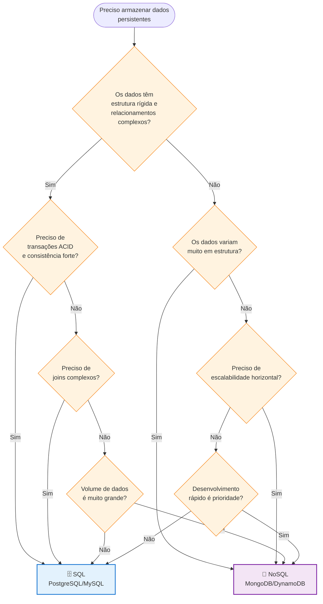
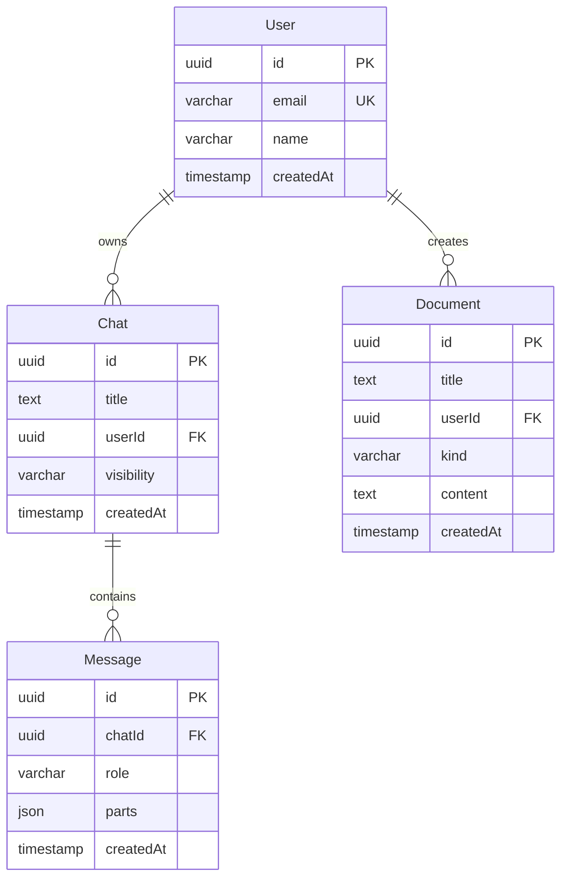
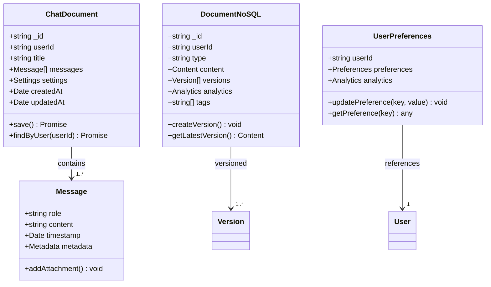
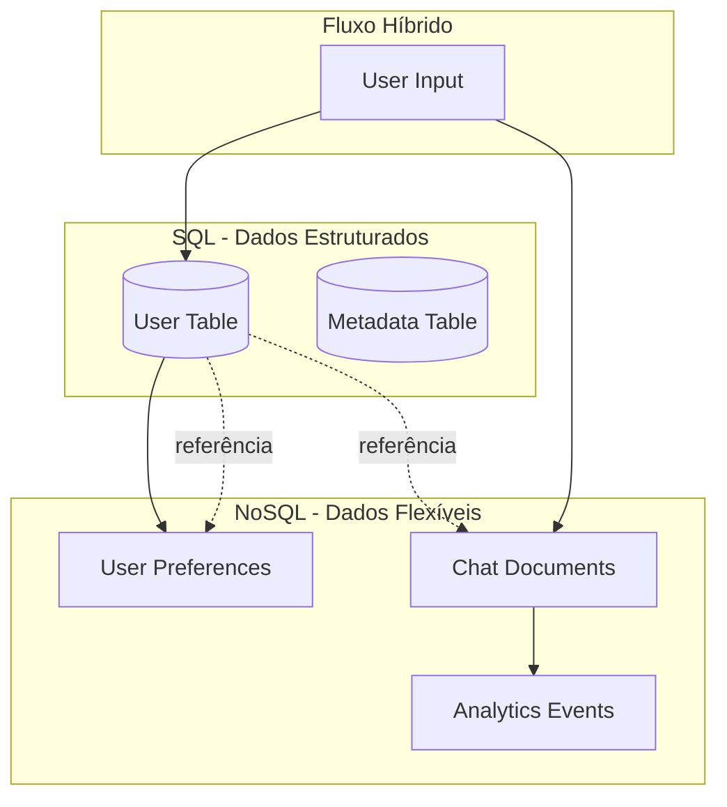

# 📊 Estratégia de Dados: SQL vs NoSQL

## 📋 Visão Geral

Este documento orienta quando usar **SQL (relacional)** vs **NoSQL (documento/JSON)**, onde implementar cada tipo na aplicação, e como documentá-los e visualizá-los adequadamente usando diagramas Mermaid.

> **💡 Importante:** Aqui tratamos de bancos de dados **persistentes**. SQL = PostgreSQL/MySQL. NoSQL = MongoDB/DynamoDB/Firestore.

## 🎯 Decisão Fundamental: SQL ou NoSQL?

### **🤔 Perguntas-Chave para Decidir:**



## 🗄️ Quando Usar SQL (Banco de Dados)

### **✅ Use SQL quando:**
- **Persistência obrigatória** - dados não podem ser perdidos
- **Relacionamentos complexos** - foreign keys, joins, etc.
- **Consultas avançadas** - filtros, ordenação, agregação
- **Múltiplos usuários** - concorrência e consistência
- **Auditoria/Versionamento** - histórico de mudanças
- **Integridade de dados** - validações e constraints
- **Performance crítica** - índices e otimizações

### **📍 Onde Implementar:**
```
📁 lib/db/
├── schema.ts              # Definições das tabelas
├── queries.ts             # Consultas e operações
├── migrations/            # Evolução do schema
└── helpers/               # Utilitários específicos
```

### **📝 Exemplo Prático:**
```typescript
// lib/db/schema.ts
export const user = pgTable('User', {
  id: uuid('id').primaryKey().notNull().defaultRandom(),
  email: varchar('email', { length: 64 }).notNull().unique(),
  name: varchar('name', { length: 100 }).notNull(),
  createdAt: timestamp('createdAt').notNull().defaultNow(),
});

export const chat = pgTable('Chat', {
  id: uuid('id').primaryKey().notNull().defaultRandom(),
  title: text('title').notNull(),
  userId: uuid('userId').notNull().references(() => user.id),
  visibility: varchar('visibility', { enum: ['public', 'private'] }).notNull(),
  createdAt: timestamp('createdAt').notNull().defaultNow(),
});

export type User = InferSelectModel<typeof user>;
export type Chat = InferSelectModel<typeof chat>;
```

### **🎯 Casos de Uso SQL:**
- **Usuários e autenticação**
- **Chats e mensagens**
- **Documentos e artifacts** (metadados)
- **Votos e feedback**
- **Sugestões e comentários**
- **Logs de auditoria**
- **Configurações por usuário**

## 📄 Quando Usar NoSQL (Banco de Documentos)

### **✅ Use NoSQL quando:**
- **Estrutura flexível** - campos podem variar entre documentos
- **Escalabilidade horizontal** - precisa distribuir em múltiplos servidores
- **Desenvolvimento rápido** - menos planejamento de schema
- **Dados semi-estruturados** - JSON complexos com aninhamento
- **Alto volume de leitura** - performance de consulta por ID
- **Dados de eventos** - logs, analytics, time-series
- **Prototipagem rápida** - schema pode evoluir facilmente

### **📍 Onde Implementar:**

#### **🔧 1. Configuração do Projeto**
```javascript
// next.config.js ou similar
const mongoConfig = {
  uri: process.env.MONGODB_URI,
  dbName: 'humana-companions',
  collections: {
    chats: 'chats',
    documents: 'documents', 
    analytics: 'analytics',
    logs: 'logs'
  }
}
```

#### **🗂️ 2. Estrutura de Dados**
```
📁 lib/db/
├── mongodb/
│   ├── connection.ts      # Conexão MongoDB
│   ├── models/           # Schemas Mongoose
│   │   ├── chat.ts
│   │   ├── document.ts
│   │   └── analytics.ts
│   └── queries/          # Operações específicas
│       ├── chat-ops.ts
│       └── document-ops.ts
```

#### **🌐 3. Modelos NoSQL**
```typescript
// lib/db/mongodb/models/chat.ts
import { Schema, model } from 'mongoose';

const ChatSchema = new Schema({
  title: String,
  userId: String,
  messages: [{
    role: String,
    content: String,
    timestamp: Date,
    metadata: Schema.Types.Mixed  // Flexibilidade total
  }],
  settings: {
    model: String,
    temperature: Number,
    customPrompts: [String]
  },
  analytics: {
    totalMessages: Number,
    avgResponseTime: Number,
    satisfaction: Number
  }
}, {
  timestamps: true,
  strict: false  // Permite campos não definidos
});
```

### **📝 Exemplo Prático:**
```typescript
// lib/db/mongodb/models/document.ts
export interface DocumentNoSQL {
  _id: string;
  title: string;
  userId: string;
  type: 'text' | 'code' | 'image' | 'sheet';
  content: {
    // Estrutura flexível baseada no tipo
    text?: {
      markdown: string;
      wordCount: number;
      readingTime: number;
    };
    code?: {
      language: string;
      content: string;
      dependencies: string[];
      testResults?: {
        passed: number;
        failed: number;
        coverage: number;
      };
    };
    image?: {
      url: string;
      alt: string;
      metadata: {
        width: number;
        height: number;
        format: string;
        aiGenerated: boolean;
      };
    };
  };
  versions: [{
    content: any;
    timestamp: Date;
    changeReason: string;
  }];
  analytics: {
    views: number;
    edits: number;
    shares: number;
    lastAccessed: Date;
  };
  tags: string[];
  createdAt: Date;
  updatedAt: Date;
}
```

### **🎯 Casos de Uso NoSQL:**
- **Chats com estrutura variável** - diferentes tipos de mensagem
- **Documentos/Artifacts** - conteúdo flexível por tipo
- **Analytics e métricas** - dados de evento com campos variáveis
- **Configurações de usuário** - preferências complexas
- **Logs de sistema** - estrutura pode variar por evento
- **Cache de sessão** - dados temporários estruturados
- **Dados de APIs externas** - estrutura definida por terceiros

## 🔄 Híbrido: Quando Usar Ambos

### **🤝 Cenários Híbridos:**

#### **📄 Metadados SQL + Conteúdo NoSQL**
```typescript
// SQL: Metadados estruturados e relacionamentos
export const document = pgTable('Document', {
  id: uuid('id').primaryKey(),
  title: text('title').notNull(),
  userId: uuid('userId').references(() => user.id),
  kind: varchar('kind', { enum: ['text', 'code'] }).notNull(),
  mongoDocumentId: text('mongoDocumentId').notNull(), // Referência ao MongoDB
  createdAt: timestamp('createdAt').notNull(),
});

// NoSQL: Conteúdo flexível no MongoDB
export interface DocumentContentNoSQL {
  _id: string; // Mesmo valor que mongoDocumentId no SQL
  content: {
    text?: {
      markdown: string;
      wordCount: number;
      formatting: 'markdown' | 'plain';
    };
    code?: {
      language: string;
      content: string;
      dependencies: string[];
      executionResults?: any[];
    };
  };
  versions: Array<{
    content: any;
    timestamp: Date;
    changeReason: string;
  }>;
  metadata: Record<string, any>; // Campos flexíveis
}
```

#### **⚙️ Usuários SQL + Preferências NoSQL**
```typescript
// SQL: Dados estruturados do usuário
export const user = pgTable('User', {
  id: uuid('id').primaryKey(),
  email: varchar('email', { length: 64 }).unique(),
  name: varchar('name', { length: 100 }),
  createdAt: timestamp('createdAt').notNull(),
});

// NoSQL: Preferências flexíveis no MongoDB
export interface UserPreferencesNoSQL {
  userId: string; // Referência ao SQL
  preferences: {
    theme: 'light' | 'dark' | 'auto';
    language: string;
    aiSettings: {
      preferredModel: string;
      temperature: number;
      customPrompts: string[];
      experimentalFeatures: string[];
    };
    uiCustomization: {
      sidebarWidth: number;
      fontSize: string;
      shortcuts: Record<string, string>;
    };
    notifications: {
      email: boolean;
      push: boolean;
      inApp: boolean;
      schedule: {
        enabled: boolean;
        startTime: string;
        endTime: string;
      };
    };
  };
  analytics: {
    lastLogin: Date;
    totalSessions: number;
    averageSessionTime: number;
    featuresUsed: string[];
  };
}
```

## 📊 Documentação e Visualização

### **🗄️ 1. Documentando Dados SQL**

#### **📋 Template para Tabelas SQL:**
```typescript
/**
 * @table User
 * @description Tabela principal de usuários do sistema
 * @relationships
 *   - 1:N com Chat (userId)
 *   - 1:N com Document (userId)
 * @indexes
 *   - email (unique)
 *   - createdAt (performance)
 * @constraints
 *   - email deve ser válido
 *   - name não pode estar vazio
 */
export const user = pgTable('User', {
  id: uuid('id').primaryKey().notNull().defaultRandom(),
  email: varchar('email', { length: 64 }).notNull().unique(),
  name: varchar('name', { length: 100 }).notNull(),
  createdAt: timestamp('createdAt').notNull().defaultNow(),
});
```

#### **🔗 Diagrama ERD (Entity Relationship Diagram):**


### **📄 2. Documentando Dados NoSQL**

#### **📋 Template para Documentos NoSQL:**
```typescript
/**
 * @collection ChatCollection
 * @description Coleção de chats com estrutura flexível
 * @database MongoDB
 * @indexes
 *   - userId (performance)
 *   - createdAt (ordenação)
 *   - "messages.timestamp" (consultas temporais)
 * @examples
 *   - Chat simples com mensagens texto
 *   - Chat com anexos e metadados
 *   - Chat com configurações personalizadas
 * @validation
 *   - userId deve existir na tabela SQL User
 *   - messages array não pode estar vazio
 */
export interface ChatDocument {
  /** ID único do documento */
  _id: string;
  /** Referência ao usuário (FK para SQL) */
  userId: string;
  /** Título do chat */
  title: string;
  /** Array flexível de mensagens */
  messages: Array<{
    role: 'user' | 'assistant';
    content: string;
    timestamp: Date;
    /** Metadados flexíveis por tipo de mensagem */
    metadata?: {
      model?: string;
      tokens?: number;
      attachments?: Array<{
        type: string;
        url: string;
        metadata: Record<string, any>;
      }>;
      reasoning?: {
        steps: string[];
        confidence: number;
      };
    };
  }>;
  /** Configurações específicas do chat */
  settings: {
    model: string;
    temperature: number;
    systemPrompt?: string;
    /** Configurações experimentais */
    experimental?: Record<string, any>;
  };
  /** Timestamps automáticos */
  createdAt: Date;
  updatedAt: Date;
}
```

#### **🏗️ Diagrama de Estrutura NoSQL:**


## 📋 Checklist de Decisão

### **🤔 Para Cada Novo Dado, Pergunte:**

#### **✅ Critérios para SQL:**
- [ ] Precisa persistir entre sessões?
- [ ] Tem relacionamentos com outras entidades?
- [ ] Preciso fazer consultas complexas?
- [ ] Múltiplos usuários vão acessar?
- [ ] Precisa de auditoria/versionamento?

#### **✅ Critérios para NoSQL:**
- [ ] Estrutura de dados varia muito?
- [ ] Precisa de escalabilidade horizontal?
- [ ] Desenvolvimento rápido é prioridade?
- [ ] Dados são semi-estruturados/aninhados?
- [ ] Volume muito alto de leituras?
- [ ] Schema pode evoluir frequentemente?

### **📊 Matriz de Decisão:**

| Critério | SQL | NoSQL | Peso |
|----------|-----|-------|------|
| Relacionamentos Complexos | ✅ | ❌ | Alto |
| Transações ACID | ✅ | ⚠️ | Alto |
| Consultas Complexas (Joins) | ✅ | ❌ | Médio |
| Flexibilidade Schema | ❌ | ✅ | Alto |
| Escalabilidade Horizontal | ❌ | ✅ | Alto |
| Performance Leitura (ID) | ❌ | ✅ | Médio |
| Consistência Forte | ✅ | ❌ | Alto |
| Desenvolvimento Rápido | ❌ | ✅ | Médio |
| Dados Semi-estruturados | ❌ | ✅ | Alto |

## 🎯 Templates de Documentação

### **📄 Template SQL:**
```typescript
/**
 * @table [NomeTabela]
 * @description [Descrição da responsabilidade]
 * @relationships [Lista de relacionamentos]
 * @indexes [Índices importantes]
 * @constraints [Regras de negócio]
 */
export const [nomeTabela] = pgTable('[NomeTabela]', {
  // campos aqui
});

export type [TipoTabela] = InferSelectModel<typeof [nomeTabela]>;
```

### **📄 Template NoSQL:**
```typescript
/**
 * @collection [NomeColecao]
 * @description [Descrição do propósito]
 * @database [MongoDB/DynamoDB/Firestore]
 * @indexes [Índices importantes]
 * @examples [Exemplos práticos]
 * @validation [Regras de validação]
 * @relationships [Referências para SQL se híbrido]
 */
export interface [NomeDocumento] {
  /** ID único do documento */
  _id: string;
  /** [Descrição do campo] */
  [campo]: [tipo];
  /** Timestamps automáticos */
  createdAt: Date;
  updatedAt: Date;
}
```

### **📊 Template Diagrama Mermaid:**


---

## 🎯 Resumo das Regras de Ouro

1. **🗄️ SQL** para dados **estruturados com relacionamentos complexos**
2. **📄 NoSQL** para dados **flexíveis e escalabilidade horizontal**
3. **🔄 HÍBRIDO** quando precisa de **ambos os benefícios**
4. **📊 SEMPRE** documente com templates apropriados
5. **🎨 SEMPRE** visualize com diagramas Mermaid
6. **🤔 SEMPRE** use a matriz de decisão quando em dúvida
7. **📋 CONSIDERE** transações e consistência
8. **📍 ORGANIZE** nos diretórios corretos por tipo de banco

**💡 A escolha correta entre SQL e NoSQL determina a escalabilidade, flexibilidade e performance da aplicação!** 🚀✨

## 🎯 Casos de Uso Recomendados por Tipo

### **🗄️ SQL é Ideal Para:**
- **Usuários e Autenticação** - relacionamentos claros
- **Transações Financeiras** - consistência ACID obrigatória
- **Inventário e Produtos** - relacionamentos complexos
- **Relatórios e Analytics** - consultas complexas com joins
- **Auditoria e Compliance** - integridade de dados crítica

### **📄 NoSQL é Ideal Para:**
- **Chats e Mensagens** - estrutura varia por tipo de mensagem
- **Documentos e Artifacts** - conteúdo flexível
- **Logs e Eventos** - volume alto, estrutura variável
- **Configurações de Usuário** - preferências complexas
- **Cache e Sessões** - acesso rápido por ID
- **Dados de IoT** - volume massivo, estrutura simples

### **🔄 Híbrido é Ideal Para:**
- **CMS/Blog** - metadados SQL + conteúdo NoSQL
- **E-commerce** - produtos SQL + reviews/ratings NoSQL
- **Aplicações de Chat** - usuários SQL + conversas NoSQL
- **Analytics** - eventos NoSQL + relatórios SQL
- **Aplicações Sociais** - perfis SQL + posts/atividades NoSQL 