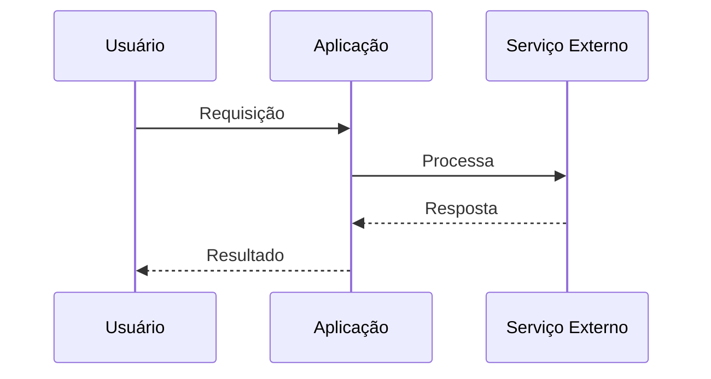
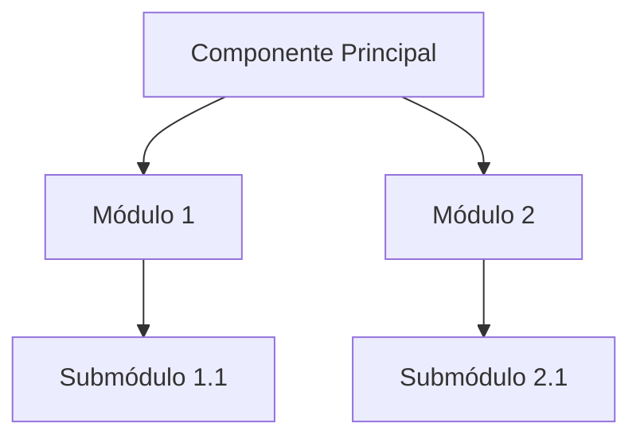
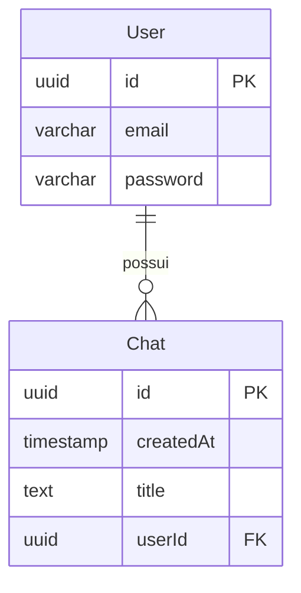
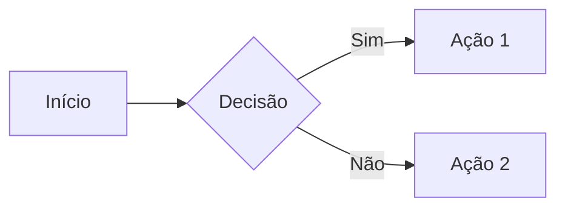

# 📝 Estratégia de Documentação

## 🎯 Princípios Fundamentais

### **1. Documentação Viva**
A documentação deve evoluir junto com o código e ser útil no dia a dia.

### **2. Contexto Específico**
Cada integração/módulo deve ter sua própria documentação organizada.

### **3. Exemplos Práticos**
Sempre incluir exemplos reais e casos de uso práticos.

### **4. Troubleshooting Proativo**
Antecipar problemas comuns e fornecer soluções.

## 🗂️ Estrutura de Documentação

### **Organização Hierárquica**
```
docs/
├── README.md                    # Índice geral do projeto
├── arquitetura_geral/          # Documentação de arquitetura
│   ├── README.md               # Índice da arquitetura
│   ├── ARQUITETURA_MODULAR.md  # Princípios arquiteturais
│   └── ...
├── [integração]/               # Documentação específica
│   ├── README.md               # Índice da integração
│   ├── SETUP.md                # Configuração inicial
│   ├── COMO_USAR.md            # Guia de uso
│   ├── GUIA_COMPLETO.md        # Documentação técnica
│   └── TROUBLESHOOTING.md      # Resolução de problemas
└── apis/                       # Documentação de APIs
    ├── README.md
    └── [endpoint]/
        └── README.md
```

### **Exemplo: Documentação Dify**
```
docs/dify/
├── README.md                   # Índice e visão geral
├── DIFY_SETUP.md              # Configuração inicial
├── COMO_USAR_AGENTES_DIFY.md  # Guia prático
├── GUIA_COMPLETO_DIFY_IDS.md  # Documentação técnica
└── TROUBLESHOOTING_DIFY.md    # Resolução de problemas
```

## 📋 Templates de Documentação

### **Template: README Principal**
```markdown
# 📖 [Nome da Integração]

## 🎯 Visão Geral
Breve descrição do que faz e por que é útil.

## 🚀 Início Rápido
Passos mínimos para começar a usar.

## 📚 Documentação Completa
Links para documentação detalhada.

## 🛠️ Scripts Úteis
Lista de comandos e scripts disponíveis.

## 🆘 Suporte
Como obter ajuda e reportar problemas.
```

### **Template: Guia de Configuração**
```markdown
# ⚙️ Configuração - [Nome da Integração]

## 📋 Pré-requisitos
- Lista de dependências
- Contas necessárias
- Versões mínimas

## 🔧 Configuração Passo a Passo

### 1. Instalação
```bash
# Comandos de instalação
```

### 2. Variáveis de Ambiente
```env
# Exemplo de .env.local
PROVIDER_API_KEY=sua-chave-aqui
PROVIDER_BASE_URL=https://api.provider.com
```

### 3. Verificação
```bash
# Comandos para testar configuração
```

## ✅ Checklist de Configuração
- [ ] Item 1 configurado
- [ ] Item 2 verificado
- [ ] Teste executado com sucesso
```

### **Template: Troubleshooting**
```markdown
# 🚨 Troubleshooting - [Nome da Integração]

## 🔍 Problemas Comuns

### Erro: "Provider not configured"
**Sintoma:** Mensagem de erro na inicialização
**Causa:** Variáveis de ambiente não configuradas
**Solução:**
1. Verificar arquivo .env.local
2. Executar script de validação
3. Reiniciar servidor de desenvolvimento

### Erro: "Failed to fetch resources"
**Sintoma:** Lista vazia ou erro ao carregar
**Causa:** Problemas de conectividade ou autenticação
**Solução:**
1. Verificar conectividade de rede
2. Validar chave de API
3. Executar script de teste

## 🧪 Scripts de Diagnóstico

### Verificar Configuração
```bash
pnpm run provider:check
```

### Testar Conectividade
```bash
pnpm run provider:test ID_RECURSO
```

### Logs Detalhados
```bash
DEBUG=provider:* pnpm run dev
```

## 📞 Suporte Avançado
Se os problemas persistirem:
1. Verificar logs do servidor
2. Executar em modo debug
3. Consultar documentação da API
4. Abrir issue no repositório
```

## 📊 Diagramas Visuais

### **Importância dos Diagramas**
Diagramas são **essenciais** para comunicar arquitetura e facilitar o entendimento:
- **Comunicação Visual:** Mais eficaz que texto para estruturas complexas
- **Onboarding:** Novos desenvolvedores entendem rapidamente
- **Documentação Viva:** Evolui junto com a arquitetura
- **Decisões Técnicas:** Base para discussões arquiteturais

### **Tipos de Diagramas Recomendados**

#### **🏗️ Diagrama C4 (Obrigatório)**
```markdown
# Exemplo de estrutura C4
## Nível 1: Contexto do Sistema
- Usuários e sistemas externos
- Integrações principais

## Nível 2: Containers
- Aplicações e serviços
- Bancos de dados e storage

## Nível 3: Componentes
- Módulos internos
- APIs e interfaces

## Nível 4: Código
- Estrutura de arquivos
- Organização de código
```

#### **🔄 Diagramas de Fluxo**


#### **🗂️ Diagramas de Estrutura**


#### **🗄️ Diagramas de Modelo de Dados (ERD)**


### **Ferramentas para Diagramas**

#### **Mermaid (Recomendado)**
- **Vantagens:** Versionável, integrado ao GitHub, texto simples
- **Uso:** Diagramas de fluxo, sequência, C4, entidade-relacionamento (ERD)
- **Exemplo:**


#### **Draw.io/Diagrams.net**
- **Vantagens:** Interface visual, muitos templates
- **Uso:** Diagramas complexos, mockups, fluxogramas
- **Exportação:** SVG, PNG, PDF

#### **Excalidraw**
- **Vantagens:** Estilo hand-drawn, colaborativo
- **Uso:** Brainstorming, sketches, wireframes
- **Integração:** Exporta para Markdown

### **Boas Práticas para Diagramas**

#### **📋 Checklist de Qualidade**
- [ ] **Propósito claro:** Cada diagrama tem objetivo específico
- [ ] **Legendas:** Símbolos e cores explicados
- [ ] **Atualização:** Sincronizado com código atual
- [ ] **Simplicidade:** Não sobrecarregar com detalhes
- [ ] **Consistência:** Padrão visual em todos os diagramas

#### **🎨 Convenções Visuais**
```markdown
# Cores padrão
- 🔵 Azul: Componentes internos
- 🟢 Verde: Integrações bem-sucedidas
- 🟡 Amarelo: Componentes em desenvolvimento
- 🔴 Vermelho: Problemas ou alertas
- ⚫ Cinza: Componentes externos

# Formas padrão
- 📦 Retângulo: Componentes/Módulos
- 🔵 Círculo: Usuários/Atores
- 💾 Cilindro: Bancos de dados
- ☁️ Nuvem: Serviços externos
```

### **Localização dos Diagramas**
```
docs/
├── diagramas/
│   ├── README.md              # Índice dos diagramas
│   ├── arquitetura-c4.md      # Diagrama C4 principal
│   ├── modelo-dados.md        # Modelo de dados (ERD)
│   ├── fluxo-integracao.md    # Fluxos específicos
│   └── estrutura-dados.md     # Estruturas específicas
```

### **Template: Arquivo de Diagrama**
```markdown
# 📊 [Nome do Diagrama]

## 🎯 Objetivo
Descrever o que o diagrama representa e quando usar.

## 📋 Legenda
- Símbolos utilizados
- Significado das cores
- Convenções específicas

## 🔄 Mermaid
```mermaid
[código do diagrama]
```

## 📝 Descrição
Explicação textual dos elementos principais.

## 🔄 Última Atualização
Data: DD/MM/YYYY
Motivo: Descrição da mudança
```

## 🎨 Estilo e Formatação

### **Uso de Emojis**
- 🎯 Objetivos e metas
- 📋 Listas e checklists
- 🚀 Início rápido
- ⚙️ Configuração
- 🔧 Ferramentas
- 🧪 Testes
- 🚨 Problemas/Erros
- ✅ Sucesso/Concluído
- 📝 Documentação
- 🔍 Busca/Investigação
- 📊 Diagramas e visualizações

### **Formatação de Código**
```markdown
# Código inline
Use `backticks` para código inline.

# Blocos de código
```typescript
// Sempre especificar a linguagem
const exemplo = 'código aqui'
```

# Comandos de terminal
```bash
pnpm run comando
```
```

### **Estrutura de Seções**
```markdown
# 📝 Título Principal

## 🎯 Seção Principal

### **Subseção Destacada**
Conteúdo importante.

#### Subseção Menor
Detalhes específicos.

---

**🎯 Resumo ou destaque final!**
```

## 🔄 Processo de Manutenção

### **Atualização Regular**
1. **Revisão Mensal:** Verificar se documentação está atualizada
2. **Após Mudanças:** Atualizar docs junto com código
3. **Feedback:** Incorporar sugestões dos usuários

### **Validação de Links**
```bash
# Script para verificar links quebrados
find docs -name "*.md" -exec markdown-link-check {} \;
```

### **Métricas de Qualidade**
- Documentação atualizada < 30 dias
- Links funcionais 100%
- Exemplos testados e funcionais
- Feedback positivo dos usuários

## 📊 Ferramentas Recomendadas

### **Editores**
- **Typora:** Editor visual para Markdown
- **Mark Text:** Editor WYSIWYG
- **VS Code:** Com extensões Markdown

### **Extensões VS Code**
- Markdown All in One
- Markdown Preview Enhanced
- markdownlint
- Paste Image

### **Validação**
```bash
# Linting de Markdown
npx markdownlint docs/**/*.md

# Verificação de links
npx markdown-link-check docs/**/*.md

# Verificação de ortografia
npx cspell "docs/**/*.md"
```

## 🎖️ Benefícios da Boa Documentação

### **Para Desenvolvedores**
- Onboarding mais rápido
- Menos dúvidas e interrupções
- Configuração sem erros
- Debug mais eficiente

### **Para o Projeto**
- Adoção mais fácil
- Menos bugs de configuração
- Contribuições de qualidade
- Manutenção simplificada

### **Para Usuários**
- Experiência fluida
- Autonomia na resolução de problemas
- Confiança na ferramenta
- Produtividade aumentada

## 📈 Métricas de Sucesso

### **Indicadores Quantitativos**
- Tempo de setup < 15 minutos
- Taxa de erro de configuração < 5%
- Issues de documentação < 10% do total
- Satisfação dos usuários > 90%

### **Indicadores Qualitativos**
- Feedback positivo sobre clareza
- Redução de dúvidas repetitivas
- Contribuições externas facilitadas
- Manutenção simplificada

---

**🎯 Documentação de qualidade é investimento, não custo!** 