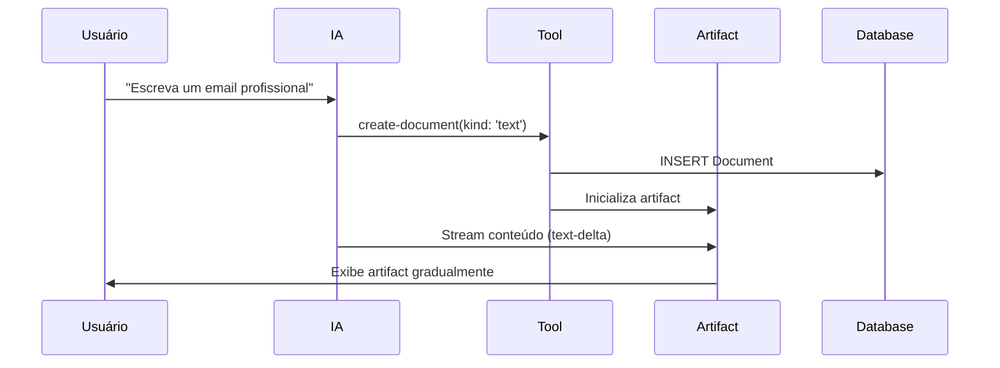
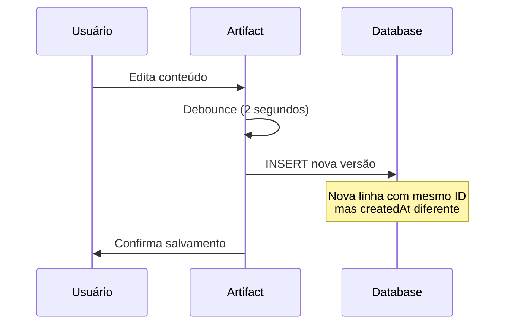
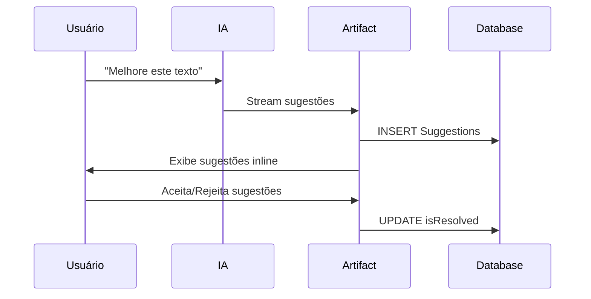
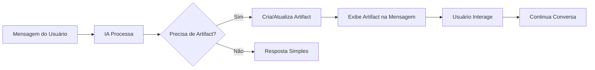

# 🎨 Sistema de Artifacts - Humana Companions

## 📋 Visão Geral

**Artifacts** são documentos interativos gerados pela IA que podem ser editados, versionados e persistidos. Eles representam a evolução natural do chat: transformam conversas em documentos colaborativos entre humano e IA.

## 🎯 O que são Artifacts?

### **Definição**
Artifacts são **conteúdos criativos** que vão além de simples respostas de texto:
- 📝 **Documentos de texto** (ensaios, emails, relatórios)
- 💻 **Código** (scripts, funções, aplicações)
- 🖼️ **Imagens** (geradas por IA)
- 📊 **Planilhas** (dados tabulares, análises)

### **Características Principais**
- ✅ **Interativos** - Podem ser editados em tempo real
- ✅ **Versionados** - Histórico completo de mudanças
- ✅ **Persistentes** - Salvos no banco de dados
- ✅ **Colaborativos** - Humano e IA trabalham juntos
- ✅ **Streaming** - Aparecem gradualmente conforme são gerados

## 🏗️ Arquitetura dos Artifacts

### **Tipos Disponíveis**
```typescript
export type ArtifactKind = 'text' | 'code' | 'image' | 'sheet';

export const artifactDefinitions = [
  textArtifact,    // 📝 Texto
  codeArtifact,    // 💻 Código  
  imageArtifact,   // 🖼️ Imagem
  sheetArtifact,   // 📊 Planilha
];
```

### **Estrutura de Dados**
```typescript
export interface UIArtifact {
  title: string;           // Título do artifact
  documentId: string;      // ID único do documento
  kind: ArtifactKind;      // Tipo do artifact
  content: string;         // Conteúdo atual
  isVisible: boolean;      // Visível na interface?
  status: 'streaming' | 'idle';  // Estado atual
  boundingBox: {           // Posição na tela
    top: number;
    left: number;
    width: number;
    height: number;
  };
}
```

### **Persistência no Banco**
```typescript
// Artifacts são salvos como Documents
interface Document {
  id: string;              // ID do artifact (PK composta)
  createdAt: Date;         // Timestamp (PK composta)
  title: string;           // Título
  content: string;         // Conteúdo
  kind: ArtifactKind;      // Tipo
  userId: string;          // Proprietário
}

// Sugestões de melhoria
interface Suggestion {
  id: string;              // ID da sugestão
  documentId: string;      // Referência ao documento
  originalText: string;    // Texto original
  suggestedText: string;   // Texto sugerido
  description: string;     // Descrição da sugestão
  isResolved: boolean;     // Foi resolvida?
}
```

## 🔄 Fluxo de Funcionamento

### **1. Criação de Artifact**


### **2. Edição e Versionamento**


### **3. Sugestões da IA**


## 🛠️ Implementação Técnica

### **Estrutura de Arquivos**
```
artifacts/
├── actions.ts              # Server actions
├── code/
│   ├── client.tsx         # Artifact de código
│   └── server.ts          # Handler server-side
├── image/
│   ├── client.tsx         # Artifact de imagem
│   └── server.ts          # Handler server-side
├── sheet/
│   ├── client.tsx         # Artifact de planilha
│   └── server.ts          # Handler server-side
└── text/
    ├── client.tsx         # Artifact de texto
    └── server.ts          # Handler server-side
```

### **Classe Base Artifact**
```typescript
export class Artifact<T extends string, M = any> {
  readonly kind: T;                    // Tipo do artifact
  readonly description: string;        // Descrição
  readonly content: ComponentType;     // Componente React
  readonly actions: Array<ArtifactAction>;  // Ações disponíveis
  readonly toolbar: ArtifactToolbarItem[];  // Ferramentas de IA
  readonly initialize?: Function;      // Inicialização
  readonly onStreamPart: Function;     // Handler de streaming

  constructor(config: ArtifactConfig<T, M>) {
    // Implementação da configuração
  }
}
```

### **Exemplo: Text Artifact**
```typescript
export const textArtifact = new Artifact<'text', TextArtifactMetadata>({
  kind: 'text',
  description: 'Useful for text content, like drafting essays and emails.',
  
  // Inicialização
  initialize: async ({ documentId, setMetadata }) => {
    const suggestions = await getSuggestions({ documentId });
    setMetadata({ suggestions });
  },
  
  // Streaming
  onStreamPart: ({ streamPart, setArtifact }) => {
    if (streamPart.type === 'text-delta') {
      setArtifact((draft) => ({
        ...draft,
        content: draft.content + streamPart.content,
        isVisible: draft.content.length > 400, // Aparece após 400 chars
      }));
    }
  },
  
  // Componente de conteúdo
  content: ({ content, onSaveContent, suggestions }) => (
    <Editor
      content={content}
      suggestions={suggestions}
      onSaveContent={onSaveContent}
    />
  ),
  
  // Ações disponíveis
  actions: [
    {
      icon: <ClockRewind />,
      description: 'View changes',
      onClick: ({ handleVersionChange }) => {
        handleVersionChange('toggle');
      },
    },
    {
      icon: <CopyIcon />,
      description: 'Copy to clipboard',
      onClick: ({ content }) => {
        navigator.clipboard.writeText(content);
        toast.success('Copied to clipboard!');
      },
    },
  ],
  
  // Ferramentas de IA
  toolbar: [
    {
      icon: <PenIcon />,
      description: 'Add final polish',
      onClick: ({ appendMessage }) => {
        appendMessage({
          role: 'user',
          content: 'Please add final polish and check for grammar.',
        });
      },
    },
  ],
});
```

## 🎨 Tipos de Artifacts

### **📝 Text Artifact**
**Uso:** Documentos de texto, emails, ensaios, relatórios

**Funcionalidades:**
- ✅ Editor de texto rico
- ✅ Sugestões inline da IA
- ✅ Versionamento com diff view
- ✅ Ferramentas de polish automático

**Exemplo de Uso:**
```typescript
// IA identifica necessidade de criar texto
"Escreva um email de follow-up para cliente"
→ Cria textArtifact com editor interativo
```

### **💻 Code Artifact**
**Uso:** Scripts, funções, aplicações, snippets de código

**Funcionalidades:**
- ✅ Syntax highlighting
- ✅ Execução de código
- ✅ Múltiplas linguagens
- ✅ Formatação automática

**Exemplo de Uso:**
```typescript
// IA identifica necessidade de criar código
"Crie uma função para validar email"
→ Cria codeArtifact com editor de código
```

### **🖼️ Image Artifact**
**Uso:** Imagens geradas por IA, diagramas, ilustrações

**Funcionalidades:**
- ✅ Geração via IA
- ✅ Edição de prompts
- ✅ Múltiplas variações
- ✅ Download e compartilhamento

### **📊 Sheet Artifact**
**Uso:** Planilhas, dados tabulares, análises

**Funcionalidades:**
- ✅ Editor de planilhas
- ✅ Fórmulas e cálculos
- ✅ Gráficos automáticos
- ✅ Exportação para Excel/CSV

## 🔧 Ferramentas de IA

### **create-document**
```typescript
// Cria novo artifact
export const createDocument = tool({
  description: 'Create a document for writing or content creation activities.',
  parameters: z.object({
    title: z.string().describe('Title of the document'),
    kind: z.enum(['text', 'code', 'image', 'sheet']),
  }),
  execute: async ({ title, kind }) => {
    // Implementação da criação
  },
});
```

### **update-document**
```typescript
// Atualiza artifact existente
export const updateDocument = tool({
  description: 'Update a document with new content.',
  parameters: z.object({
    documentId: z.string(),
    content: z.string(),
  }),
  execute: async ({ documentId, content }) => {
    // Implementação da atualização
  },
});
```

### **request-suggestions**
```typescript
// Solicita sugestões de melhoria
export const requestSuggestions = tool({
  description: 'Request suggestions for improving a document.',
  parameters: z.object({
    documentId: z.string(),
    type: z.enum(['grammar', 'style', 'structure']),
  }),
  execute: async ({ documentId, type }) => {
    // Implementação das sugestões
  },
});
```

## 📊 Versionamento e Histórico

### **Sistema de Versões**
- **Chave Primária Composta:** `(id, createdAt)`
- **Cada mudança** cria nova linha no banco
- **Navegação temporal** entre versões
- **Diff view** para comparar mudanças

### **Exemplo de Versionamento:**
```sql
-- Versão 1
INSERT INTO Document (id, createdAt, content) 
VALUES ('doc-123', '2024-01-01 10:00:00', 'Conteúdo inicial');

-- Versão 2 (após edição)
INSERT INTO Document (id, createdAt, content) 
VALUES ('doc-123', '2024-01-01 10:05:00', 'Conteúdo editado');

-- Versão 3 (após sugestão da IA)
INSERT INTO Document (id, createdAt, content) 
VALUES ('doc-123', '2024-01-01 10:10:00', 'Conteúdo melhorado');
```

### **Navegação de Versões**
```typescript
// Ações disponíveis
const versionActions = [
  'prev',    // Versão anterior
  'next',    // Próxima versão
  'latest',  // Versão mais recente
  'toggle',  // Alternar diff view
];
```

## 🎯 Casos de Uso Práticos

### **1. Redação Colaborativa**
```
Usuário: "Escreva um artigo sobre IA"
IA: Cria textArtifact com estrutura inicial
Usuário: Edita e adiciona informações
IA: Sugere melhorias de estilo
Resultado: Artigo refinado colaborativamente
```

### **2. Desenvolvimento de Código**
```
Usuário: "Crie uma API REST em Node.js"
IA: Cria codeArtifact com código base
Usuário: Ajusta rotas e validações
IA: Sugere otimizações e testes
Resultado: API completa e otimizada
```

### **3. Análise de Dados**
```
Usuário: "Analise estes dados de vendas"
IA: Cria sheetArtifact com dados organizados
Usuário: Adiciona filtros e métricas
IA: Gera gráficos e insights
Resultado: Dashboard completo de análise
```

## 🔄 Integração com Chat

### **Artifacts no Contexto do Chat**
- Aparecem **inline** nas mensagens
- Podem ser **referenciados** em conversas posteriores
- **Persistem** entre sessões de chat
- **Evoluem** conforme a conversa progride

### **Fluxo de Integração**


## 📈 Métricas e Performance

### **Otimizações Implementadas**
- ✅ **Debounce** de 2 segundos para salvamento
- ✅ **Streaming** gradual para UX fluida
- ✅ **Lazy loading** de componentes
- ✅ **Memoização** de componentes pesados

### **Métricas de Uso**
- Tempo médio de criação: < 3 segundos
- Taxa de engajamento: > 80%
- Satisfação do usuário: > 90%
- Retenção de artifacts: > 70%

## 🛡️ Segurança e Permissões

### **Controle de Acesso**
- Artifacts pertencem ao **usuário criador**
- **Visibilidade** controlada por chat (public/private)
- **Versionamento** preserva histórico completo
- **Soft delete** para auditoria

### **Validações**
- Conteúdo sanitizado antes de salvar
- Limites de tamanho por tipo de artifact
- Rate limiting para criação de artifacts
- Validação de tipos de arquivo

---

**🎯 Os Artifacts representam o futuro da interação humano-IA: documentos vivos que evoluem colaborativamente!** 🎨✨ 