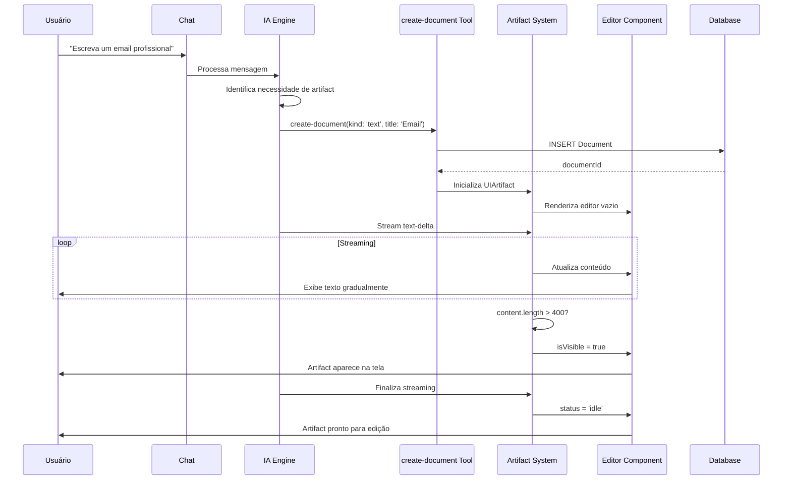
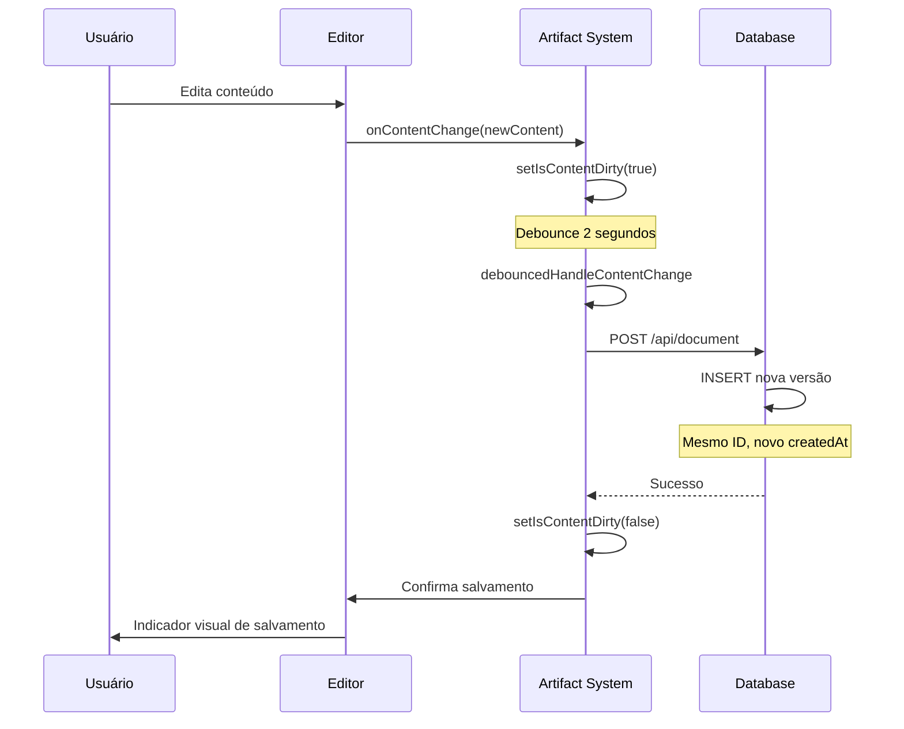
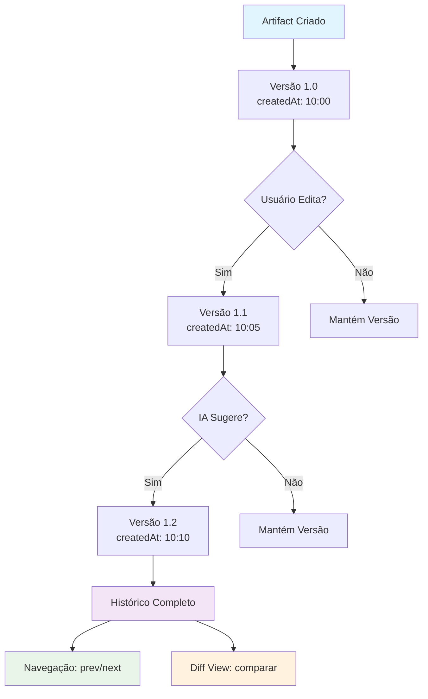
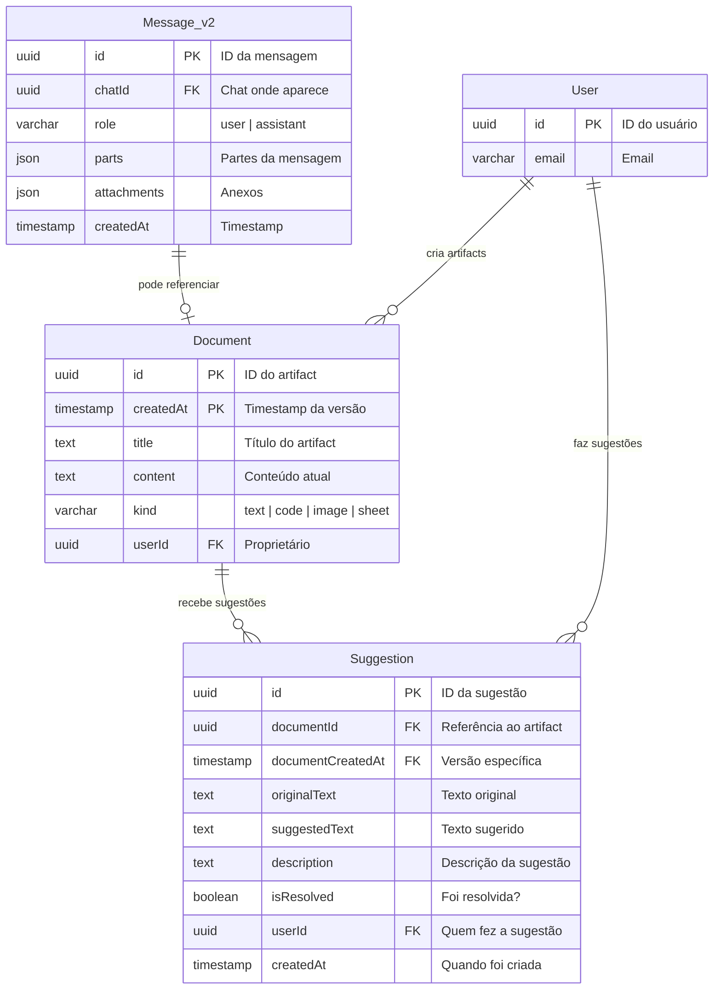
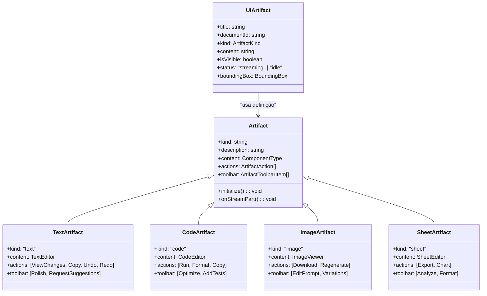
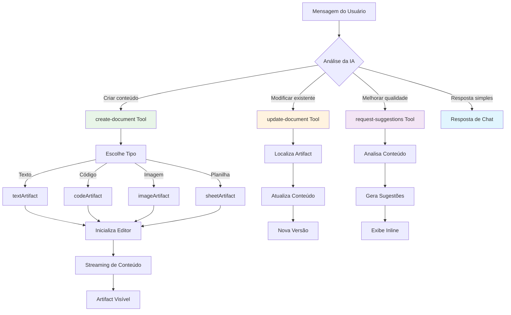
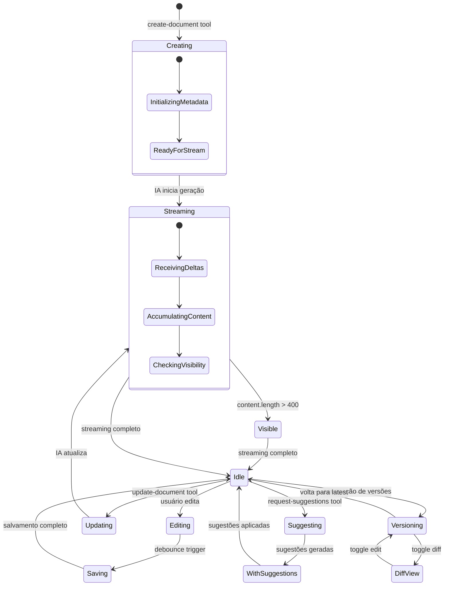
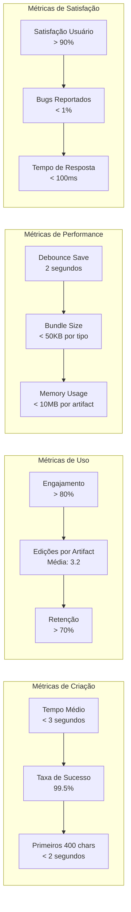

# 🎨 Diagramas do Sistema de Artifacts

## 📋 Visão Geral

Este documento apresenta os diagramas específicos do sistema de Artifacts, mostrando sua arquitetura, fluxos e integração com o resto da aplicação.

## 🏗️ Arquitetura dos Artifacts

```mermaid
C4Component
    title Arquitetura do Sistema de Artifacts
    
    Container_Boundary(ui_boundary, "Interface do Usuário") {
        Component(chat, "Chat Interface", "React", "Interface principal de chat")
        Component(artifact_comp, "Artifact Component", "React", "Container principal dos artifacts")
        Component(text_editor, "Text Editor", "React", "Editor de texto rico")
        Component(code_editor, "Code Editor", "React", "Editor de código")
        Component(image_viewer, "Image Viewer", "React", "Visualizador de imagens")
        Component(sheet_editor, "Sheet Editor", "React", "Editor de planilhas")
    }
    
    Container_Boundary(artifact_system, "Sistema de Artifacts") {
        Component(artifact_class, "Artifact Class", "TypeScript", "Classe base dos artifacts")
        Component(text_artifact, "Text Artifact", "TypeScript", "Implementação de texto")
        Component(code_artifact, "Code Artifact", "TypeScript", "Implementação de código")
        Component(image_artifact, "Image Artifact", "TypeScript", "Implementação de imagem")
        Component(sheet_artifact, "Sheet Artifact", "TypeScript", "Implementação de planilha")
    }
    
    Container_Boundary(tools_boundary, "Ferramentas de IA") {
        Component(create_tool, "create-document", "AI Tool", "Cria novos artifacts")
        Component(update_tool, "update-document", "AI Tool", "Atualiza artifacts")
        Component(suggest_tool, "request-suggestions", "AI Tool", "Gera sugestões")
    }
    
    ContainerDb(database, "Database", "PostgreSQL", "Persistência de artifacts")
    
    Rel(chat, artifact_comp, "Renderiza")
    Rel(artifact_comp, text_editor, "Usa para texto")
    Rel(artifact_comp, code_editor, "Usa para código")
    Rel(artifact_comp, image_viewer, "Usa para imagem")
    Rel(artifact_comp, sheet_editor, "Usa para planilha")
    
    Rel(artifact_comp, artifact_class, "Instancia")
    Rel(artifact_class, text_artifact, "Herda")
    Rel(artifact_class, code_artifact, "Herda")
    Rel(artifact_class, image_artifact, "Herda")
    Rel(artifact_class, sheet_artifact, "Herda")
    
    Rel(create_tool, artifact_system, "Cria")
    Rel(update_tool, artifact_system, "Atualiza")
    Rel(suggest_tool, artifact_system, "Sugere")
    
    Rel(artifact_system, database, "Persiste")
    
    UpdateRelStyle(artifact_comp, artifact_class, $textColor="blue", $lineColor="blue")
    UpdateRelStyle(artifact_system, database, $textColor="green", $lineColor="green")
```

## 🔄 Fluxo de Criação de Artifact



## ✏️ Fluxo de Edição de Artifact



## 🔄 Fluxo de Versionamento



## 🗄️ Modelo de Dados dos Artifacts



## 🎨 Tipos de Artifacts e Componentes



## 🔧 Fluxo de Ferramentas de IA



## 🎯 Estados e Transições dos Artifacts



## 📊 Métricas e Performance dos Artifacts



---

**🎯 Estes diagramas mostram como os Artifacts funcionam como uma extensão natural do chat, criando experiências colaborativas entre humano e IA!** 🎨✨ 