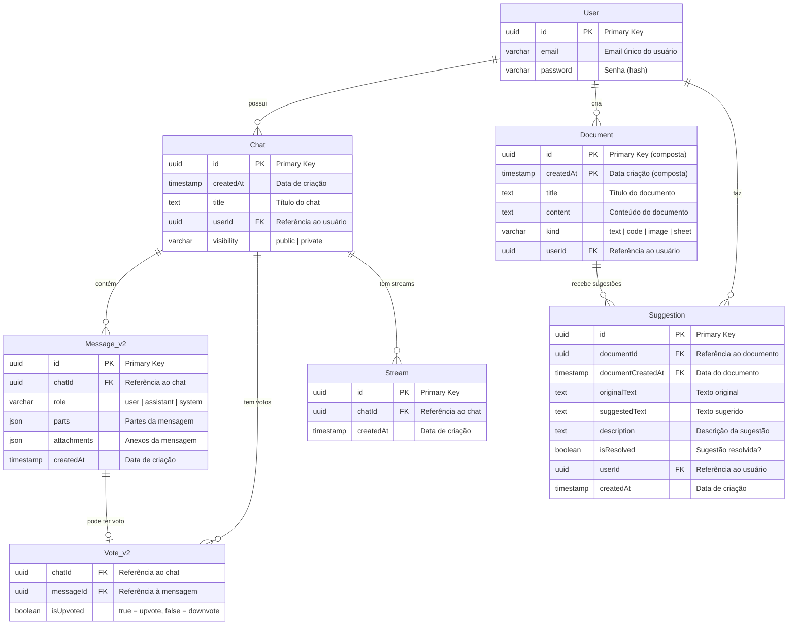
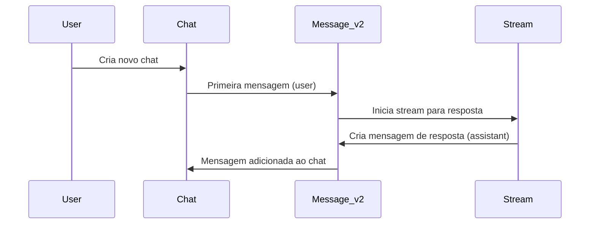
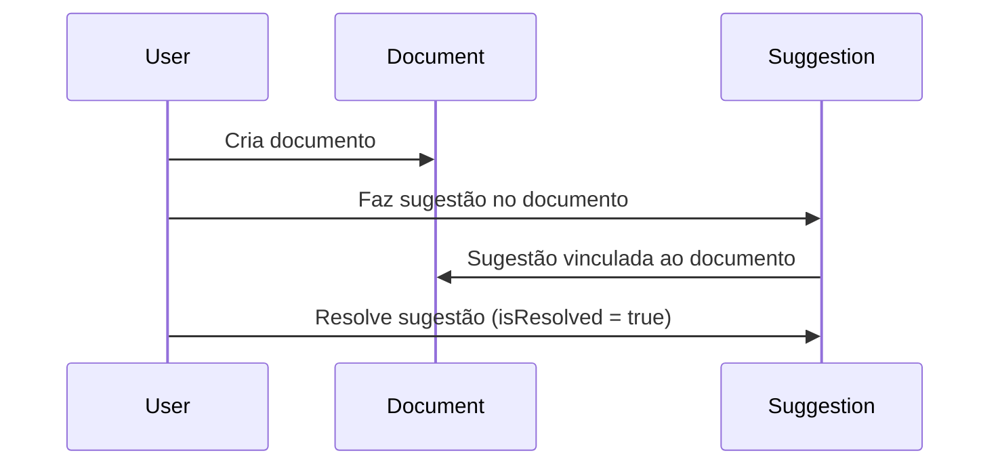
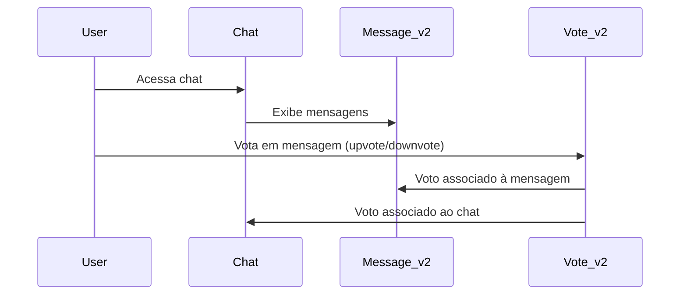
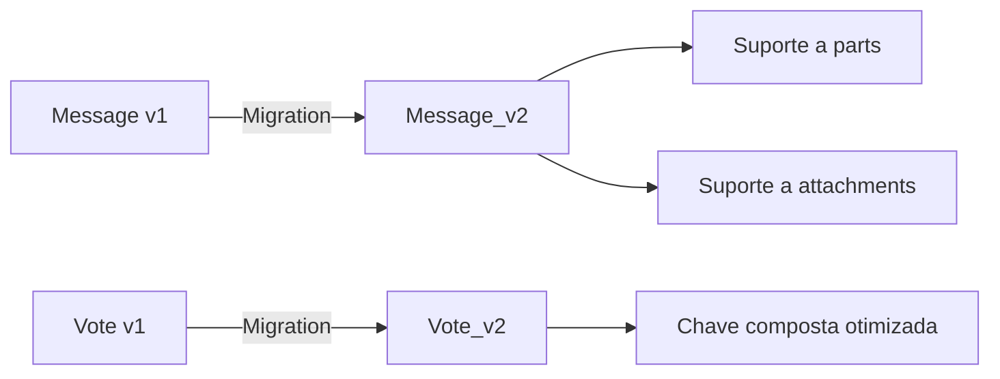

# 🗄️ Modelo de Dados - Humana Companions

## 📋 Visão Geral

Este documento apresenta o modelo de dados da aplicação Humana Companions, incluindo entidades, relacionamentos e estruturas de dados utilizadas.

## 🏗️ Diagrama Entidade-Relacionamento (ERD)



## 📊 Estruturas de Dados Detalhadas

### **🧑‍💼 User (Usuário)**
```typescript
interface User {
  id: string          // UUID gerado automaticamente
  email: string       // Email único (max 64 chars)
  password?: string   // Hash da senha (opcional para OAuth)
}
```

**Relacionamentos:**
- 1:N com `Chat` (um usuário pode ter múltiplos chats)
- 1:N com `Document` (um usuário pode criar múltiplos documentos)
- 1:N com `Suggestion` (um usuário pode fazer múltiplas sugestões)

### **💬 Chat (Conversa)**
```typescript
interface Chat {
  id: string           // UUID gerado automaticamente
  createdAt: Date      // Data de criação
  title: string        // Título da conversa
  userId: string       // FK para User
  visibility: 'public' | 'private'  // Visibilidade do chat
}
```

**Relacionamentos:**
- N:1 com `User` (muitos chats pertencem a um usuário)
- 1:N com `Message_v2` (um chat contém múltiplas mensagens)
- 1:N com `Vote_v2` (um chat pode ter múltiplos votos)
- 1:N com `Stream` (um chat pode ter múltiplos streams)

### **📝 Message_v2 (Mensagem)**
```typescript
interface DBMessage {
  id: string           // UUID gerado automaticamente
  chatId: string       // FK para Chat
  role: string         // 'user' | 'assistant' | 'system'
  parts: MessagePart[] // Array de partes da mensagem
  attachments: Attachment[] // Array de anexos
  createdAt: Date      // Data de criação
}

// Estrutura das partes da mensagem
interface MessagePart {
  type: 'text' | 'image' | 'file'
  content: string
  metadata?: Record<string, any>
}

// Estrutura dos anexos
interface Attachment {
  id: string
  name: string
  type: string
  url: string
  size: number
}
```

**Relacionamentos:**
- N:1 com `Chat` (muitas mensagens pertencem a um chat)
- 1:1 com `Vote_v2` (uma mensagem pode ter um voto)

### **👍 Vote_v2 (Voto)**
```typescript
interface Vote {
  chatId: string      // FK para Chat (parte da PK composta)
  messageId: string   // FK para Message_v2 (parte da PK composta)
  isUpvoted: boolean  // true = upvote, false = downvote
}
```

**Chave Primária Composta:** `(chatId, messageId)`

**Relacionamentos:**
- N:1 com `Chat` (muitos votos pertencem a um chat)
- 1:1 com `Message_v2` (um voto pertence a uma mensagem)

### **📄 Document (Documento)**
```typescript
interface Document {
  id: string          // UUID (parte da PK composta)
  createdAt: Date     // Data de criação (parte da PK composta)
  title: string       // Título do documento
  content?: string    // Conteúdo do documento
  kind: 'text' | 'code' | 'image' | 'sheet'  // Tipo do documento
  userId: string      // FK para User
}
```

**Chave Primária Composta:** `(id, createdAt)`

**Relacionamentos:**
- N:1 com `User` (muitos documentos pertencem a um usuário)
- 1:N com `Suggestion` (um documento pode ter múltiplas sugestões)

### **💡 Suggestion (Sugestão)**
```typescript
interface Suggestion {
  id: string                    // UUID (PK)
  documentId: string           // FK para Document.id
  documentCreatedAt: Date      // FK para Document.createdAt
  originalText: string         // Texto original
  suggestedText: string        // Texto sugerido
  description?: string         // Descrição da sugestão
  isResolved: boolean          // Sugestão foi resolvida?
  userId: string              // FK para User
  createdAt: Date             // Data de criação
}
```

**Relacionamentos:**
- N:1 com `User` (muitas sugestões pertencem a um usuário)
- N:1 com `Document` (muitas sugestões pertencem a um documento)

### **🌊 Stream (Stream)**
```typescript
interface Stream {
  id: string          // UUID (PK)
  chatId: string      // FK para Chat
  createdAt: Date     // Data de criação
}
```

**Relacionamentos:**
- N:1 com `Chat` (muitos streams pertencem a um chat)

## 🔄 Fluxos de Dados Principais

### **Fluxo de Chat**


### **Fluxo de Documentos**


### **Fluxo de Votação**


## 🗂️ Organização por Contexto

### **👤 Contexto de Usuário**
- `User` - Dados básicos do usuário
- `Chat` - Conversas do usuário
- `Document` - Documentos criados pelo usuário

### **💬 Contexto de Conversa**
- `Chat` - Dados da conversa
- `Message_v2` - Mensagens da conversa
- `Stream` - Streams de resposta
- `Vote_v2` - Votos nas mensagens

### **📝 Contexto de Documentos**
- `Document` - Documento principal
- `Suggestion` - Sugestões de melhoria

## 🔧 Migrations e Versionamento

### **Tabelas Depreciadas**
```markdown
⚠️ DEPRECATED - Serão removidas em versões futuras:
- Message (substituída por Message_v2)
- Vote (substituída por Vote_v2)
```

### **Evolução do Schema**


## 📊 Métricas e Performance

### **Índices Recomendados**
```sql
-- Índices para performance
CREATE INDEX idx_chat_user_created ON Chat(userId, createdAt DESC);
CREATE INDEX idx_message_chat_created ON Message_v2(chatId, createdAt DESC);
CREATE INDEX idx_document_user_created ON Document(userId, createdAt DESC);
CREATE INDEX idx_suggestion_document ON Suggestion(documentId, documentCreatedAt);
```

### **Queries Comuns**
```typescript
// Buscar chats do usuário
const userChats = await db
  .select()
  .from(chat)
  .where(eq(chat.userId, userId))
  .orderBy(desc(chat.createdAt))

// Buscar mensagens do chat
const chatMessages = await db
  .select()
  .from(message)
  .where(eq(message.chatId, chatId))
  .orderBy(asc(message.createdAt))

// Buscar documentos com sugestões
const documentsWithSuggestions = await db
  .select()
  .from(document)
  .leftJoin(suggestion, and(
    eq(suggestion.documentId, document.id),
    eq(suggestion.documentCreatedAt, document.createdAt)
  ))
  .where(eq(document.userId, userId))
```

## 🎯 Considerações de Design

### **Chaves Primárias Compostas**
- `Document`: `(id, createdAt)` - Permite versionamento temporal
- `Vote_v2`: `(chatId, messageId)` - Garante um voto por mensagem por chat

### **Campos JSON**
- `Message_v2.parts` - Flexibilidade para diferentes tipos de conteúdo
- `Message_v2.attachments` - Suporte a anexos variados

### **Soft Delete vs Hard Delete**
- Atualmente usa hard delete
- Considerar soft delete para auditoria futura

---

**🎯 Este modelo de dados suporta a funcionalidade completa da aplicação com flexibilidade para crescimento futuro!** 