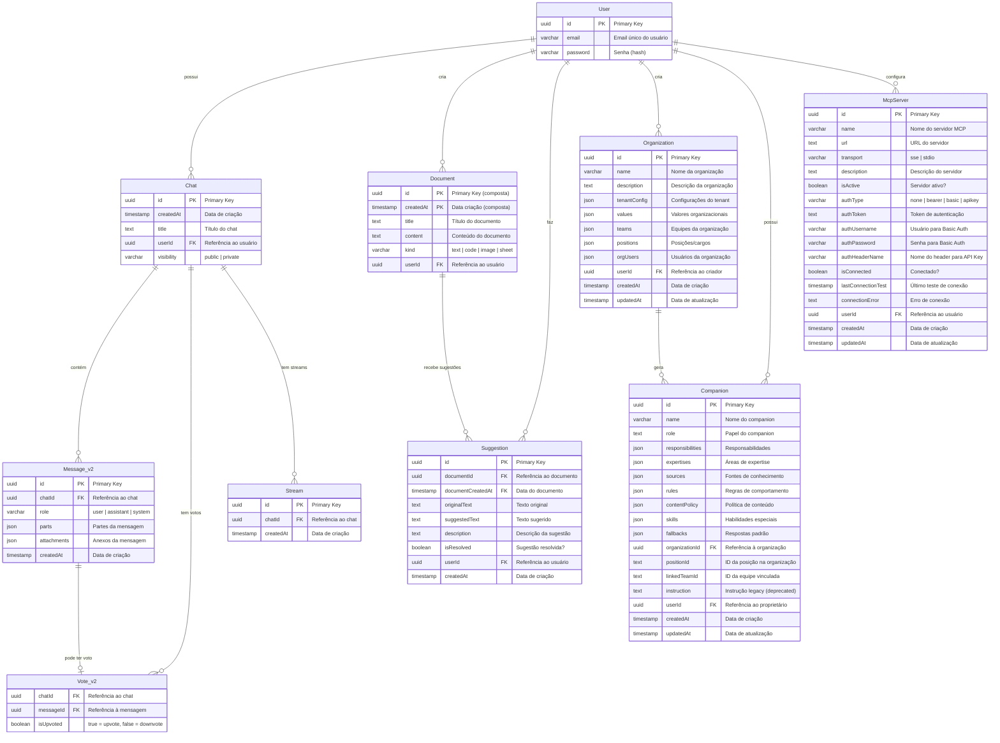

# 🗄️ Modelo de Dados - Humana Companions

## 📋 Visão Geral

Este documento apresenta o modelo de dados da aplicação Humana Companions, incluindo entidades, relacionamentos e estruturas de dados utilizadas.

## 🏗️ Diagrama Entidade-Relacionamento (ERD)



## 📊 Estruturas de Dados Detalhadas

### **🧑‍💼 User (Usuário)**
```typescript
interface User {
  id: string          // UUID gerado automaticamente
  email: string       // Email único (max 64 chars)
  password?: string   // Hash da senha (opcional para OAuth)
}
```

**Relacionamentos:**
- 1:N com `Chat` (um usuário pode ter múltiplos chats)
- 1:N com `Document` (um usuário pode criar múltiplos documentos)
- 1:N com `Suggestion` (um usuário pode fazer múltiplas sugestões)
- 1:N com `Organization` (um usuário pode criar múltiplas organizações)
- 1:N com `Companion` (um usuário pode possuir múltiplos companions)
- 1:N com `McpServer` (um usuário pode configurar múltiplos servidores MCP)

### **🏢 Organization (Organização)**
```typescript
interface Organization {
  id: string                    // UUID gerado automaticamente
  name: string                  // Nome da organização (max 100 chars)
  description: string           // Descrição da organização
  tenantConfig: TenantConfig    // Configurações do tenant
  values: OrganizationalValue[] // Valores organizacionais
  teams: Team[]                 // Equipes da organização
  positions: Position[]         // Posições/cargos
  orgUsers: OrgUser[]          // Usuários da organização
  userId: string               // FK para User (criador)
  createdAt: Date              // Data de criação
  updatedAt: Date              // Data de atualização
}

interface TenantConfig {
  timezone: string      // Ex: "America/Sao_Paulo"
  language: string      // Ex: "pt-BR"
  llm_provider: string  // Ex: "azure-openai"
  default_model: string // Ex: "gpt-4o"
}

interface OrganizationalValue {
  name: string                  // Ex: "Inovação"
  description: string           // Ex: "Buscamos sempre..."
  expected_behaviors: string[]  // Lista de comportamentos esperados
}

interface Team {
  id: string          // Ex: "team_product"
  name: string        // Ex: "Produto"
  description: string // Ex: "Equipe responsável..."
  members: string[]   // Lista de IDs de usuários
}

interface Position {
  id: string                    // Ex: "pos_ceo"
  title: string                 // Ex: "Chief Executive Officer"
  description: string           // Ex: "Responsável pela..."
  reports_to: string | null     // ID da posição superior
  r_and_r: string[]            // Responsabilidades
  companions: CompanionRef[]    // Companions vinculados
}

interface CompanionRef {
  companion_id: string    // Ex: "comp_ceo_ai"
  name: string           // Ex: "CEO.ai"
  status: string         // Ex: "active"
  linked_team_id: string // ID da equipe vinculada
}

interface OrgUser {
  user_id: string       // UUID do usuário
  position_id: string   // ID da posição
  role: string          // Ex: "admin", "member"
  permissions: string[] // Lista de permissões
}
```

**Relacionamentos:**
- N:1 com `User` (muitas organizações pertencem a um usuário)
- 1:N com `Companion` (uma organização pode gerar múltiplos companions)

### **🤖 Companion (Companion)**
```typescript
interface Companion {
  id: string                    // UUID gerado automaticamente
  name: string                  // Nome do companion (max 100 chars)
  role: string                  // Papel do companion
  responsibilities: string[]    // Array de responsabilidades
  expertises: Expertise[]       // Array de áreas de expertise
  sources: Source[]             // Array de fontes de conhecimento
  rules: Rule[]                 // Array de regras de comportamento
  contentPolicy: ContentPolicy // Política de conteúdo
  skills?: Skill[]             // Array de habilidades especiais (opcional)
  fallbacks?: Fallbacks        // Respostas padrão (opcional)
  organizationId?: string      // FK para Organization (opcional)
  positionId?: string          // ID da posição na organização (opcional)
  linkedTeamId?: string        // ID da equipe vinculada (opcional)
  instruction?: string         // Instrução legacy (deprecated)
  userId: string               // FK para User
  createdAt: Date              // Data de criação
  updatedAt: Date              // Data de atualização
}

interface Expertise {
  area: string      // Ex: "Desenvolvimento"
  topics: string[]  // Ex: ["TypeScript", "React"]
}

interface Source {
  type: string        // Ex: "Base de Conhecimento"
  description: string // Ex: "Documentação técnica..."
}

interface Rule {
  type: string        // Ex: "tone", "restriction"
  description: string // Ex: "Use linguagem profissional"
}

interface ContentPolicy {
  allowed: string[]    // Lista de conteúdos permitidos
  disallowed: string[] // Lista de conteúdos não permitidos
}

interface Skill {
  name: string        // Nome da habilidade
  description: string // Descrição da habilidade
  tools: string[]     // Ferramentas utilizadas
  example: string     // Exemplo de uso
}

interface Fallbacks {
  ambiguous?: string    // Resposta para perguntas ambíguas
  out_of_scope?: string // Resposta para fora do escopo
  unknown?: string      // Resposta para situações desconhecidas
}
```

**Relacionamentos:**
- N:1 com `User` (muitos companions pertencem a um usuário)
- N:1 com `Organization` (muitos companions pertencem a uma organização)

### **🔧 McpServer (Servidor MCP)**
```typescript
interface McpServer {
  id: string                    // UUID gerado automaticamente
  name: string                  // Nome do servidor (max 100 chars)
  url: string                   // URL do servidor
  transport: 'sse' | 'stdio'    // Tipo de transporte
  description?: string          // Descrição do servidor
  isActive: boolean             // Servidor ativo?
  authType: 'none' | 'bearer' | 'basic' | 'apikey' // Tipo de autenticação
  authToken?: string            // Token para Bearer/API Key
  authUsername?: string         // Usuário para Basic Auth
  authPassword?: string         // Senha para Basic Auth
  authHeaderName?: string       // Nome do header para API Key
  isConnected: boolean          // Status de conexão
  lastConnectionTest?: Date     // Último teste de conexão
  connectionError?: string      // Erro de conexão
  userId: string               // FK para User
  createdAt: Date              // Data de criação
  updatedAt: Date              // Data de atualização
}
```

**Relacionamentos:**
- N:1 com `User` (muitos servidores MCP pertencem a um usuário)

### **💬 Chat (Conversa)**
```typescript
interface Chat {
  id: string           // UUID gerado automaticamente
  createdAt: Date      // Data de criação
  title: string        // Título da conversa
  userId: string       // FK para User
  visibility: 'public' | 'private'  // Visibilidade do chat
}
```

**Relacionamentos:**
- N:1 com `User` (muitos chats pertencem a um usuário)
- 1:N com `Message_v2` (um chat contém múltiplas mensagens)
- 1:N com `Vote_v2` (um chat pode ter múltiplos votos)
- 1:N com `Stream` (um chat pode ter múltiplos streams)

### **📝 Message_v2 (Mensagem)**
```typescript
interface DBMessage {
  id: string           // UUID gerado automaticamente
  chatId: string       // FK para Chat
  role: string         // 'user' | 'assistant' | 'system'
  parts: MessagePart[] // Array de partes da mensagem
  attachments: Attachment[] // Array de anexos
  createdAt: Date      // Data de criação
}

// Estrutura das partes da mensagem
interface MessagePart {
  type: 'text' | 'image' | 'file'
  content: string
  metadata?: Record<string, any>
}

// Estrutura dos anexos
interface Attachment {
  id: string
  name: string
  type: string
  url: string
  size: number
}
```

**Relacionamentos:**
- N:1 com `Chat` (muitas mensagens pertencem a um chat)
- 1:1 com `Vote_v2` (uma mensagem pode ter um voto)

### **👍 Vote_v2 (Voto)**
```typescript
interface Vote {
  chatId: string      // FK para Chat (parte da PK composta)
  messageId: string   // FK para Message_v2 (parte da PK composta)
  isUpvoted: boolean  // true = upvote, false = downvote
}
```

**Chave Primária Composta:** `(chatId, messageId)`

**Relacionamentos:**
- N:1 com `Chat` (muitos votos pertencem a um chat)
- 1:1 com `Message_v2` (um voto pertence a uma mensagem)

### **📄 Document (Documento)**
```typescript
interface Document {
  id: string          // UUID (parte da PK composta)
  createdAt: Date     // Data de criação (parte da PK composta)
  title: string       // Título do documento
  content?: string    // Conteúdo do documento
  kind: 'text' | 'code' | 'image' | 'sheet'  // Tipo do documento
  userId: string      // FK para User
}
```

**Chave Primária Composta:** `(id, createdAt)`

**Relacionamentos:**
- N:1 com `User` (muitos documentos pertencem a um usuário)
- 1:N com `Suggestion` (um documento pode ter múltiplas sugestões)

### **💡 Suggestion (Sugestão)**
```typescript
interface Suggestion {
  id: string                    // UUID (PK)
  documentId: string           // FK para Document.id
  documentCreatedAt: Date      // FK para Document.createdAt
  originalText: string         // Texto original
  suggestedText: string        // Texto sugerido
  description?: string         // Descrição da sugestão
  isResolved: boolean          // Sugestão foi resolvida?
  userId: string              // FK para User
  createdAt: Date             // Data de criação
}
```

**Relacionamentos:**
- N:1 com `User` (muitas sugestões pertencem a um usuário)
- N:1 com `Document` (muitas sugestões pertencem a um documento)

### **🌊 Stream (Stream)**
```typescript
interface Stream {
  id: string      // UUID (PK)
  chatId: string  // FK para Chat
  createdAt: Date // Data de criação
}
```

**Relacionamentos:**
- N:1 com `Chat` (muitos streams pertencem a um chat)

## 🔄 Migrações Aplicadas

### **Histórico de Migrações**
- **0000**: Schema inicial básico
- **0001**: Adição de campos de autenticação
- **0002**: Implementação de mensagens v2
- **0003**: Sistema de votos v2
- **0004**: Documentos e sugestões
- **0005**: Sistema de streams
- **0006**: Companions básicos
- **0007**: Melhorias nos companions
- **0008**: Campos adicionais
- **0009**: Otimizações de performance
- **0010**: Estrutura completa de companions
- **0011**: Tabela Organization
- **0012**: Vinculação Organization ↔ Companion

### **Migração 0011 - Organization**
```sql
CREATE TABLE "Organization" (
  id uuid PRIMARY KEY DEFAULT gen_random_uuid(),
  name varchar(100) NOT NULL,
  description text NOT NULL,
  "tenantConfig" json NOT NULL,
  values json NOT NULL,
  teams json NOT NULL,
  positions json NOT NULL,
  "orgUsers" json NOT NULL,
  "userId" uuid NOT NULL REFERENCES "User"(id),
  "createdAt" timestamp DEFAULT now(),
  "updatedAt" timestamp DEFAULT now()
);
```

### **Migração 0012 - Vinculação Companions**
```sql
ALTER TABLE "Companion" ADD COLUMN "organizationId" uuid REFERENCES "Organization"(id);
ALTER TABLE "Companion" ADD COLUMN "positionId" text;
ALTER TABLE "Companion" ADD COLUMN "linkedTeamId" text;
```

## 📊 Índices de Performance

```sql
-- Índices principais
CREATE INDEX idx_organization_user_id ON "Organization"("userId");
CREATE INDEX idx_companion_organization_id ON "Companion"("organizationId");
CREATE INDEX idx_companion_user_org ON "Companion"("userId", "organizationId");
CREATE INDEX idx_chat_user_id ON "Chat"("userId");
CREATE INDEX idx_message_chat_id ON "Message_v2"("chatId");
CREATE INDEX idx_document_user_id ON "Document"("userId");
CREATE INDEX idx_mcpserver_user_id ON "McpServer"("userId");
```

## 🔍 Queries Principais

### **Organizações do Usuário**
```sql
SELECT * FROM "Organization" 
WHERE "userId" = $1 
ORDER BY "createdAt" DESC;
```

### **Companions da Organização**
```sql
SELECT * FROM "Companion" 
WHERE "organizationId" = $1 AND "userId" = $2 
ORDER BY "createdAt" DESC;
```

### **Estatísticas Completas**
```sql
SELECT 
  u.id as user_id,
  u.email,
  COUNT(DISTINCT o.id) as organizations_count,
  COUNT(DISTINCT c.id) as companions_count,
  COUNT(DISTINCT ch.id) as chats_count,
  COUNT(DISTINCT m.id) as mcpservers_count
FROM "User" u
LEFT JOIN "Organization" o ON o."userId" = u.id
LEFT JOIN "Companion" c ON c."userId" = u.id
LEFT JOIN "Chat" ch ON ch."userId" = u.id
LEFT JOIN "McpServer" m ON m."userId" = u.id
WHERE u.id = $1
GROUP BY u.id, u.email;
```

---

**🎯 Este modelo de dados suporta a funcionalidade completa da aplicação com flexibilidade para crescimento futuro!** 