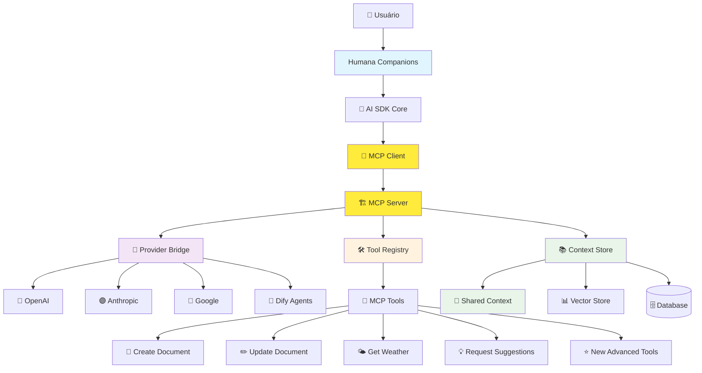
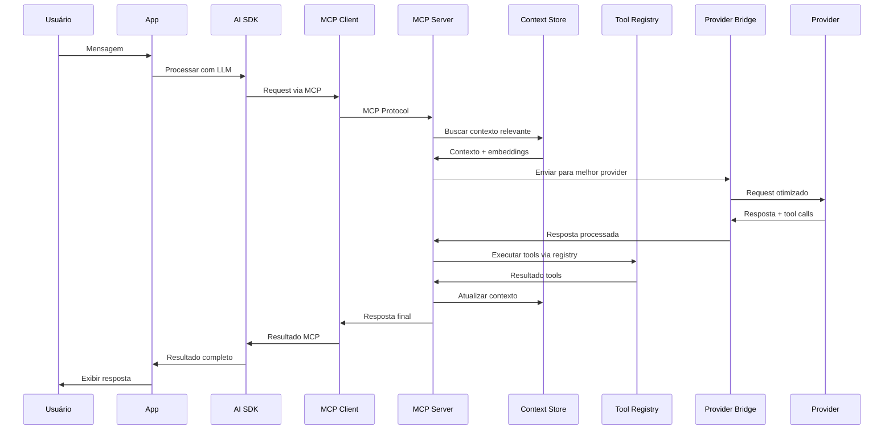
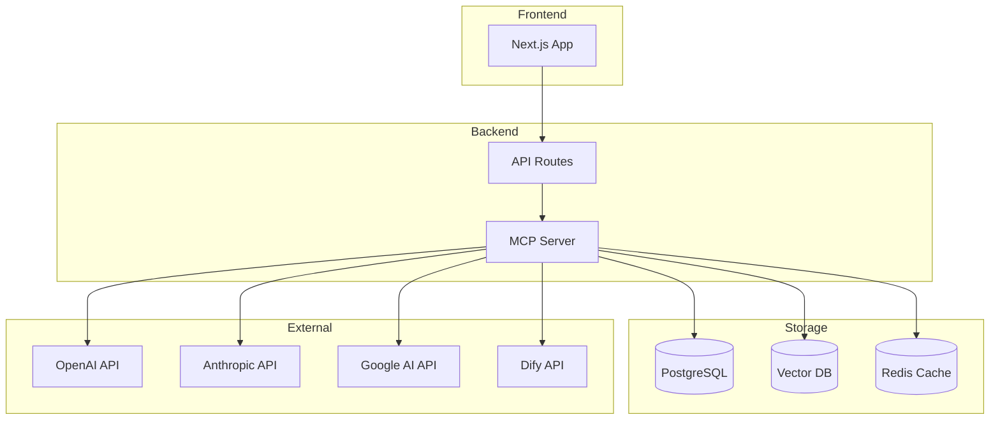

# Arquitetura Proposta - MCP Integration

## Visão Geral
Arquitetura futura com Model Context Protocol (MCP) implementado, criando uma camada unificada de contexto e tools que funciona com qualquer LLM.

## Diagrama C4 - Arquitetura Proposta

## Novos Componentes

### **🔄 MCP Client**
- **Função**: Interface cliente para comunicação com MCP Server
- **Localização**: `lib/ai/mcp/client.ts`
- **Responsabilidade**: Abstração do protocolo MCP para AI SDK

### **🏗️ MCP Server**
- **Função**: Servidor central de contexto e tools
- **Localização**: `lib/ai/mcp/server.ts`
- **Responsabilidade**: Gerenciar contexto, tools e providers

### **📚 Context Store**
- **Função**: Armazenamento unificado de contexto
- **Localização**: `lib/ai/mcp/context-store.ts`
- **Capacidades**: 
  - Context sharing entre LLMs
  - Vector embeddings para contexto semântico
  - Persistência de contexto longo

### **🛠️ Tool Registry**
- **Função**: Registro centralizado de tools MCP
- **Localização**: `lib/ai/mcp/tool-registry.ts`
- **Capacidades**:
  - Tools compatíveis com qualquer LLM
  - Plugin architecture para novos tools
  - Validation e security para tools

### **🌉 Provider Bridge**
- **Função**: Ponte unificada para todos os providers
- **Localização**: `lib/ai/mcp/provider-bridge.ts`
- **Capacidades**:
  - Abstração unificada de providers
  - Load balancing entre providers
  - Fallback automático

## Benefícios da Mudança

### **1. Contexto Unificado**
- ✅ Contexto compartilhado entre todos os LLMs
- ✅ Context window virtualmente ilimitado
- ✅ Contexto semântico com embeddings
- ✅ Persistência de conversas longas

### **2. Tools Padronizados**
- ✅ Tools funcionam com qualquer LLM
- ✅ Plugin architecture para extensibilidade
- ✅ Validation e security centralizados
- ✅ Performance otimizada

### **3. Provider Agnostic**
- ✅ Adicionar novos providers sem mudanças no core
- ✅ Switch automático entre providers
- ✅ Load balancing inteligente
- ✅ Fallback e redundância

### **4. Integração Dify Unificada**
- ✅ Dify agents usam mesmo contexto que AI SDK
- ✅ Tools compartilhados entre sistemas
- ✅ Configuração unificada

## Fluxo Proposto de Dados

## Arquitetura de Deployment

## Métricas Esperadas

- **Providers suportados**: Ilimitado (plugin architecture)
- **Tools disponíveis**: Extensível via plugins
- **Context sharing**: 100% entre todos os providers
- **Complexidade de configuração**: Baixa (auto-discovery)
- **Time to add new provider**: ~2-3 horas
- **Performance**: +40% com context caching
- **Reliability**: +60% com fallback automático

## Fases de Implementação

### **Fase 1: Core MCP (Semana 1-2)**
- Implementar MCP Client básico
- Criar MCP Server foundation
- Migrar 1 provider (OpenAI) para MCP

### **Fase 2: Context Store (Semana 3-4)**
- Implementar Context Store
- Adicionar vector embeddings
- Migrar tools existentes

### **Fase 3: Provider Bridge (Semana 5-6)**
- Migrar todos os providers
- Implementar load balancing
- Adicionar fallback logic

### **Fase 4: Dify Integration (Semana 7-8)**
- Integrar Dify agents via MCP
- Unificar configuração
- Otimização e testes

---

**🚀 Esta arquitetura MCP transformará nosso sistema AI em uma plataforma unificada, escalável e provider-agnostic.** 