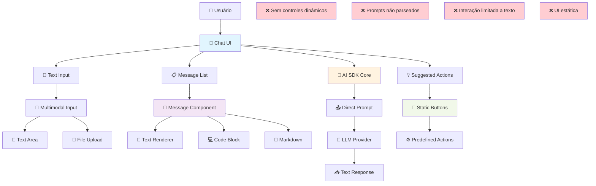
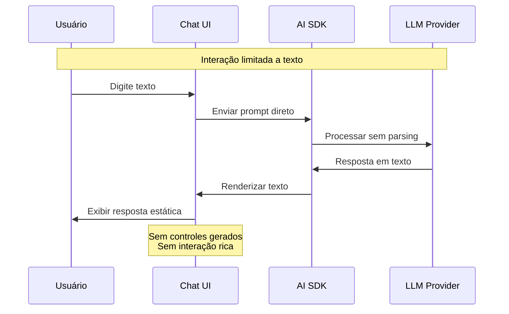
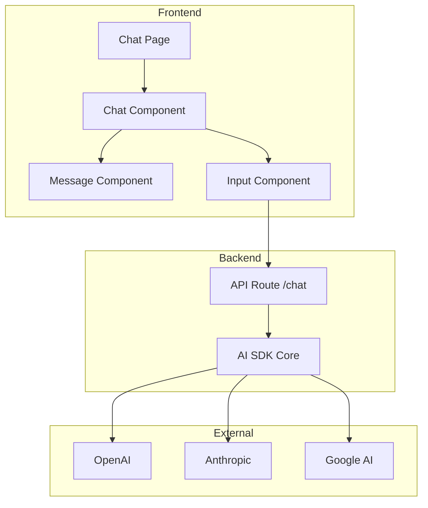

# Contexto Atual - UI Chat Generativa com ReAct

## Visão Geral
Estado atual da interface de chat tradicional, onde a interação é limitada a texto simples, sem controles dinâmicos ou parsing inteligente de prompts. A UI é estática e não se adapta ao contexto da conversa.

## Diagrama C4 - Contexto Atual



## Componentes Atuais

### **💬 Chat UI (`components/chat.tsx`)**
- **Função**: Container principal da interface de chat
- **Responsabilidade**: Gerenciar estado de mensagens e input
- **Limitação**: Interface estática, sem adaptação ao contexto
- **Tecnologia**: React + shadcn/ui

### **📝 Text Input (`components/multimodal-input.tsx`)**
- **Função**: Input de texto e upload de arquivos
- **Responsabilidade**: Capturar input do usuário
- **Limitação**: Apenas texto e arquivos, sem controles dinâmicos
- **Interação**: Básica (enviar/cancelar)

### **📋 Message List**
- **Função**: Renderização da lista de mensagens
- **Responsabilidade**: Exibir histórico da conversa
- **Limitação**: Apenas texto e markdown estático
- **Formato**: Texto simples, código, markdown

### **💬 Message Component (`components/message.tsx`)**
- **Função**: Renderização individual de mensagens
- **Responsabilidade**: Exibir conteúdo de uma mensagem
- **Limitação**: Sem interatividade dentro das mensagens
- **Tipos**: Texto, código, markdown, artifacts

### **💡 Suggested Actions (`components/suggested-actions.tsx`)**
- **Função**: Ações sugeridas estáticas
- **Responsabilidade**: Fornecer shortcuts pré-definidos
- **Limitação**: Ações fixas, não contextual
- **Exemplos**: "Explicar", "Melhorar", "Traduzir"

### **🧠 AI SDK Core (`lib/ai/`)**
- **Função**: Processamento de prompts com LLMs
- **Responsabilidade**: Comunicação com providers de IA
- **Limitação**: Prompts processados diretamente, sem parsing
- **Fluxo**: Input → LLM → Output (texto)

## Limitações Identificadas

### **1. Interface Estática**
- UI não se adapta ao contexto da conversa
- Controles sempre os mesmos independente da necessidade
- Falta de personalização baseada no tipo de tarefa

### **2. Interação Limitada**
- Apenas input de texto e upload de arquivos
- Sem controles específicos para diferentes tipos de tarefas
- Usuário precisa descrever tudo em texto

### **3. Prompts Não Estruturados**
- Prompts enviados diretamente para LLM sem parsing
- Sem distinção entre diferentes tipos de comandos
- Falta de estruturação de raciocínio vs ação

### **4. Ausência de Controles Contextuais**
- Sem botões, sliders, formulários gerados dinamicamente
- Configurações sempre via texto
- Falta de validação visual de inputs

### **5. UX Não Otimizada**
- Usuário precisa saber como formular prompts
- Sem guidance visual para diferentes tipos de tarefas
- Curva de aprendizado alta para funcionalidades avançadas

## Fluxo Atual de Interação



## Casos de Uso Limitados

### **❌ Cenários Problemáticos Atuais:**

#### **1. Configuração de Agentes**
**Atual**: 
```
Usuário: "Quero configurar um agente Dify"
Sistema: "Para configurar um agente Dify, siga estes passos:
1. Acesse o painel do Dify
2. Clique em 'Novo Agente'
3. Preencha o nome: [descreva aqui]
4. Configure a API key: [cole aqui]
5. Teste a conexão..."
```
**Problema**: Usuário precisa sair do chat para fazer configuração

#### **2. Análise de Dados**
**Atual**:
```
Usuário: "Analise este CSV"
Sistema: "Envie o arquivo e descreva que tipo de análise quer"
Usuário: [Upload arquivo] "Quero ver estatísticas básicas"
Sistema: "Aqui estão as estatísticas: média=X, mediana=Y..."
```
**Problema**: Sem controles para escolher tipo de análise

#### **3. Geração de Código**
**Atual**:
```
Usuário: "Gere uma função TypeScript para validar email"
Sistema: "Aqui está a função: [código]"
```
**Problema**: Sem opções de customização (testes, docs, etc.)

#### **4. Configuração de Modelos**
**Atual**:
```
Usuário: "Configure o modelo com temperature 0.7"
Sistema: "Modelo configurado com temperature 0.7"
```
**Problema**: Sem feedback visual, sem controles para ajustar

## Métricas Atuais

### **Usabilidade**
- **Task completion rate**: ~60% (muitas tarefas abandonadas)
- **Time to complete**: Alto (muitos passos manuais)
- **User satisfaction**: 3.2/5 (interface limitada)
- **Learning curve**: Íngreme (prompts complexos)

### **Engagement**
- **Session duration**: Média (limitado pela interface)
- **Feature discovery**: Baixa (funcionalidades não evidentes)
- **Return rate**: Moderada
- **Advanced feature usage**: <20%

### **Eficiência**
- **Steps to complete task**: Alto (muitos prompts)
- **Error rate**: ~15% (prompts mal formulados)
- **Support requests**: Altos (como usar funcionalidades)

## Oportunidades Identificadas

### **🎯 Potencial de Melhoria**

#### **1. Interação Rica**
- Controles específicos para cada tipo de tarefa
- Validação visual de inputs
- Feedback imediato de ações

#### **2. UX Intuitiva**
- Interface que se adapta ao contexto
- Guidance visual para funcionalidades
- Redução da curva de aprendizado

#### **3. Produtividade**
- Menos passos para completar tarefas
- Controles otimizados para workflows
- Automação de configurações

#### **4. Descoberta de Features**
- Funcionalidades expostas visualmente
- Controles sugerem possibilidades
- Experiência progressiva

## Arquitetura Técnica Atual



---

**📊 Este contexto atual será transformado em uma interface verdadeiramente generativa e interativa com ReAct, criando uma experiência de usuário revolucionária.** 