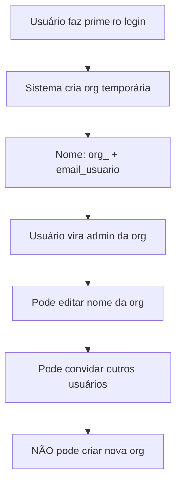
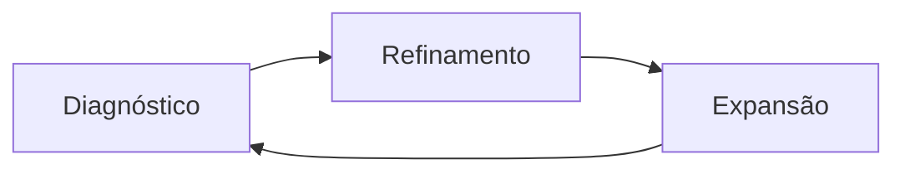
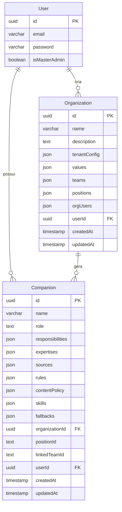

# 🧠 Organization Designer - Plataforma Humana AI

## 🎯 Visão Geral da Plataforma

### **🏛️ Humana AI: Arquitetura Cognitiva Organizacional**

A **Humana AI** é uma plataforma projetada para **mapear, expandir e preservar a inteligência organizacional**. Ela transforma cargos e papéis humanos em entidades cognitivas chamadas **Companions** — agentes que pensam, aprendem e atuam com seus usuários.

**Premissa Central**: Toda organização possui um **capital cognitivo interno** distribuído entre pessoas, processos, decisões, experiências e dados. A Humana materializa esse capital em forma **operacional, treinável e transferível**.

### **🎭 Filosofia: Amplificação Cognitiva**

- **❌ NÃO substitui** pessoas
- **✅ AMPLIFICA** cognitivamente os humanos  
- **🚀 PROMOVE** aprendizado ativo
- **👥 FACILITA** execução supervisionada
- **🧠 PRESERVA** conhecimento crítico organizacional

---

## 📋 Status da Implementação

**Funcionalidade**: Sistema completo de **Organization Designer** 
**Status**: ✅ **Implementado e Funcional**
**Complexidade**: **Alta**
**Impacto**: **Alto** - Nova funcionalidade core
**Data**: Janeiro 2025

---

## 🏗️ Arquitetura Multi-Tenant

### **🏢 Isolamento Organizacional**

Cada organização opera em **ambiente isolado** com:
- **🔒 Segurança** e controle dos dados organizacionais
- **🎛️ Flexibilidade** na modelagem da estrutura funcional
- **🌍 Adaptação** aos contextos culturais, operacionais e estratégicos

### **👑 Tipos de Administradores**

```yaml
Administrador_Normal:
  - Vê apenas SUA organização
  - Não pode criar nova organização
  - Controle total da sua organização
  - Pode convidar e gerenciar usuários

Administrador_Master:
  - Campo isMasterAdmin = true no banco
  - Vê lista de TODAS as organizações
  - Pode criar novas organizações
  - Acesso total ao sistema
```

### **🆕 Criação Automática de Organização**



---

## 💼 Estrutura Organizacional

### **🎯 Posições como Unidade Funcional**

As **posições** são a base estrutural de cada organização:

```yaml
Características:
  - Representa uma função cognitiva organizacional
  - Pode estar subordinada a outra (hierarquia)
  - Sempre associada a um time/área
  - Tem escopo de atuação definido
  - Serve como ancoragem para Companions
```

### **👥 Teams como Agrupadores Cognitivos**

Os **teams** organizam as posições horizontalmente:

```yaml
Finalidades:
  - Organizar posições por finalidade organizacional
  - Controlar permissões de acesso
  - Estimular colaboração entre Companions correlatos
  - Permitir visões matriciais e funcionais
```

---

## 🤖 Companions: Representação Cognitiva das Funções

### **�� Conceito Central**

O **Companion** é uma espécie de **gêmeo cognitivo de uma função** — mas não da pessoa que a ocupa. Representa o **como pensar, decidir, agir e melhorar** dentro de uma função específica.

### **📋 Características Principais**

#### **🔢 Múltiplos Companions por Cargo**
- Um cargo pode ter **mais de um Companion** associado
- Divisão deve ser por **escopos de atuação organizacional distintos**
- **❌ NÃO** dividir por tarefas específicas
- **✅ SIM** dividir por responsabilidades funcionais diferentes

**Exemplo - CEO:**
```yaml
CEO_Estratégico:
  escopo: "Visão estratégica e planejamento de longo prazo"
  habilidades: ["Análise de mercado", "Planejamento estratégico"]

CEO_Cultural:
  escopo: "Cultura organizacional e liderança"  
  habilidades: ["Gestão de pessoas", "Comunicação interna"]
```

### **⚖️ Responsabilidade vs Habilidade**

#### **🎯 Responsabilidade (O PORQUÊ)**
- Compromissos organizacionais
- Garantir execução da estratégia
- Preservar a cultura
- Otimizar processos

#### **🛠️ Habilidade (O COMO)**
- Capacidades cognitivas e operacionais
- Planejar estratégias
- Automatizar análises
- Redigir relatórios
- Mapear riscos

---

## 🎯 Funcionalidades Implementadas

### **🏗️ 1. Estrutura Organizacional Completa**
- ✅ **Configuração de Tenant** (timezone, idioma, LLM provider)
- ✅ **Valores Organizacionais** com princípios comportamentais
- ✅ **Equipes** com membros e permissões
- ✅ **Posições/Cargos** com hierarquia e R&Rs detalhados
- ✅ **Usuários da Organização** com roles específicos

### **🤖 2. Geração Automática com IA**
- ✅ **Modal de entrada** com 3 campos simples
- ✅ **Prompt especializado** para gerar estrutura organizacional completa
- ✅ **Geração de Companions** automática para cada posição
- ✅ **Parsing inteligente** da resposta JSON da IA
- ✅ **Validação robusta** com tratamento de erros

### **🗄️ 3. Persistência e APIs**
- ✅ **Tabela Organization** no PostgreSQL
- ✅ **Campo isMasterAdmin** no User
- ✅ **APIs REST completas** (GET, POST, PUT, DELETE)
- ✅ **Validação Zod** em todas as APIs
- ✅ **Queries CRUD** otimizadas
- ✅ **Migrações 0011 e 0012** aplicadas

### **🎨 4. Interface de Usuário**
- ✅ **Página /organizations** com dashboard visual
- ✅ **Listagem com estatísticas** (equipes, posições, companions, valores)
- ✅ **Formulário completo** para edição manual
- ✅ **Página dedicada** para edição (não modal)
- ✅ **Tooltips informativos** em todos os campos

### **🔗 5. Vinculação com Companions**
- ✅ **Campos organizacionais** adicionados ao schema Companion
- ✅ **Geração automática** de Companions por posição
- ✅ **Vinculação ao usuário** administrador da organização
- ✅ **API específica** para listar Companions por organização

---

## 🏆 Companions como Ativos Organizacionais

### **💎 Valor Estratégico**

Os Companions **não são passageiros**:

```yaml
Características:
  - Acumulam histórico e aprendizados
  - Preservam referências organizacionais
  - Persistem mesmo com mudanças de pessoal
  - Treinam novos ocupantes da posição
```

### **🔄 Continuidade Organizacional**

Mesmo que uma pessoa saia da organização, o Companion:
- **Preserva** a inteligência da função
- **Acelera** onboarding de novos colaboradores
- **Catalisa** melhoria contínua
- **Mantém** consistência em decisões
- **Preserva** conhecimento tácito

Com o tempo, os Companions se tornam os **maiores ativos imateriais** da empresa.

---

## 🚀 APIs Implementadas

### **📡 Endpoints REST**

```typescript
// Listar organizações (filtrado por tipo de admin)
GET /api/organizations
Response: Organization[] (sua org OU todas as orgs se master)

// Criar nova organização (apenas master admin)
POST /api/organizations
Body: OrganizationCreateInput
Response: Organization
Restriction: Apenas isMasterAdmin = true

// Buscar organização específica
GET /api/organizations/[id]
Response: Organization

// Atualizar organização
PUT /api/organizations/[id]
Body: OrganizationUpdateInput
Response: Organization

// Deletar organização
DELETE /api/organizations/[id]
Response: { success: boolean }

// Gerar organização com IA
POST /api/organizations/generate
Body: { name, description, orgChart }
Response: { 
  organization: Organization,
  companions: Companion[],
  companionsCreated: number
}

// Listar Companions da organização
GET /api/organizations/[id]/companions
Response: Companion[]
```

---

## 🔧 Companions como Sistemas Cognitivos Modulares

### **🧩 Blocos de Construção**

Cada Companion é estruturado com:

```yaml
Conhecimento:
  - O que ele sabe (fontes, dados, experiências)

Ações:
  - O que ele faz (automações, processos, entregas)

Comportamento:
  - Como ele age (estilo, regras, limites)

Relacionamentos:
  - Com quem ele conversa (usuários, permissões)

Aprendizado:
  - Como ele melhora (ciclo MCP)
```

### **⚡ Habilidades como Núcleo de Atuação**

```yaml
Raciocínio_Estratégico:
  exemplo: "Analisar riscos da expansão internacional"

Geração_de_Conteúdo:
  exemplo: "Redigir carta de recomendação executiva"

Processamento_de_Dados:
  exemplo: "Interpretar KPIs de vendas e sugerir ações"

Simulação:
  exemplo: "Criar roleplay com cliente B2B difícil"

Acesso_a_Ferramentas:
  exemplo: "Rodar modelo de precificação com planilhas"
```

---

## 🔄 Ciclo MCP: Melhoria Contínua da Performance Cognitiva

### **📊 Três Fases do Ciclo**



### **🔍 1. Diagnóstico**
- Gaps entre escopo da função e habilidades
- Erros recorrentes identificados
- Respostas evasivas mapeadas
- Baixa utilidade percebida pelos usuários

### **⚙️ 2. Refinamento**
- Fontes de informação
- Templates e instruções
- Ferramentas disponíveis
- Incorporação de feedback real

### **🚀 3. Expansão**
- Novas habilidades adicionadas
- Ampliação de escopo para novos contextos
- Geração de clones para outras posições
- Criação de variantes especializadas

---

## 🎯 Inteligência Combinada como Objetivo Final

### **🧠 Conceito Central**

**Inteligência Combinada** = Fusão entre cognição humana + cognição artificial

### **🤝 Papel dos Companions**

Os Companions são **catalisadores** dessa fusão:
- **❌ NÃO** pensam sozinhos
- **✅ SIM** pensam **COM** os humanos
- **📚 APRENDEM** com o ambiente
- **🎯 ATUAM** para o coletivo organizacional

### **🏗️ Resultado Final**

A plataforma cria:
- **Infraestrutura cognitiva viva**
- **Sistema de documentação prática e aplicável**
- **Forma de continuar aprendendo enquanto se trabalha**
- **Nova organização do conhecimento e trabalho**

---

## 📊 Modelo de Dados Implementado

### **🗄️ Schema Completo**



### **🏗️ Estrutura JSON da Organization**

```typescript
interface OrganizationStructure {
  id?: string;
  name: string;
  description: string;
  tenantConfig: {
    timezone: string;           // Ex: "America/Sao_Paulo"
    language: string;           // Ex: "pt-BR"
    llm_provider: string;       // Ex: "azure-openai"
    default_model: string;      // Ex: "gpt-4o"
  };
  values: Array<{
    name: string;               // Ex: "Inovação"
    description: string;        // Ex: "Buscamos sempre..."
    expected_behaviors: string[]; // Lista de comportamentos
  }>;
  teams: Array<{
    id: string;                 // Ex: "team_product"
    name: string;               // Ex: "Produto"
    description: string;        // Ex: "Equipe responsável..."
    members: string[];          // Lista de IDs de usuários
  }>;
  positions: Array<{
    id: string;                 // Ex: "pos_ceo"
    title: string;              // Ex: "Chief Executive Officer"
    description: string;        // Ex: "Responsável pela..."
    reports_to: string | null;  // ID da posição superior
    r_and_r: string[];          // Responsabilidades
    companions: Array<{
      companion_id: string;     // Ex: "comp_ceo_ai"
      name: string;             // Ex: "CEO.ai"
      status: string;           // Ex: "active"
      linked_team_id: string;   // ID da equipe vinculada
    }>;
  }>;
  orgUsers: Array<{
    user_id: string;
    position_id: string;
    role: string;               // Ex: "admin", "member"
    permissions: string[];
  }>;
  userId?: string;
  createdAt?: string;
  updatedAt?: string;
}
```

---

## ✅ Implementado vs 🔄 Próximos Passos

### **✅ Implementado**
- ✅ Estrutura organizacional multi-tenant
- ✅ Posições como unidade funcional
- ✅ Times como agrupadores
- ✅ Companions vinculados a posições
- ✅ Geração automática com IA
- ✅ APIs REST completas
- ✅ Interface de usuário moderna
- ✅ Campo `isMasterAdmin` no schema User

### **🔄 Precisa Implementar**
- 🔄 Lógica de criação automática de organização no primeiro login
- 🔄 Restrições de criação de organização por tipo de admin
- 🔄 Estrutura completa de habilidades nos Companions
- 🔄 Sistema de templates reutilizáveis
- 🔄 Ciclo MCP de melhoria contínua
- 🔄 Sistema de supervisão e feedback
- 🔄 Integração com fontes de dados externas

### **📋 Próximos Passos**
1. **Migração 0013**: Aplicar campo `isMasterAdmin` (já criada)
2. **Middleware**: Implementar lógica de criação automática de org
3. **APIs**: Restringir criação de org por tipo de admin
4. **Companions**: Expandir estrutura de habilidades
5. **Templates**: Sistema de prompts reutilizáveis
6. **MCP**: Implementar ciclo de melhoria contínua

---

## 🎯 Casos de Uso Práticos

### **🚀 Para Startups**
1. **Comece simples**: CEO, CTO, Desenvolvedor
2. **Use geração automática** para estrutura básica
3. **Refine os companions** conforme necessário
4. **Expanda gradualmente** conforme crescimento

### **🏢 Para Empresas Médias**
1. **Mapeie departamentos** existentes
2. **Defina hierarquia clara** com reportes
3. **Crie equipes por função** (Produto, Eng, Marketing)
4. **Personalize valores** organizacionais específicos

### **🏭 Para Grandes Corporações**
1. **Comece com uma divisão** ou departamento
2. **Teste a estrutura** antes de expandir
3. **Replique padrões** para outras áreas
4. **Integre com sistemas** existentes de RH

---

## 📚 Documentação Relacionada

- [`especificacoes-negocio.md`](especificacoes-negocio.md) - Especificações completas da plataforma
- [`estrutura-dados.md`](estrutura-dados.md) - Modelo de dados detalhado
- [`api-reference.md`](api-reference.md) - Documentação completa das APIs
- [`guia-uso.md`](guia-uso.md) - Manual do usuário
- [`diagramas/arquitetura-sistema.md`](diagramas/arquitetura-sistema.md) - Diagramas técnicos

---

*A Humana AI não entrega apenas IA, mas uma nova forma de organizar o conhecimento e o trabalho.* 