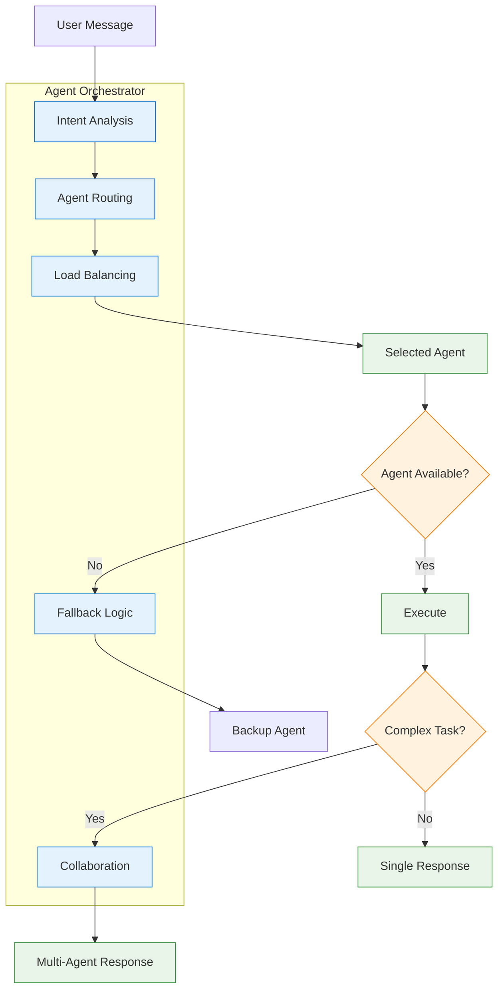
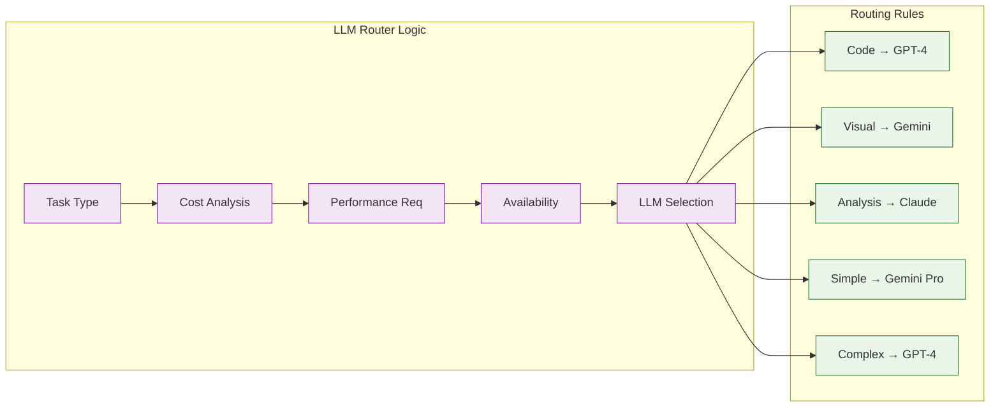
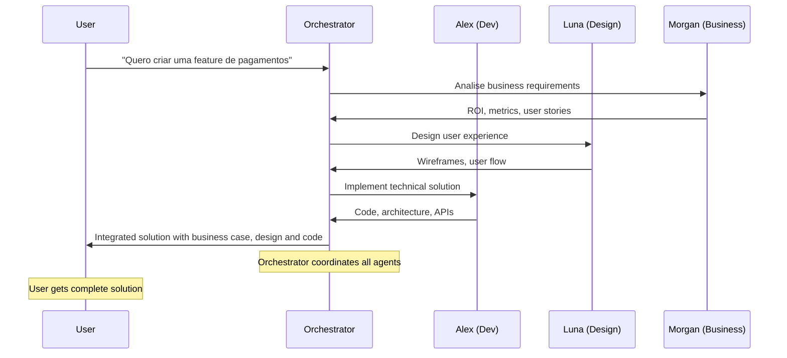
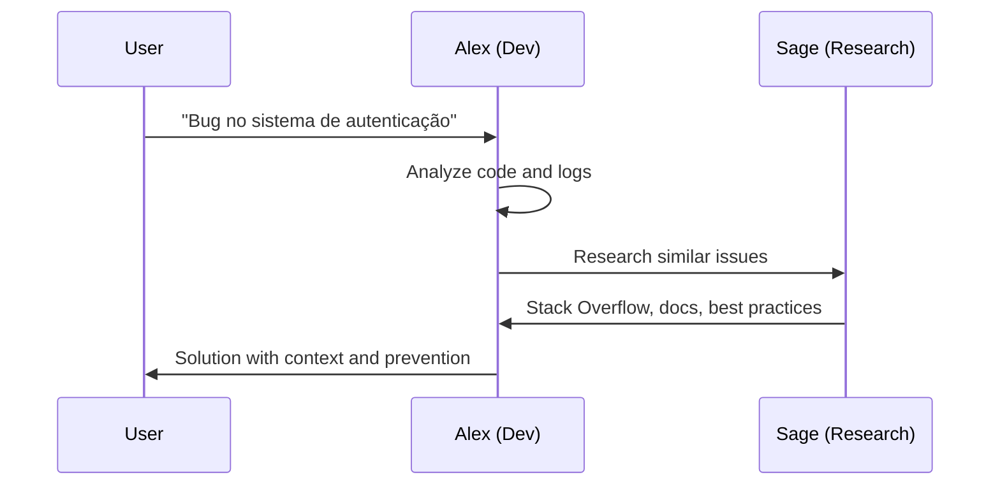
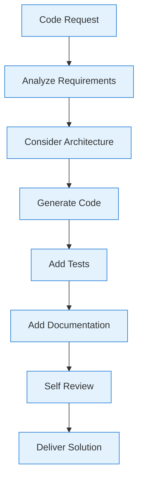
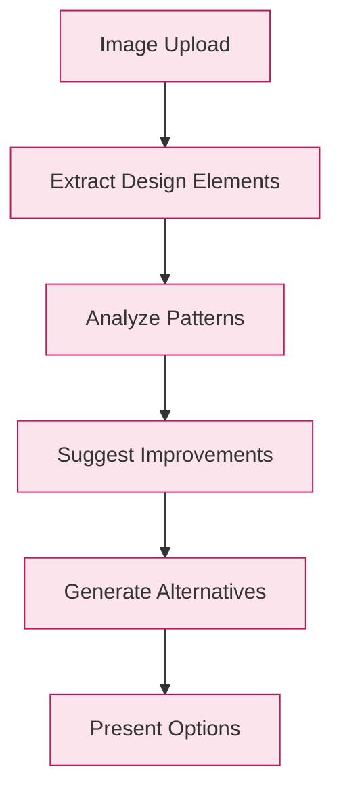
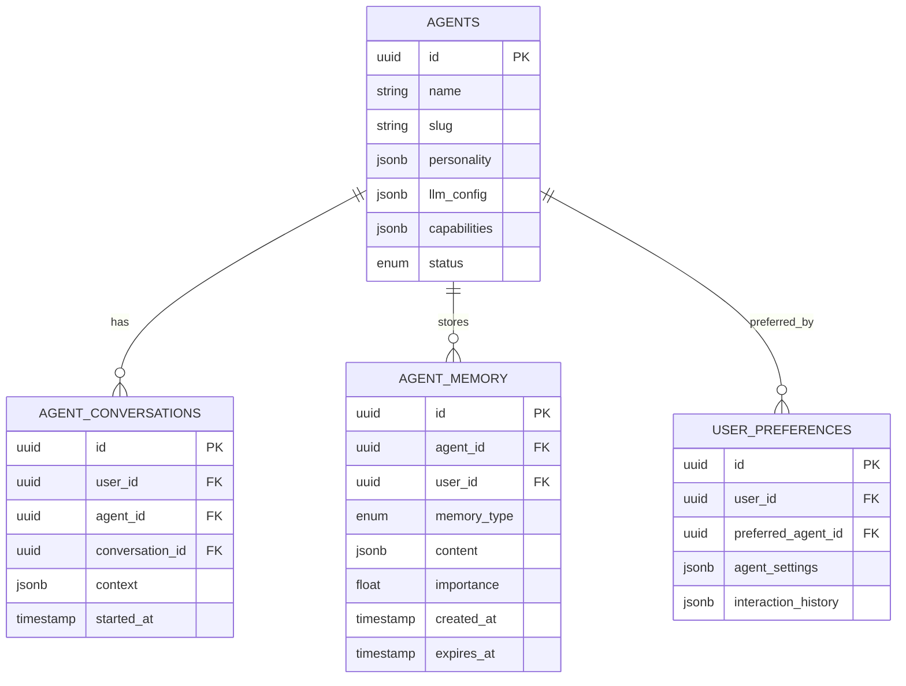

# Arquitetura Proposta - Sistema de Agentes Companions

## 🏗️ Nova Arquitetura com Agentes Especializados

```mermaid
graph TB
    subgraph "Frontend Layer"
        UI[Multi-Agent Chat UI]
        SELECTOR[Agent Selector]
        AVATAR[Agent Avatars]
        CONTEXT[Context Panel]
    end
    
    subgraph "Agent Orchestration Layer"
        ORCH[Agent Orchestrator]
        ROUTER[LLM Router]
        MEMORY[Memory Manager]
        COLLAB[Collaboration Engine]
    end
    
    subgraph "Agent Registry"
        REG[Agent Registry]
        ALEX[Alex - Dev]
        LUNA[Luna - Design]
        MORGAN[Morgan - Business]
        SAGE[Sage - Research]
        SAM[Sam - Support]
    end
    
    subgraph "LLM Layer"
        GPT4[OpenAI GPT-4]
        GEMINI[Google Gemini]
        CLAUDE[Anthropic Claude]
        DIFY[Dify Workflows]
    end
    
    subgraph "Capability Layer"
        CODE[Code Generation]
        IMAGE[Image Analysis]
        SEARCH[Web Search]
        DOCS[Documentation]
        ANALYSIS[Data Analysis]
    end
    
    subgraph "Memory & Context"
        AGENT_MEM[Agent Memory]
        USER_PREF[User Preferences]
        CONV_HIST[Conversation History]
        CONTEXT_STORE[Context Store]
    end
    
    subgraph "Database Layer"
        AGENTS_DB[Agents Table]
        AGENT_CONV[Agent Conversations]
        AGENT_MEM_DB[Agent Memory]
        USERS_DB[Users & Preferences]
    end
    
    UI --> SELECTOR
    SELECTOR --> ORCH
    ORCH --> REG
    REG --> ALEX
    REG --> LUNA
    REG --> MORGAN
    REG --> SAGE
    REG --> SAM
    
    ORCH --> ROUTER
    ROUTER --> GPT4
    ROUTER --> GEMINI
    ROUTER --> CLAUDE
    ROUTER --> DIFY
    
    ALEX --> CODE
    LUNA --> IMAGE
    MORGAN --> ANALYSIS
    SAGE --> SEARCH
    SAM --> DOCS
    
    ORCH --> MEMORY
    MEMORY --> AGENT_MEM
    MEMORY --> USER_PREF
    MEMORY --> CONV_HIST
    MEMORY --> CONTEXT_STORE
    
    MEMORY --> AGENTS_DB
    MEMORY --> AGENT_CONV
    MEMORY --> AGENT_MEM_DB
    MEMORY --> USERS_DB
    
    ORCH --> COLLAB
    COLLAB --> ALEX
    COLLAB --> LUNA
    COLLAB --> MORGAN
    
    AVATAR --> UI
    CONTEXT --> UI
    
    classDef frontend fill:#e1f5fe,stroke:#01579b
    classDef orchestration fill:#f3e5f5,stroke:#4a148c
    classDef agents fill:#fff3e0,stroke:#e65100
    classDef llm fill:#e8f5e8,stroke:#1b5e20
    classDef capabilities fill:#fce4ec,stroke:#880e4f
    classDef memory fill:#f1f8e9,stroke:#33691e
    classDef database fill:#e0f2f1,stroke:#004d40
    
    class UI,SELECTOR,AVATAR,CONTEXT frontend
    class ORCH,ROUTER,MEMORY,COLLAB orchestration
    class REG,ALEX,LUNA,MORGAN,SAGE,SAM agents
    class GPT4,GEMINI,CLAUDE,DIFY llm
    class CODE,IMAGE,SEARCH,DOCS,ANALYSIS capabilities
    class AGENT_MEM,USER_PREF,CONV_HIST,CONTEXT_STORE memory
    class AGENTS_DB,AGENT_CONV,AGENT_MEM_DB,USERS_DB database
```



## 🤖 Detalhamento dos Agentes

### **Agent Orchestrator - Cérebro do Sistema**



### **LLM Router - Otimização Inteligente**



## 🎭 Personalidades dos Agentes

### **Alex - Dev Companion**
```typescript
const alexPersonality = {
  traits: ['technical', 'direct', 'solution-focused'],
  expertise: ['typescript', 'react', 'nextjs', 'ai-sdk'],
  communicationStyle: 'concise-technical',
  llmConfig: {
    primary: 'openai-gpt4',
    temperature: 0.1,
    systemPrompt: `Você é Alex, um desenvolvedor sênior especializado em TypeScript e React.
    Seja direto, técnico e focado em soluções práticas. Sempre considere nossa stack:
    - Next.js 14+ com App Router
    - TypeScript strict
    - AI SDK para LLMs
    - Tailwind CSS
    - Drizzle ORM`
  }
}
```

### **Luna - Design Companion**
```typescript
const lunaPersonality = {
  traits: ['creative', 'visual', 'user-focused'],
  expertise: ['ui-ux', 'design-systems', 'accessibility'],
  communicationStyle: 'visual-collaborative',
  llmConfig: {
    primary: 'gemini-pro',
    temperature: 0.7,
    systemPrompt: `Você é Luna, uma designer UX/UI apaixonada por criar experiências incríveis.
    Seja criativa, visual e sempre pense no usuário primeiro. Considere:
    - Design Systems (shadcn/ui)
    - Acessibilidade (WCAG)
    - Mobile-first
    - Tailwind CSS
    - Figma workflows`
  }
}
```

## 🔄 Fluxos de Colaboração

### **Desenvolvimento de Feature (Multi-Agent)**



### **Debug Colaborativo**



## 🚀 Capacidades Expandidas

### **Code Generation (Alex)**


### **Visual Analysis (Luna)**


## 📊 Arquitetura de Dados

### **Agent Memory System**


## 🎯 Benefícios da Nova Arquitetura

### **Performance Otimizada**
- **Routing inteligente**: Modelo certo para cada tarefa
- **Custo reduzido**: 40-60% economia em LLM APIs
- **Latência menor**: Modelos mais rápidos para tarefas simples

### **Experiência Personalizada**
- **Especialização**: Cada agente é expert em seu domínio
- **Consistência**: Personalidade mantida entre sessões
- **Contexto**: Memória compartilhada e relevante

### **Escalabilidade**
- **Novos agentes**: Fácil adição de especialistas
- **Load balancing**: Distribuição inteligente de carga
- **Fallback**: Resiliência com agentes backup

---

**🚀 Esta arquitetura transforma o chat em uma plataforma de agentes especializados, cada um otimizado para suas tarefas específicas, criando uma experiência única e altamente eficiente.** 