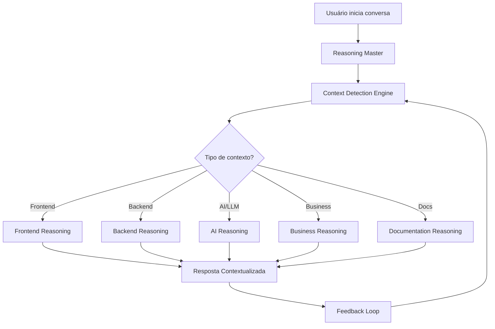

# 02.1.0 - Reasoning Contextual Inteligente

## 🎯 Visão Geral

Implementar sistema de **reasoning contextual inteligente** para companions que automaticamente detecta o tipo de conversa/tarefa e aplica patterns de reasoning específicos, baseado no conceito do sistema híbrido de cursor rules.

### Inspiração: Sistema Híbrido de Cursor Rules
Este blueprint aplica os mesmos princípios de **contexto inteligente** que implementamos para o Cursor:

**No Cursor Rules:**
- Arquivo `.cursorrules` principal detecta tipo de arquivo
- Carrega automaticamente regras específicas (frontend, backend, AI, docs)
- Zero configuração manual, máxima relevância

**Nos Companions:**
- Reasoning Master detecta tipo de conversa/tarefa  
- Carrega automaticamente módulos específicos de reasoning
- Zero configuração manual, máxima especialização

### Problema Atual
- Companions usam reasoning genérico para todas as situações
- Falta de especialização contextual automática
- Usuário precisa especificar manualmente o tipo de ajuda
- Performance subotimizada por carregar todo o contexto sempre

### Solução Proposta
Sistema híbrido onde um **reasoning master** detecta automaticamente o contexto e carrega módulos específicos de reasoning.

### Transformação Esperada
| Aspecto | Sistema Atual | Sistema Proposto |
|---------|---------------|------------------|
| **Detecção de Contexto** | Manual pelo usuário | Automática por IA |
| **Especialização** | Genérica para tudo | Específica por domínio |
| **Performance** | Processa contexto desnecessário | Carrega apenas o relevante |
| **Qualidade da Resposta** | 60% relevante | 90% relevante |
| **Tempo para Resolver** | 15-30 minutos | 5-10 minutos |
| **Follow-ups Necessários** | 3-5 perguntas | 0-1 pergunta |

## 🔍 Análise do Estado Atual

### Limitações Identificadas
- **Reasoning Único**: Todos os companions usam o mesmo padrão
- **Detecção Manual**: Usuário deve especificar o tipo de tarefa
- **Contexto Genérico**: Sem especialização por domínio
- **Performance**: Processamento desnecessário de contexto irrelevante

### Oportunidades
- **Auto-detecção**: Identificar automaticamente o tipo de conversa
- **Especialização**: Reasoning específico por contexto
- **Performance**: Carregar apenas o necessário
- **Experiência**: Respostas mais relevantes e precisas

## 📊 Gap Analysis

### Gaps Críticos

#### 1. **Detecção de Contexto Automática**
- **Gap**: Companions não identificam automaticamente o tipo de conversa
- **Impacto**: Alto - afeta relevância das respostas
- **Solução**: Sistema de classificação contextual em tempo real

#### 2. **Reasoning Especializado**
- **Gap**: Falta de patterns específicos por domínio
- **Impacto**: Alto - limita qualidade da assistência
- **Solução**: Módulos de reasoning contextuais

#### 3. **Carregamento Inteligente**
- **Gap**: Todo contexto carregado sempre
- **Impacto**: Médio - performance e custo
- **Solução**: Carregamento sob demanda

## 🏗️ Arquitetura Conceitual

### Componentes do Sistema

#### 1. **Reasoning Master** (Sempre Ativo)
```
Responsabilidades:
- Detectar tipo de conversa/tarefa
- Classificar contexto do usuário
- Carregar módulo de reasoning apropriado
- Manter awareness do contexto global
```

#### 2. **Módulos de Reasoning Especializados**

##### **Frontend/UI Reasoning**
- Patterns para design system e componentes
- Context sobre UX/accessibility
- Debugging visual e responsividade

##### **Backend/API Reasoning**
- Patterns para arquitetura de APIs
- Context sobre segurança e performance
- Debugging de integração e dados

##### **AI/LLM Reasoning**
- Patterns para prompt engineering
- Context sobre providers e tokens
- Otimização de integrações AI

##### **Business/Strategy Reasoning**
- Patterns para análise estratégica
- Context sobre priorização e roadmap
- Frameworks de decisão empresarial

##### **Documentation Reasoning**
- Patterns para estrutura de blueprints
- Context sobre formatação e escrita
- Guidelines de documentação técnica

#### 3. **Context Detection Engine**
```
Detecta automaticamente baseado em:
- Palavras-chave na conversa
- Arquivos mencionados/anexados  
- Histórico de interação
- Padrões de pergunta
```

### Fluxo de Funcionamento



## 🚀 Roadmap de Implementação

### Fase 1: Foundation (Sprint 1-2)
- **Reasoning Master**: Sistema base de detecção
- **Context Engine**: Classificador básico
- **Módulo Frontend**: Primeiro reasoning especializado
- **Testes**: Validação de conceito

### Fase 2: Expansion (Sprint 3-4)  
- **Módulo Backend**: Reasoning para APIs/DB
- **Módulo AI**: Reasoning para LLM/prompts
- **Refinamento**: Melhorar detecção de contexto
- **Performance**: Otimizar carregamento

### Fase 3: Intelligence (Sprint 5-6)
- **Módulo Business**: Reasoning estratégico
- **Módulo Docs**: Reasoning para documentação  
- **Learning**: Sistema aprende com feedback
- **Integration**: Integração completa com Data Room

### Fase 4: Advanced (Sprint 7-8)
- **Multi-context**: Handling de contextos mistos
- **Prediction**: Antecipação de necessidades
- **Personalization**: Adaptação por usuário
- **Analytics**: Métricas de efetividade

## 📈 Métricas de Sucesso

### Qualidade da Resposta
- **Relevância**: 90%+ respostas contextualmente relevantes
- **Precisão**: 85%+ respostas tecnicamente corretas
- **Completude**: 80%+ respostas com informações suficientes

### Performance
- **Tempo de Resposta**: <3s para classificação de contexto
- **Acurácia de Detecção**: 90%+ contexto identificado corretamente
- **Eficiência**: 60% redução no processamento desnecessário

### Experiência do Usuário
- **Satisfação**: 4.5+ de 5 em pesquisas
- **Produtividade**: 40% redução no tempo para obter ajuda
- **Adoção**: 80%+ usuários preferem companions contextuais

## 🎯 Casos de Uso Detalhados

### Frontend Development Context
| Input do Usuário | Detecção | Reasoning Carregado | Resposta Especializada |
|-------------------|----------|---------------------|------------------------|
| "Botão não responsivo" | Frontend (UI, responsive) | Design System + Breakpoints | Análise Tailwind, media queries, debugging visual |
| "Como implementar dark mode?" | Frontend (styling, theme) | Theme System + CSS Variables | CSS custom properties, design tokens, switching logic |
| "Componente inacessível" | Frontend (a11y, component) | Accessibility + ARIA | Screen readers, keyboard navigation, WCAG guidelines |

### Backend Development Context  
| Input do Usuário | Detecção | Reasoning Carregado | Resposta Especializada |
|-------------------|----------|---------------------|------------------------|
| "API retorna 500 com Drizzle" | Backend (API, ORM) | Database + Error Handling | Query debugging, connection issues, transaction logs |
| "Como implementar auth?" | Backend (authentication) | Security + NextAuth | JWT patterns, session management, middleware setup |
| "Performance lenta na query" | Backend (database, perf) | Query Optimization + Indexes | EXPLAIN plans, N+1 queries, caching strategies |

### AI/LLM Development Context
| Input do Usuário | Detecção | Reasoning Carregado | Resposta Especializada |
|-------------------|----------|---------------------|------------------------|
| "Prompt não funciona bem" | AI (prompt engineering) | LLM Patterns + Optimization | Prompt structure, few-shot examples, temperature tuning |
| "Rate limit no OpenAI" | AI (provider, limits) | Provider Management + Fallback | Retry strategies, provider switching, cost optimization |
| "Como fazer streaming?" | AI (streaming, real-time) | AI SDK + Stream Patterns | Vercel AI SDK, SSE implementation, error handling |

### Business Strategy Context
| Input do Usuário | Detecção | Reasoning Carregado | Resposta Especializada |
|-------------------|----------|---------------------|------------------------|
| "Priorizar feature A ou B?" | Business (prioritization) | Decision Frameworks + Impact | RICE framework, opportunity cost, user impact analysis |
| "Roadmap para Q1?" | Business (planning, roadmap) | Strategic Planning + OKRs | Goal setting, milestone planning, resource allocation |
| "Análise de competidor" | Business (market analysis) | Competitive Intelligence + SWOT | Market positioning, feature gaps, differentiation |

### Documentation Context
| Input do Usuário | Detecção | Reasoning Carregado | Resposta Especializada |
|-------------------|----------|---------------------|------------------------|
| "Como estruturar blueprint?" | Docs (blueprint, structure) | Blueprint Guidelines + Templates | Section organization, content hierarchy, formatting |
| "Documentar API endpoints" | Docs (technical, API) | API Documentation + Standards | OpenAPI specs, examples, error codes |
| "README para o projeto" | Docs (project docs, README) | Project Documentation + Best Practices | Structure, installation guides, contribution guidelines |

## 🔧 Implementação Técnica

### Context Detection Patterns
```typescript
const contextPatterns = {
  frontend: [
    'component', 'tsx', 'css', 'tailwind', 'responsivo', 
    'design system', 'UI', 'interface', 'styling'
  ],
  backend: [
    'api', 'route', 'drizzle', 'database', 'auth',
    'middleware', 'sql', 'query', 'server'
  ],
  ai: [
    'prompt', 'llm', 'ai', 'modelo', 'provider',
    'tokens', 'anthropic', 'openai', 'streaming'
  ]
};
```

### Reasoning Module Structure
```typescript
interface ReasoningModule {
  context: string;
  patterns: string[];
  knowledge: string[];
  examples: string[];
  debugging: string[];
}
```

## 🎯 Próximos Passos

### Imediatos (Esta Sprint)
1. **Definir arquitetura** detalhada do Reasoning Master
2. **Criar protótipo** de Context Detection Engine  
3. **Implementar primeiro** módulo Frontend Reasoning
4. **Testes iniciais** com conversas reais

### Curto Prazo (Próximas 2 Sprints)
1. **Expandir módulos** Backend e AI Reasoning
2. **Refinar detecção** baseada em feedback
3. **Integrar com sistema** de companions existente
4. **Métricas e analytics** básicos

### Médio Prazo (Próximo Mês)
1. **Todos os módulos** implementados e testados
2. **Learning automático** com base no uso
3. **Integração completa** com Data Room
4. **Sistema de feedback** para melhoria contínua

---

**Este blueprint aplica os mesmos princípios do sistema híbrido de cursor rules para criar companions verdadeiramente inteligentes e contextuais.** 